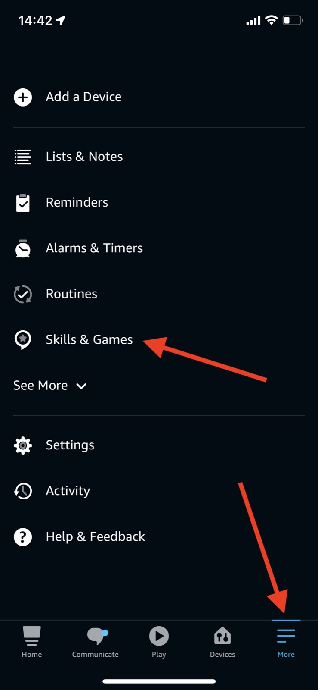
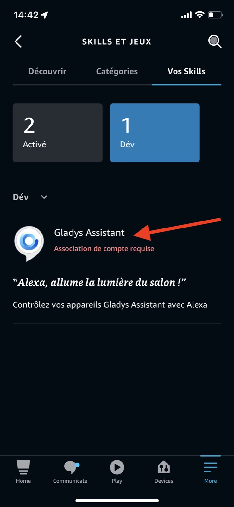
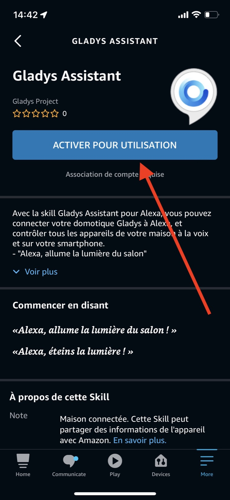
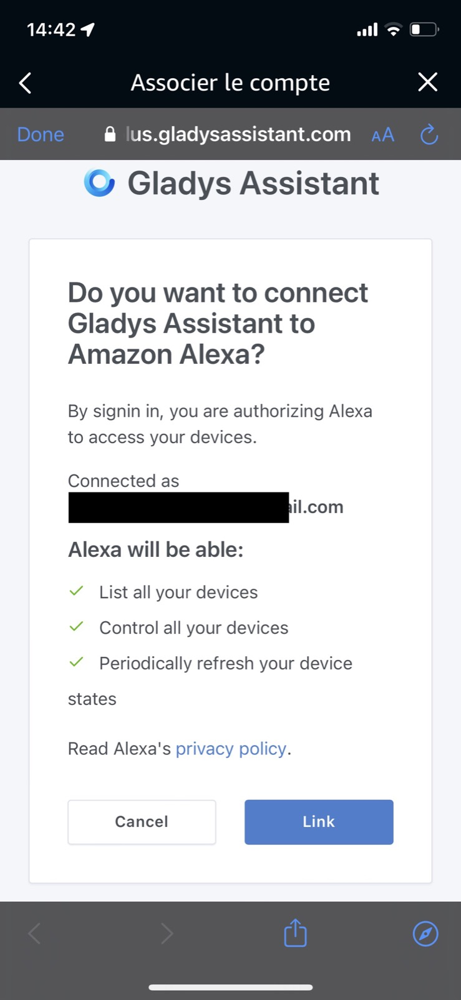
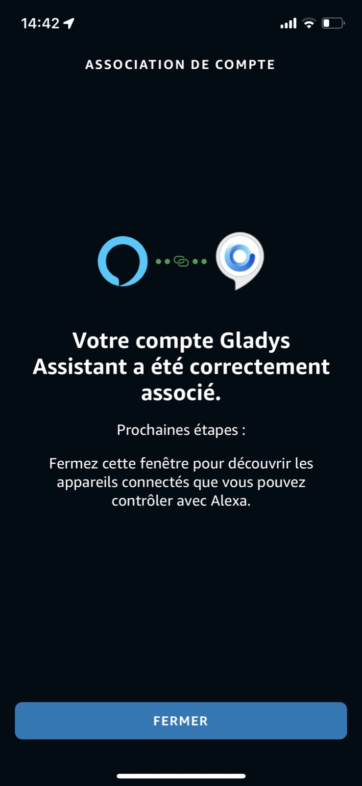
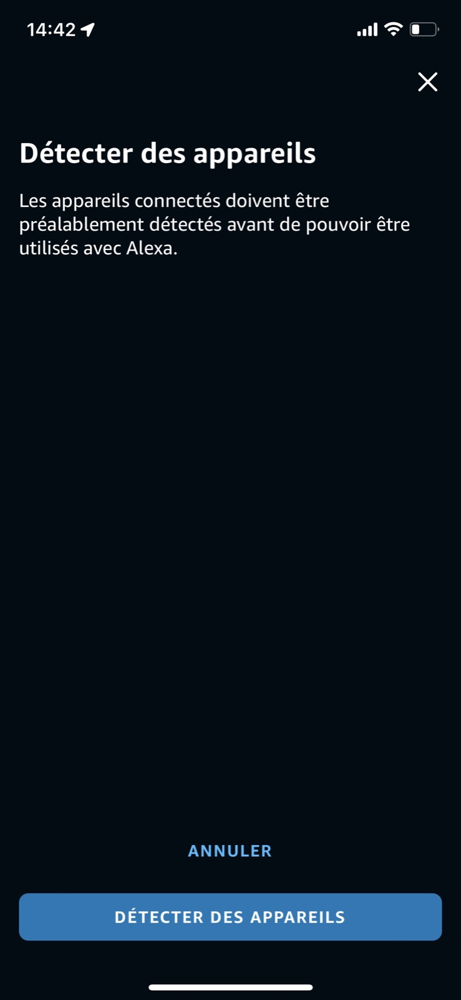

Mit [Gladys Plus](/de/plus), unserem Online-Gateway-Dienst, kannst du deine Gladys-Geräte über Alexa steuern.

Alexa ist eine besondere Integration, denn Alexa funktioniert ausschließlich in der Cloud. Das bedeutet, dass wir (leider) nur sehr begrenzt beeinflussen können, was möglich ist und was nicht.

Um Alexa-Partner zu werden, mussten wir:

- Eine Reihe automatisierter Tests auf Amazon-Seite bestehen
- Eine manuelle Prüfung durch das Amazon-Team bestehen
- Einen Alexa-Zertifizierungsprozess durchlaufen

Das ist kein einfacher Prozess, und es ist daher nicht realistisch, dass jeder unserer Nutzer ihn selbst durchläuft. Er richtet sich an Profis und Unternehmen – deshalb bieten wir diese Integration ausschließlich in Gladys Plus an.

## Ein Gladys-Plus-Konto erstellen

Um Gladys Plus beizutreten, geh auf die [entsprechende Seite](/de/plus) und gib deine E-Mail-Adresse ein.

## Gladys Plus einrichten

Gladys Plus muss vollständig eingerichtet sein, bevor du die Alexa-Integration nutzen kannst.

Wir empfehlen dir, die Schritte zu befolgen, die du per E-Mail erhalten hast, um Gladys Plus einzurichten.

Am Ende solltest du dich problemlos unter [plus.gladysassistant.com](https://plus.gladysassistant.com) anmelden können.

Sobald du dich erfolgreich bei Gladys Plus angemeldet hast, kannst du Alexa einrichten!

## Alexa einrichten

Öffne zuerst die Alexa-App auf deinem Smartphone.

Gehe zu „Skills und Spiele“:

Tippe auf die Integration „Gladys Assistant“:

Aktiviere die Integration:

Du musst dich anschließend mit deinem Gladys-Plus-Konto verbinden.

Geschafft!

Alexa sucht jetzt nach all deinen Geräten auf Gladys-Seite.

## Kompatible Geräte

Aktuell nur:

- Lampen (Ein/Aus / Farbe / Helligkeit)
- Schalter (Ein/Aus)

Weitere Gerätetypen werden auf Anfrage ergänzt. Schick uns deine Feature-Wünsche gerne über [das Forum](https://community.gladysassistant.com/).
