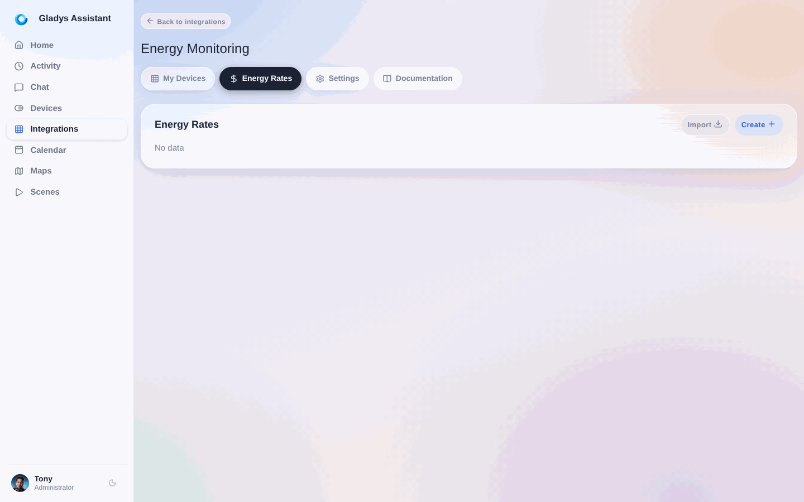
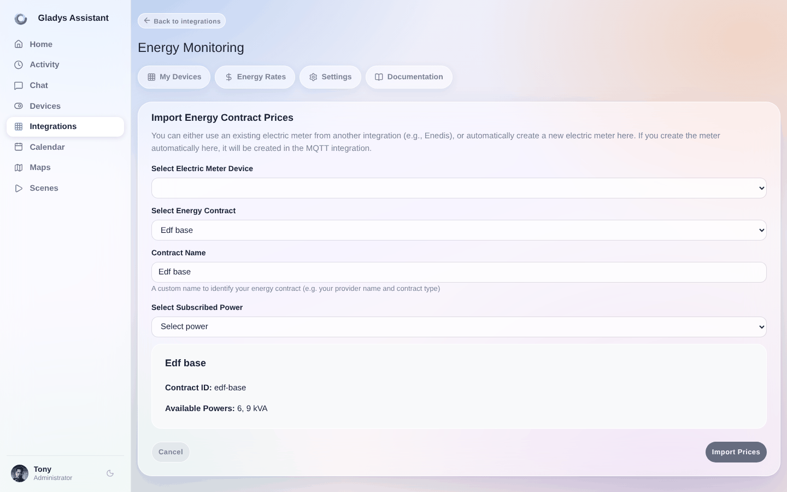
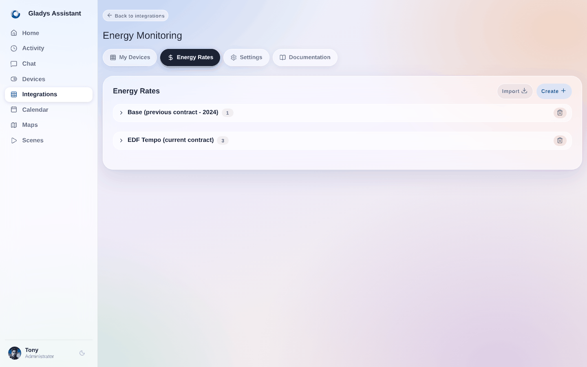
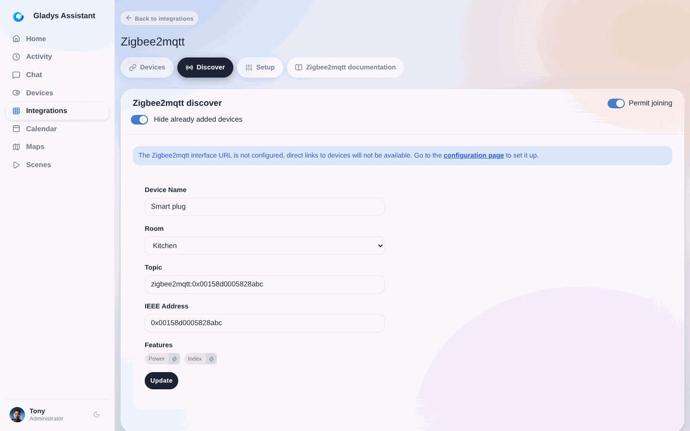
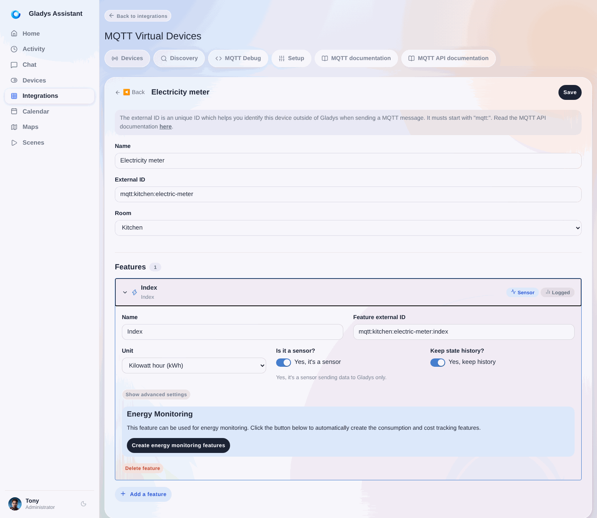
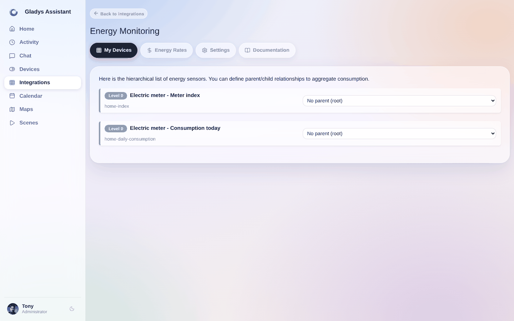
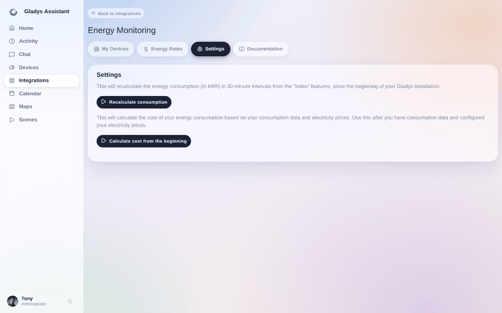
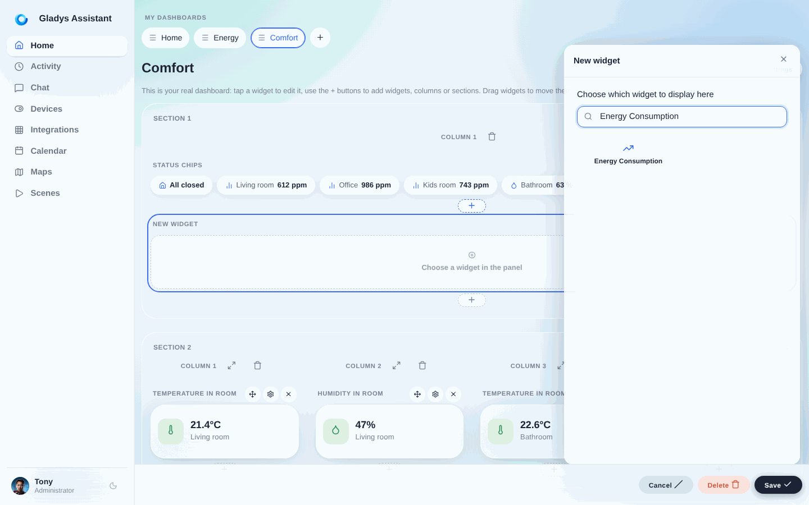
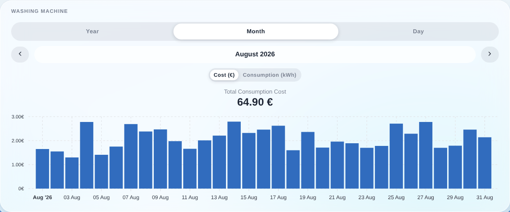

Mit der Integration „Energiemonitoring“ kannst du deinen Energieverbrauch mit Gladys Assistant verfolgen.

:::tip[Weiterführend]
So machst du aus den Daten echte Einsparungen: [Senke deine Stromrechnung](/de/home-energy-monitoring/). Hast du einen zeitabhängigen Tarif? Sieh dir live die [EDF-Tempo-Farbe](/de/edf-tempo/), die [Hydro-Québec-Spitzenlastereignisse](/de/hydro-quebec-peak-events/) und die [Stromtarife in Ontario](/de/ontario-electricity-rates/) an.
:::

Sie ist seit Gladys Assistant 4.66 verfügbar.

## Kompatible Hardware

Für diese Integration brauchst du Geräte, die Energieverbrauchsdaten in kWh liefern.

Dafür gibt es mehrere Möglichkeiten:

### 1. **Mit einem Lixee ZLinky TIC über Zigbee (nur Frankreich)**

:::note[Für Nutzer in Frankreich]
Diese Option ist spezifisch für Frankreich und den intelligenten Linky-Zähler.
:::

Das ist die beste Lösung, um deinen Verbrauch in Frankreich genau zu verfolgen: Messwerte jede Minute in kWh, ideal für die Überwachung deines gesamten Zuhauses.

Zigbee-kompatibel, erhältlich für 49 €:

- [bei Domadoo](https://www.domadoo.fr/fr/eco-energie/7492-lixee-module-tic-vers-zigbee-30-pour-compteur-linky-v2-v4000-0014-3770014375179.html?domid=17)
- [auf der Lixee-Website](https://lixee.fr/fr/produits/42-zlinky-tic-v2-3770014375179.html)

Bei mir zu Hause ergibt das ein Diagramm wie dieses:


Jede Farbe steht für einen Energiepreis (ich habe den Tempo-Tarif). Man sieht deutlich die weißen Tage, die Ende November mit der Rückkehr der Kälte aufgetaucht sind 🥶

### 2. **Über die Enedis-Integration in Gladys Plus (nur Frankreich)**

:::note[Für Nutzer in Frankreich]
Diese Option ist spezifisch für Frankreich und setzt einen Linky-Zähler mit Enedis-Konto voraus.
:::

Mit der Enedis-Integration kannst du die von deinem Linky-Zähler erfassten Werte abrufen, die einmal täglich automatisch an Enedis übermittelt werden.

Diese Integration funktioniert ohne zusätzliche Hardware, hat aber den Nachteil, dass der Verbrauch nur einmal pro Tag geliefert wird – im Gegensatz zum ZLinky, der alle 60 Sekunden live Daten sendet.

Um Enedis einzurichten, folge [dieser Anleitung](/de/docs/integrations/enedis/).

### 3. **Mit einer Zigbee-Steckdose mit Verbrauchsmessung (international)**

Das ist die empfohlene Option für internationale Nutzer. Ideal, um ein bestimmtes Gerät zu überwachen. Ich nutze zum Beispiel diese NOUS-Steckdose, um den Verbrauch meiner Waschmaschine zu verfolgen:

[NOUS-A1Z-Steckdose mit Verbrauchsmessung bei Domadoo](https://www.domadoo.fr/fr/prises-connectees/6165-nous-prise-intelligente-zigbee-30-mesure-de-consommation-5907772033517.html?domid=17)

### 4. **Mit einem eigenen MQTT-Gerät (international)**

Diese Option funktioniert weltweit. Wenn du einen intelligenten Zähler oder Geräte hast, die Verbrauchswerte in kWh liefern, kannst du sie über die MQTT-Integration in Gladys Assistant einbinden.

## Konfiguration

:::info
Du brauchst Gladys Assistant 4.66 oder höher, um diese Integration zu nutzen.
Du kannst Gladys in den Systemeinstellungen mit einem Klick aktualisieren.
:::

Die Reihenfolge der Schritte in dieser Anleitung ist wichtig!

### Schritt 1: Die Enedis-Integration einrichten (optional, nur Frankreich)

:::note[Für Nutzer in Frankreich]
Überspringe diesen Schritt, wenn du nicht in Frankreich wohnst.
:::

Wenn du die Enedis-Integration nutzen möchtest, folge [dieser Anleitung](/de/docs/integrations/enedis/).

Nutzt du die Enedis-Integration bereits, öffne die Integration, Tab „Meine Zähler“, und prüfe, ob das Gerät ein Funktions-Update benötigt.

Wird ein Button „Aktualisieren“ angezeigt, klicke darauf und anschließend auf „Mit Gladys Plus synchronisieren“.

Nach Abschluss der Synchronisierung kannst du prüfen, ob dein Enedis-Gerät die Daten korrekt an Gladys übertragen hat, indem du ein Diagramm für die Funktion „Enedis (30-Minuten-Verbrauch)“ erstellst.

Siehst du deinen gesamten Verbrauch in kWh, super – dann kannst du zum nächsten Schritt übergehen!

### Schritt 2: Deine Energietarife einrichten

Jetzt musst du Gladys mitteilen, welchen Energieversorger du nutzt und welchen Tarif du hast.

Es gibt zwei Möglichkeiten: Entweder hast du einen Vertrag, den Gladys kennt und den du einfach importieren kannst, oder du hast einen unbekannten Vertrag und musst ihn manuell einrichten.

Hinweis: Die Liste der Energieverträge ist Open Source und kann von jedem in [diesem GitHub-Repository](https://github.com/GladysAssistant/energy-contracts) bearbeitet werden.

#### Einen Vertrag importieren

Um deinen Vertrag einzurichten, öffne die Integration „Energiemonitoring“, Tab „Energietarife“, und klicke auf „Importieren“:



Gladys bittet dich, einen Stromzähler auszuwählen.

Nutzt du die Enedis-Integration, solltest du hier deinen Zähler sehen und kannst ihn auswählen.

Andernfalls kannst du auf „Einen Stromzähler erstellen“ klicken, damit Gladys automatisch ein Gerät anlegt, das als „Elternelement“ aller Energiesensoren in deinem Zuhause dient.

Wähle dann deinen Vertrag aus der Liste und anschließend deine vertraglich vereinbarte Leistung:



Hast du einen Tarif mit Haupt- und Nebenzeiten (HT/NT), musst du die Zeitfenster deines Vertrags auswählen.

Beim Tempo-Tarif werden dabei Dutzende Preise angelegt, weil der gesamte Verlauf dieses Vertrags mit 6 Preisen pro Zeitraum importiert wird!



### Einen Vertrag manuell anlegen

Ist dein Vertrag nicht in der Liste, klicke auf „Erstellen“.

Du musst einen Preis pro Zeitraum und pro Preisart anlegen. Hast du einen Tarif mit Haupt- und Nebenzeiten, musst du für jeden Zeitraum 2 Preise anlegen.

Beispiel:

Wenn dein Energietarif 2024 bei 0,15 €/kWh in der Hauptzeit und 0,10 €/kWh in der Nebenzeit lag und die Preise 2025 um 0,05 €/kWh sinken, musst du 4 Preise anlegen:

- 2024 Hauptzeit
- 2024 Nebenzeit
- 2025 Hauptzeit
- 2025 Nebenzeit

Das kann schnell mühsam werden, wenn sich die Preise deines Vertrags häufig ändern. Deshalb möchte ich dich ausdrücklich ermutigen, deinen Vertrag zur gemeinsamen Vertragsdatenbank im [GitHub-Repository](https://github.com/GladysAssistant/energy-contracts) hinzuzufügen.

Das Projekt ist kollaborativ, und jeder kann einen Tarif vorschlagen!

### Schritt 3: Deine Zigbee-Geräte aktualisieren

Wenn du in der Zigbee-Integration **vor diesem Update** Zigbee-Geräte mit Verbrauchsmessung hinzugefügt hast, musst du sie aktualisieren.



Dadurch werden die für das Energiemonitoring nötigen Funktionen hinzugefügt.

### Schritt 4: Deine MQTT-Geräte aktualisieren

Wenn du in der MQTT-Integration Geräte mit „Index“-Funktionen hast, siehst du bei diesen „Index“-Funktionen einen neuen Button, um die Energiemonitoring-Funktion zu aktivieren:



Dadurch werden die für das Energiemonitoring nötigen Funktionen hinzugefügt.

### Schritt 5: Die Hierarchie deines Stromnetzes prüfen

Öffne die Integration „Energiemonitoring“. Auf dem ersten Tab solltest du die Hierarchie deines Stromnetzes sehen.



Prüfe, ob jedes Gerät korrekt seinem Elternelement zugeordnet ist.

In der Logik von Gladys entspricht das „Elternelement“ eines Geräts dem, woran das Gerät angeschlossen ist.

Ein Beispiel für eine Hierarchie:

```
- Stromzähler
  - NOUS-A1Z-Steckdose (Verbrauchte Energie)
     - NOUS-A1Z-Steckdose (30-Minuten-Verbrauch)
        - NOUS-A1Z-Steckdose (30-Minuten-Kosten)
```

Die Hierarchie ist sehr wichtig, damit Gladys die Kosten deines Verbrauchs korrekt berechnen kann.

### Schritt 6: Den gesamten historischen Verbrauch neu berechnen

Wenn deine Geräte einen Verbrauchsverlauf haben, kannst du im Tab „Einstellungen“ eine Neuberechnung des historischen 30-Minuten-Verbrauchs und der 30-Minuten-Kosten starten:



Klicke zuerst auf den ersten Button, um den Verbrauch aus den Zählerständen zu berechnen, und dann auf den zweiten Button, um die 30-Minuten-Kosten zu berechnen.

### Schritt 7: Deinen Verbrauch auf dem Dashboard anzeigen

Auf deinem Dashboard kannst du jetzt ein neues Widget „Energieverbrauch“ hinzufügen:



So kannst du deinen Verbrauch anzeigen:


Du kannst auch jedes Gerät einzeln anzeigen, zum Beispiel meine Waschmaschine:



## Feedback?

Diese Funktion ist ganz neu. Wenn du Fragen oder Feedback hast, schreib gerne einen Beitrag [im Forum](https://community.gladysassistant.com/).

Ich möchte Thomas Lemaistre danken, der diese Entwicklung finanziert und es mir ermöglicht hat, sie umzusetzen!

Wenn du dir in Zukunft größere Entwicklungen wie diese in Gladys wünschst: Ich stehe für Feature-Sponsoring zur Verfügung.
