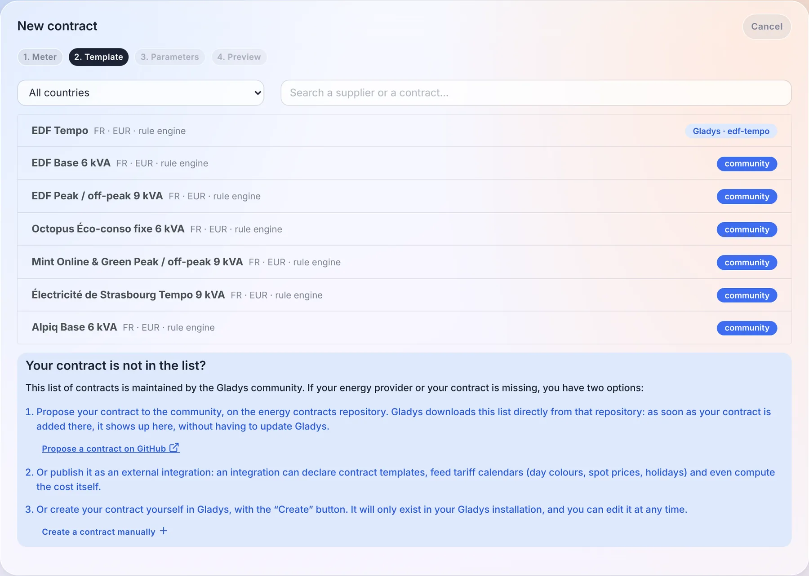
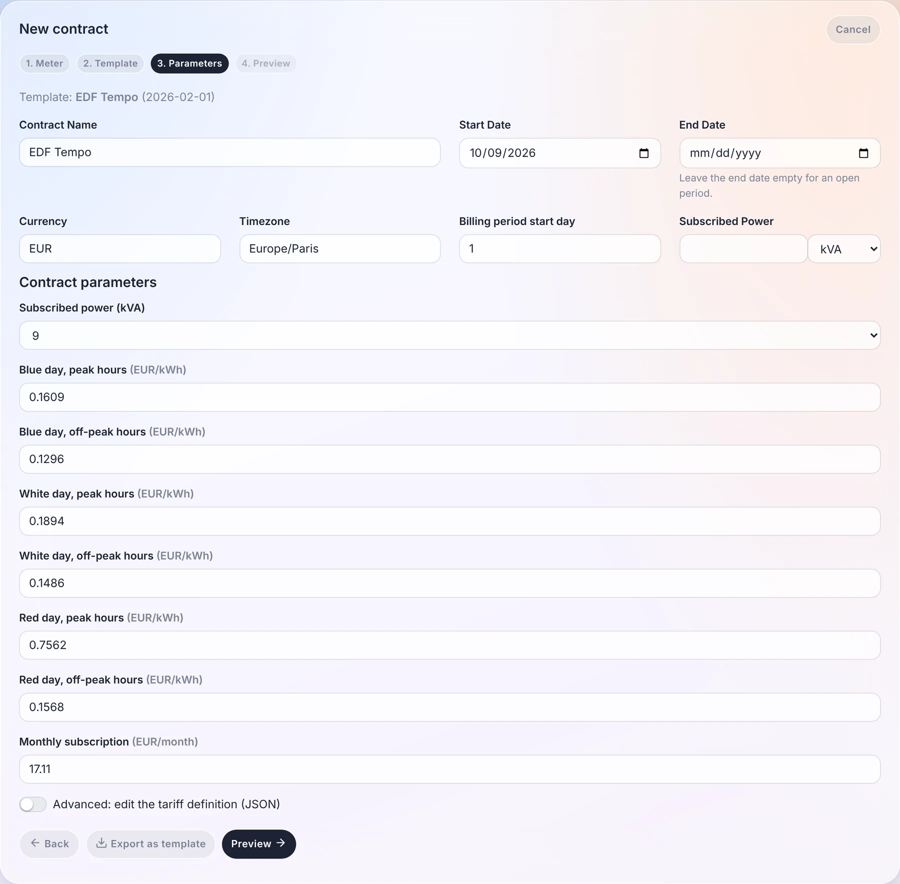
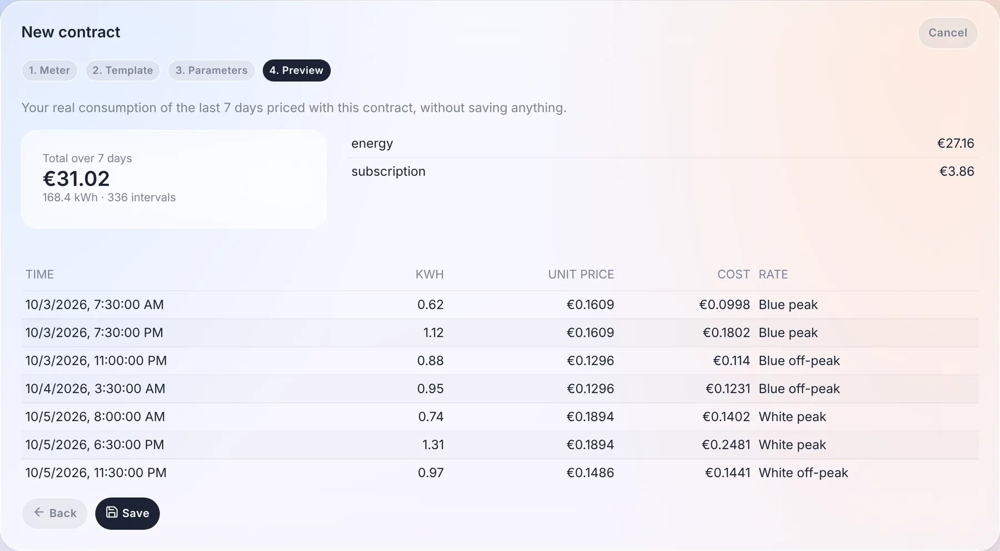
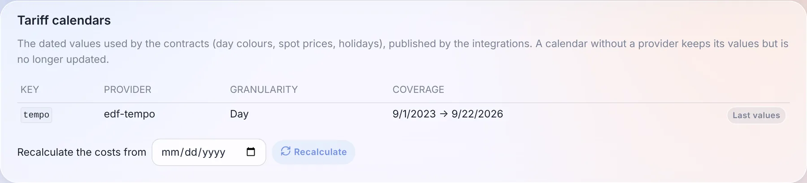

Mit der Integration „Energiemonitoring“ kannst du deinen Energieverbrauch mit Gladys Assistant verfolgen.

:::tip[Weiterführend]
So machst du aus den Daten echte Einsparungen: [Senke deine Stromrechnung](/de/home-energy-monitoring/). Hast du einen zeitabhängigen Tarif? Sieh dir live die [EDF-Tempo-Farbe](/de/edf-tempo/), die [Hydro-Québec-Spitzenlastereignisse](/de/hydro-quebec-peak-events/) und die [Stromtarife in Ontario](/de/ontario-electricity-rates/) an.
:::

Sie ist seit Gladys Assistant 4.66 verfügbar. Seit Gladys Assistant 5.2 werden die Kosten deines Verbrauchs anhand von **Energieverträgen** berechnet, die die Stromverträge fast aller Länder beschreiben können: Zeitfenster, Jahreszeiten, Tagesfarben, Verbrauchsstufen, Spotpreise …

## Kompatible Hardware

Für diese Integration brauchst du Geräte, die Energieverbrauchsdaten in kWh liefern.

Dafür gibt es mehrere Möglichkeiten:

### 1. **Mit einem Lixee ZLinky TIC über Zigbee (nur Frankreich)**

:::note[Für Nutzer in Frankreich]
Diese Option ist spezifisch für Frankreich und den intelligenten Linky-Zähler.
:::

Das ist die beste Lösung, um deinen Verbrauch in Frankreich genau zu verfolgen: Messwerte jede Minute in kWh, ideal für die Überwachung deines gesamten Zuhauses.

Zigbee-kompatibel, erhältlich für 49 €:

- [bei Domadoo](https://www.domadoo.fr/fr/eco-energie/7492-lixee-module-tic-vers-zigbee-30-pour-compteur-linky-v2-v4000-0014-3770014375179.html?domid=17)
- [auf der Lixee-Website](https://lixee.fr/fr/produits/42-zlinky-tic-v2-3770014375179.html)

Bei mir zu Hause ergibt das ein Diagramm wie dieses:


Jede Farbe steht für einen Energiepreis (ich habe den Tempo-Tarif). Man sieht deutlich die weißen Tage, die Ende November mit der Rückkehr der Kälte aufgetaucht sind 🥶

### 2. **Über die Enedis-Integration in Gladys Plus (nur Frankreich)**

:::note[Für Nutzer in Frankreich]
Diese Option ist spezifisch für Frankreich und setzt einen Linky-Zähler mit Enedis-Konto voraus.
:::

Mit der Enedis-Integration kannst du die von deinem Linky-Zähler erfassten Werte abrufen, die einmal täglich automatisch an Enedis übermittelt werden.

Diese Integration funktioniert ohne zusätzliche Hardware, hat aber den Nachteil, dass der Verbrauch nur einmal pro Tag geliefert wird – im Gegensatz zum ZLinky, der alle 60 Sekunden live Daten sendet.

Um Enedis einzurichten, folge [dieser Anleitung](/de/docs/integrations/enedis/).

### 3. **Mit einer Zigbee-Steckdose mit Verbrauchsmessung (international)**

Das ist die empfohlene Option für internationale Nutzer. Ideal, um ein bestimmtes Gerät zu überwachen. Ich nutze zum Beispiel diese NOUS-Steckdose, um den Verbrauch meiner Waschmaschine zu verfolgen:

[NOUS-A1Z-Steckdose mit Verbrauchsmessung bei Domadoo](https://www.domadoo.fr/fr/prises-connectees/6165-nous-prise-intelligente-zigbee-30-mesure-de-consommation-5907772033517.html?domid=17)

### 4. **Mit einem eigenen MQTT-Gerät (international)**

Diese Option funktioniert weltweit. Wenn du einen intelligenten Zähler oder Geräte hast, die Verbrauchswerte in kWh liefern, kannst du sie über die MQTT-Integration in Gladys Assistant einbinden.

## Konfiguration

:::info
Du brauchst Gladys Assistant 4.66 oder höher, um diese Integration zu nutzen.
Du kannst Gladys in den Systemeinstellungen mit einem Klick aktualisieren.
:::

Die Reihenfolge der Schritte in dieser Anleitung ist wichtig!

### Schritt 1: Die Enedis-Integration einrichten (optional, nur Frankreich)

:::note[Für Nutzer in Frankreich]
Überspringe diesen Schritt, wenn du nicht in Frankreich wohnst.
:::

Wenn du die Enedis-Integration nutzen möchtest, folge [dieser Anleitung](/de/docs/integrations/enedis/).

Nutzt du die Enedis-Integration bereits, öffne die Integration, Tab „Meine Zähler“, und prüfe, ob das Gerät ein Funktions-Update benötigt.

Wird ein Button „Aktualisieren“ angezeigt, klicke darauf und anschließend auf „Mit Gladys Plus synchronisieren“.

Nach Abschluss der Synchronisierung kannst du prüfen, ob dein Enedis-Gerät die Daten korrekt an Gladys übertragen hat, indem du ein Diagramm für die Funktion „Enedis (30-Minuten-Verbrauch)“ erstellst.

Siehst du deinen gesamten Verbrauch in kWh, super – dann kannst du zum nächsten Schritt übergehen!

### Schritt 2: Deinen Energievertrag anlegen

Jetzt musst du Gladys sagen, wie dein Anbieter dir die Energie berechnet. Seit Gladys Assistant 5.2 ist das ein **Energievertrag**: ein Gültigkeitszeitraum, eine Währung, eine Zeitzone und eine Tarifdefinition, die deinem Stromzähler zugeordnet sind.

Öffne die Integration „Energieüberwachung“, Reiter „Verträge“, und klicke auf „Erstellen“. Ein Assistent führt dich in 4 Schritten durch die Einrichtung.

**1. Zähler**

Wähle deinen Stromzähler aus. Wenn du die Enedis-Integration nutzt, solltest du deinen Zähler hier sehen und kannst ihn auswählen.

Andernfalls wähle „Stromzähler erstellen“, damit Gladys automatisch ein Gerät anlegt, das das „Elternteil“ aller Energiesensoren in deinem Zuhause wird.

**2. Vorlage**

Wähle deinen Vertrag in der Liste aus. Du kannst nach Land filtern und nach Anbieter oder Vertragsname suchen. Jede Vorlage zeigt, woher sie stammt: aus dem Community-Katalog, von einem Gladys-Dienst (EDF Tempo, mit den Tagesfarben aus Gladys Plus) oder von einer installierten Integration.



Die Liste der Community-Verträge ist Open Source und kann von allen in [diesem GitHub-Repository](https://github.com/GladysAssistant/energy-contracts) bearbeitet werden.

**3. Parameter**

Prüfe den Namen des Vertrags, sein Startdatum (und sein Enddatum, falls er eins hat), die Währung, die Zeitzone und den Tag, an dem deine Abrechnungsperiode beginnt. Fülle dann die Parameter der Vorlage aus: die Anschlussleistung, die Preise, deine Niedertarifzeiten auf einem Raster aus 30-Minuten-Slots bei einem Hoch-/Niedertarifvertrag …



**4. Vorschau**

Bevor irgendetwas gespeichert wird, berechnet Gladys deinen **realen Verbrauch der letzten 7 Tage** mit diesem Vertrag: die Summe, die Aufschlüsselung nach Bestandteilen (Energie, Grundgebühr …) und eine Auswahl an 30-Minuten-Intervallen mit dem jeweils angewendeten Preis. So prüfst du am einfachsten, ob der Vertrag zu deiner Rechnung passt.



Klicke auf „Speichern“: Der Vertrag erscheint in der Liste, mit seinem Status (aktiv, geplant, abgelaufen).

Wenn sich deine Preise ändern, fasst du die Vergangenheit nicht an: Beende den laufenden Vertrag zum Datum der Änderung und lege einen neuen an, der am Tag danach beginnt. Ein Zähler hat an einem bestimmten Datum höchstens einen aktiven Vertrag.

:::info[Du kommst von einer älteren Version?]
Deine vor Gladys 5.2 angelegten Energiepreise werden beim ersten Start automatisch in Verträge umgewandelt, ohne die bereits berechnete Kostenhistorie anzutasten. Prüfe sie im Reiter „Verträge“: Ein umgewandelter Vertrag, dessen Berechnung von der alten abweicht, wird markiert.
:::

#### Mein Vertrag ist nicht in der Liste

Du hast drei Möglichkeiten:

1. **Ihn der Community vorschlagen**, im [Repository der Energieverträge](https://github.com/GladysAssistant/energy-contracts). Gladys lädt diese Liste direkt herunter: Sobald dein Vertrag hinzugefügt ist, erscheint er in jeder Gladys-Instanz, ohne Update.
2. **Ihn als externe Integration veröffentlichen**: Eine Integration kann Vertragsvorlagen deklarieren, Tarifkalender (Tagesfarben, Spotpreise, Feiertage) liefern und die Kosten sogar selbst berechnen. Siehe [die Entwicklerdokumentation](/de/docs/dev/external-integrations/).
3. **Ihn selbst anlegen**: Aktiviere im Schritt „Parameter“ die Option „Erweitert: Tarifdefinition bearbeiten (JSON)“ und beschreibe deinen Vertrag. Mit „Als Vorlage exportieren“ erhältst du anschließend eine Vorlage, die du teilen kannst.

#### Was ein Vertrag ausdrücken kann

Die Tarif-Engine von Gladys kennt keinen Anbieter beim Namen: Ein Vertrag ist eine Liste von Regeln, die für jedes 30-Minuten-Intervall ausgewertet werden. Eine Regel kann abhängen von:

- der **Uhrzeit** (Hoch-/Niedertarif, Zeitfenster);
- dem **Wochentag** (günstigere Wochenenden);
- dem **Monat oder der Jahreszeit** (Sommer-/Wintertarife);
- einem **Datumsbereich** (Aktion, Übergangszeit);
- einem **Tarifkalender**: Tagesfarbe (Tempo), Feiertage, Spitzenlasttage;
- **Verbrauchsstufen**, pro Tag, pro Monat oder pro Abrechnungsperiode (progressive Tarife);
- der **Spitzenleistung** des Intervalls.

Außerdem kann ein Vertrag **Fixkosten** (pro Tag oder pro Monat), **Steuern** in Prozent, einen **Leistungspreis** pro kW Spitzenleistung und **stündliche oder viertelstündliche Börsenpreise** (Spotpreise) mit Faktor und Aufschlag enthalten.

Die Engine wird mit echten Verträgen aus Frankreich, Belgien, dem Vereinigten Königreich, Deutschland, Finnland, Norwegen, den USA, Kanada, Australien, Japan, Südkorea und Indien getestet.

#### Die Tarifkalender

Manche Verträge hängen von Werten ab, die sich jeden Tag ändern: die Tempo-Farbe, Spotpreise, Spitzenlasttage. Diese Werte werden in **Tarifkalendern** gespeichert, die im Reiter „Einstellungen“ der Integration sichtbar sind, mit ihrem Anbieter, ihrer Granularität (Tag, 30 Minuten, 15 Minuten), ihrer Abdeckung und ihren letzten Werten.



Auf derselben Karte berechnet „Kosten neu berechnen ab“ die Kosten aller Zähler ab dem gewählten Datum neu, zum Beispiel nachdem du einen Preis korrigiert hast.

### Schritt 3: Deine Zigbee-Geräte aktualisieren

Wenn du in der Zigbee-Integration **vor diesem Update** Zigbee-Geräte mit Verbrauchsmessung hinzugefügt hast, musst du sie aktualisieren.


Dadurch werden die für das Energiemonitoring nötigen Funktionen hinzugefügt.

### Schritt 4: Deine MQTT-Geräte aktualisieren

Wenn du in der MQTT-Integration Geräte mit „Index“-Funktionen hast, siehst du bei diesen „Index“-Funktionen einen neuen Button, um die Energiemonitoring-Funktion zu aktivieren:


Dadurch werden die für das Energiemonitoring nötigen Funktionen hinzugefügt.

### Schritt 5: Die Hierarchie deines Stromnetzes prüfen

Öffne die Integration „Energiemonitoring“. Auf dem ersten Tab solltest du die Hierarchie deines Stromnetzes sehen.


Prüfe, ob jedes Gerät korrekt seinem Elternelement zugeordnet ist.

In der Logik von Gladys entspricht das „Elternelement“ eines Geräts dem, woran das Gerät angeschlossen ist.

Ein Beispiel für eine Hierarchie:

```
- Stromzähler
  - NOUS-A1Z-Steckdose (Verbrauchte Energie)
     - NOUS-A1Z-Steckdose (30-Minuten-Verbrauch)
        - NOUS-A1Z-Steckdose (30-Minuten-Kosten)
```

Die Hierarchie ist sehr wichtig, damit Gladys die Kosten deines Verbrauchs korrekt berechnen kann.

### Schritt 6: Den gesamten historischen Verbrauch neu berechnen

Wenn deine Geräte einen Verbrauchsverlauf haben, kannst du im Tab „Einstellungen“ eine Neuberechnung des historischen 30-Minuten-Verbrauchs und der 30-Minuten-Kosten starten:


Klicke zuerst auf den ersten Button, um den Verbrauch aus den Zählerständen zu berechnen, und dann auf den zweiten Button, um die 30-Minuten-Kosten zu berechnen.

### Schritt 7: Deinen Verbrauch auf dem Dashboard anzeigen

Auf deinem Dashboard kannst du jetzt ein neues Widget „Energieverbrauch“ hinzufügen:


So kannst du deinen Verbrauch anzeigen:


Du kannst auch jedes Gerät einzeln anzeigen, zum Beispiel meine Waschmaschine:


### Schritt 8: Den aktuellen Strompreis anzeigen

Das Widget „Strompreis“ zeigt für den gewählten Vertrag den aktuellen Preis pro kWh, die aktuelle Stufe (zum Beispiel „Blue peak“), bis wann sie gilt und wie der nächste Preis lautet, sowie den heutigen Verbrauch.


Es funktioniert mit jedem Vertrag, unabhängig von Anbieter oder Land, und aktualisiert sich alle 5 Minuten.

### Schritt 9: Den Preis in deinen Szenen nutzen

Zwei Szenen-Bausteine verwenden deinen Vertrag:

- der Auslöser **„Strompreis geändert“** startet eine Szene, sobald sich der Preis pro kWh (oder die Tarifstufe) des Vertrags ändert, zum Beispiel beim Wechsel vom Hoch- in den Niedertarif;
- die Aktion **„Bedingung zum Strompreis“** lässt die Szene nur weiterlaufen, wenn der aktuelle Preis unter, über oder gleich dem gewählten Schwellenwert liegt.

Zum Beispiel, um den Geschirrspüler zu starten, sobald der Strom günstiger wird:


## Feedback?

Diese Funktion ist ganz neu. Wenn du Fragen oder Feedback hast, schreib gerne einen Beitrag [im Forum](https://community.gladysassistant.com/).

Ich möchte Thomas Lemaistre danken, der diese Entwicklung finanziert und es mir ermöglicht hat, sie umzusetzen!

Wenn du dir in Zukunft größere Entwicklungen wie diese in Gladys wünschst: Ich stehe für Feature-Sponsoring zur Verfügung.
