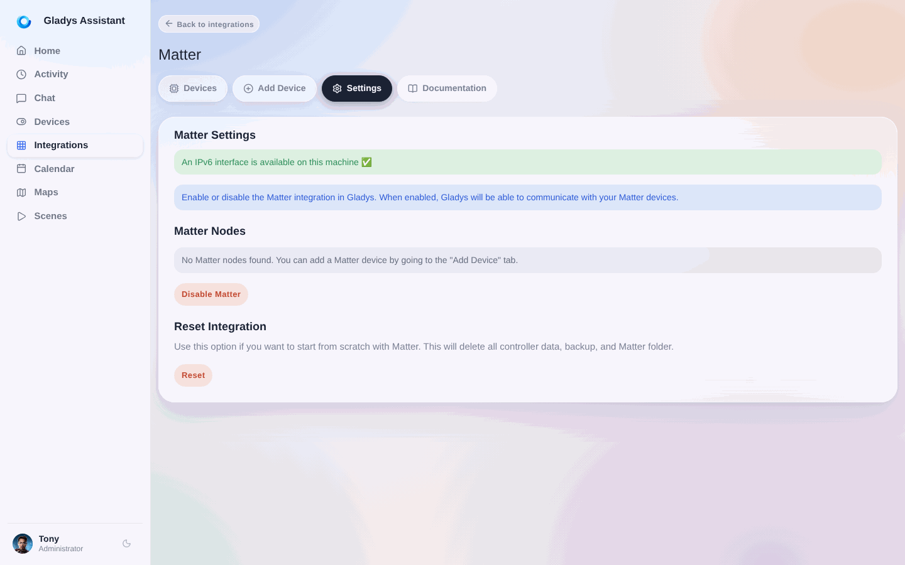
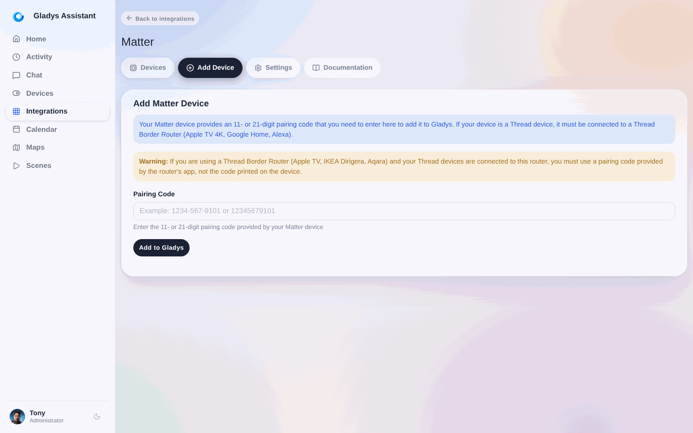
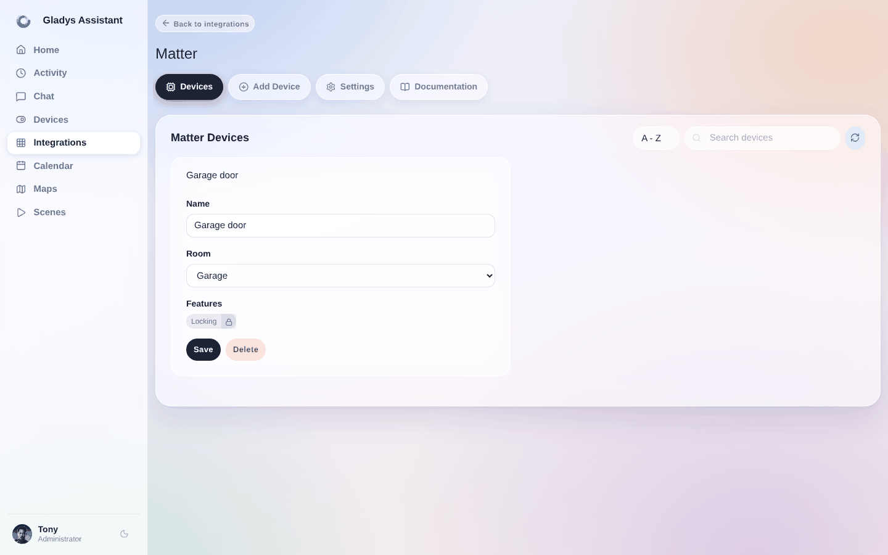
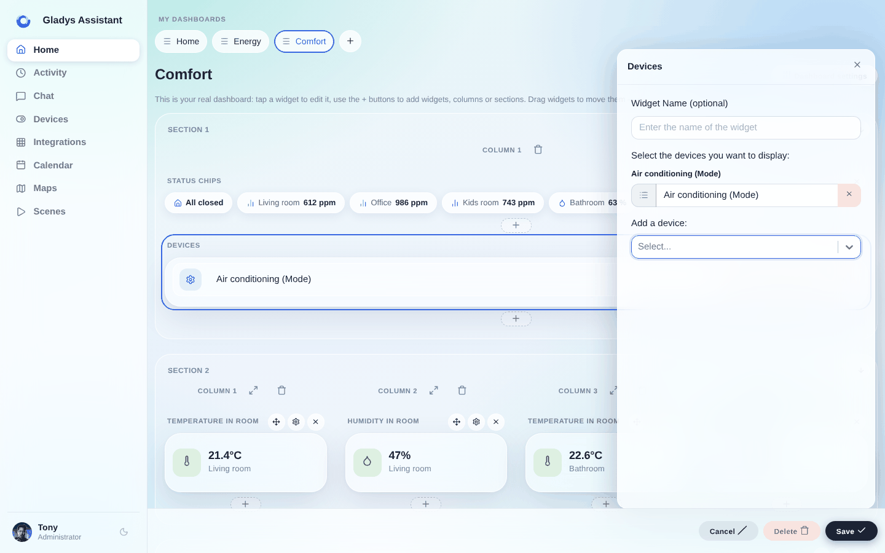
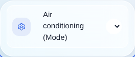

Das Matter-Protokoll ist eine kleine Revolution in der Smart-Home-Welt: Endlich können smarte Geräte verschiedener Hersteller einheitlich miteinander kommunizieren.

:::tip[Controller, Border Router, Bridge?]
Du weißt nicht genau, was du für Matter- und Thread-Geräte brauchst? Lies [Brauchst du einen Matter-Hub?](/de/matter-hub/)
:::

Gladys Assistant ist Matter-kompatibel, du kannst also Matter-Geräte in dein Setup integrieren. Gladys übernimmt die Rolle deines **Matter-Controllers** und läuft auf deinem eigenen Rechner: Für ein Matter-Gerät im WLAN oder per Ethernet musst du überhaupt keinen Hub kaufen. Thread-Geräte sind die Ausnahme, mehr dazu weiter unten. Falls du dich fragst, welche Box du brauchst, lies unseren Ratgeber [Welcher Matter-Hub ist der richtige?](/de/matter-hub/).

## Kompatibilität

Gladys unterstützt folgende Funktionen:

- **Ein/Aus**: Steckdosen, Lampen, Klimaanlagen, Heizungen, Ventilatoren usw.
- **Lampen**: Helligkeit und Farbsteuerung.
- **Rollläden / Vorhänge**: Öffnen, Schließen, Anhalten + Positionssteuerung.
- **Thermostate**: Einstellung der Solltemperatur.
- **Klimaanlagen**: Einstellung der Solltemperatur.
- **Bewegungsmelder**
- **Helligkeitssensoren**
- **Temperatursensoren**
- **Feuchtigkeitssensoren**

Wenn du ein Gerät hast, das noch nicht unterstützt wird, teile es gerne im [Forum](https://community.gladysassistant.com/) – wir kümmern uns darum, es zu unterstützen.

## Matter vs. Thread

Matter ist ein **Anwendungsprotokoll**. Es legt fest, wie Geräte auf Ebene der ausgetauschten Nachrichten miteinander kommunizieren: welche Befehle möglich sind (z. B. eine Lampe einschalten, die Temperatur abfragen), in welchem Format diese Nachrichten verschickt werden und wie Geräte mit ihrem Zustand, der Kopplung oder der Sicherheit umgehen.

Kurz gesagt: Matter kümmert sich um das „Was“ und das „Wie“ der Interaktion zwischen smarten Geräten.

Thread hingegen ist ein **Low-Level-Mesh-Netzwerkprotokoll** für die Kommunikation zwischen drahtlosen Geräten mit geringem Energieverbrauch. Es ist eine Alternative zu Zigbee oder WLAN, basiert aber im Gegensatz zu diesen auf IP-Standards (IPv6) und ist damit von Haus aus internetkompatibel.

Thread kümmert sich um den Transportweg, also darum, Nachrichten über ein zuverlässiges, schnelles und sicheres Funknetz zu übertragen.

Manche Matter-Geräte nutzen Thread als Netzwerkprotokoll, aber nicht alle! Matter-Geräte können auch WLAN, Ethernet oder sogar Bluetooth verwenden.

### Wenn dein Gerät bereits in deinem Netzwerk ist

Ist dein Gerät Matter-kompatibel und nutzt WLAN oder Ethernet, ist es bereits in deinem Netzwerk und kann direkt in Gladys verwendet werden!

Das gilt für alle Matter-Bridges von Herstellern wie Philips Hue, IKEA mit dem DIRIGERA-Hub usw.

Ebenso gilt es für alle WLAN-Geräte wie smarte Steckdosen oder Lampen, die direkt mit dem WLAN verbunden sind.

### Wenn dein Gerät nicht Matter-kompatibel ist

Du brauchst kein Matter, um ein Gerät in Gladys zu nutzen. Wenn es für dein Gerät oder deinen Dienst keine native Integration gibt, wirf einen Blick in den [Katalog der externen Integrationen](/de/docs/integrations/external/): Community-Integrationen, die du mit einem Klick installierst, ganz ohne Kommandozeile oder Konfigurationsdatei.

Und falls die passende noch nicht existiert, kannst du sie selbst erstellen: Siehe den [Entwickler-Leitfaden für externe Integrationen](/de/docs/dev/external-integrations/).

### Wenn dein Gerät nur Thread nutzt

Nutzt dein Gerät Thread, musst du es mit einem Thread-Router verbinden, bevor du es in Gladys verwenden kannst.

Ein Thread-Router (oder „Thread Border Router“) verbindet deine Thread-Geräte mit deinem Heimnetzwerk. **Gladys ist kein Thread Border Router**: Gladys ist ein Matter-Controller, ein Thread-Gerät braucht also einen Border Router in deinem Netzwerk.

Viele handelsübliche Geräte sind Thread-Router:

- Apple TV 4K Ethernet 128 GB
- Apple HomePod
- Google Nest Hub Max
- Google Nest Hub (2. Generation)
- Google Nest Wi-Fi Pro
- Google TV Streamer 4K
- Amazon Echo (4. Generation)
- Amazon Echo Hub
- Amazon Echo Studio
- Amazon Echo Show (21, 15, 10 und 8)

Du kannst auch deinen eigenen Thread-Router mit einem USB-Thread-Dongle und OpenThread aufsetzen.

:::warning
Ein Thread Border Router allein reicht derzeit nicht aus, um ein Matter-over-Thread-Gerät zu Gladys hinzuzufügen. Die Kopplung eines solchen Geräts läuft über Bluetooth, das Gladys noch nicht unterstützt. Die erste Kopplung muss daher mit einem **vollwertigen Matter-Controller** erfolgen: einem Apple TV, einem Matter-kompatiblen Amazon Echo oder einem Google-Nest-Gerät. Sobald das Gerät dort gekoppelt ist, lässt du dir von diesem Controller einen neuen Kopplungscode geben und fügst das Gerät damit zu Gladys hinzu, das es dann lokal steuert.

Das bedeutet auch: Ein mit OpenThread geflashter Thread-Dongle oder das Thread-Funkmodul eines Multiprotokoll-Koordinators wie dem SMLIGHT SLZB-MR1 oder dem SONOFF Dongle Max leitet zwar Thread-Verkehr weiter, ersetzt diesen Controller aber nicht.

Das kann sich künftig ändern, falls Gladys die Kopplung per Bluetooth erhält.
:::

## Einrichtung in Gladys Assistant

Öffne den Tab „Integrationen“ und dann „Matter“.

Aktiviere zuerst Matter in den Einstellungen:

:::note
Matter funktioniert mit IPv6, daher muss IPv6 auf deinem Router und deinem Rechner aktiviert sein.
Gladys listet die auf deinem Rechner verfügbaren Netzwerkschnittstellen auf. Wird keine Schnittstelle gefunden, zeigt Gladys eine Fehlermeldung an.
:::

Wechsle dann in den Tab „Gerät hinzufügen“, um ein neues Matter-Gerät zu koppeln:

Um ein Matter-Gerät hinzuzufügen, brauchst du einen 11-stelligen Kopplungscode.

:::note
Ist dein Gerät bereits mit einem anderen Matter-Controller verbunden, brauchst du einen Kopplungscode von diesem Controller, nicht den ursprünglichen Code des Geräts. **Beispiel:** Ich habe eine smarte Eve-Steckdose, die mit meinem Apple TV 4K Ethernet verbunden ist. Den Kopplungscode finde ich in der App „Home“ unter iOS.
:::

Sobald das Gerät gekoppelt ist, öffne den Tab „Geräte“, um es zu Gladys hinzuzufügen.

In diesem Tab siehst du alle gekoppelten Matter-Geräte sowie die, die bereits zu Gladys hinzugefügt wurden:

Nach dem Hinzufügen kannst du das Gerät in deinem Dashboard und in Szenen verwenden.

## Beispiel: Deine Klimaanlage über das Dashboard steuern

Im Dashboard kannst du jetzt ein Widget „Geräte“ hinzufügen und deine Matter-Klimaanlage auswählen:

Nach dem Speichern des Dashboards kannst du die Klimaanlage steuern:

