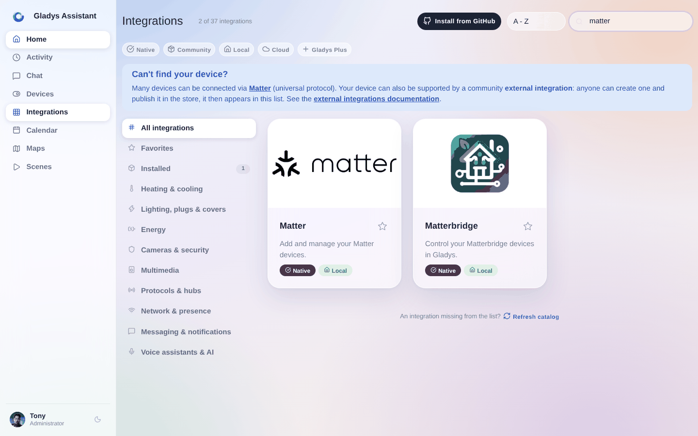
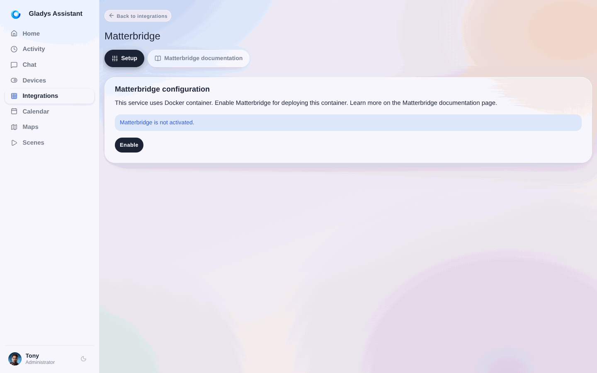

:::tip
Um ein Gerät oder einen Dienst ohne native Integration hinzuzufügen, sind [externe Integrationen](/de/docs/integrations/external/) der empfohlene Weg: Du installierst sie mit einem Klick aus Gladys heraus, und jeder kann [selbst eine erstellen](/de/docs/dev/external-integrations/).

Für die meisten Geräte, für die früher Matterbridge empfohlen wurde, gibt es inzwischen eine externe Integration, die direkt mit ihnen kommuniziert, ohne zwischengeschaltete Matter-Bridge: [Overkiz](/de/docs/integrations/external/overkiz/) für Somfy TaHoma, TaHoma Switch und Connexoon, [Shelly](/de/docs/integrations/external/shelly/) für Shelly-Geräte. [Stöbere zuerst im Katalog](/de/docs/integrations/external/): Matterbridge ist die Notlösung, wenn dort nichts für dein Gerät dabei ist.
:::

[Matterbridge](https://github.com/Luligu/matterbridge) ist eine Matter-Bridge, mit der du Nicht-Matter-Geräte in ein Matter-Ökosystem einbinden kannst. Dank seiner zahlreichen Plugins kann Matterbridge Geräte verschiedenster Hersteller über das Matter-Protokoll an Gladys weitergeben.

## Matterbridge aktivieren

Öffne in Gladys `Integrationen / Matterbridge`.

Gladys muss einen Docker-Container installieren, um Matterbridge auszuführen. Keine Sorge, alles ist automatisiert.

Klicke auf die Schaltfläche **Aktivieren**, um den Matterbridge-Container zu starten.

Nach kurzer Zeit (abhängig von deiner Hardware und deiner Bandbreite) ist Matterbridge einsatzbereit.

## Verwendung

Sobald Matterbridge läuft, kannst du über die Weboberfläche:

- Plugins installieren
- Deine Geräte konfigurieren
- Den Matter-Kopplungscode abrufen

Weitere Details zur Plugin-Konfiguration und die Liste der verfügbaren Plugins findest du in der [offiziellen Matterbridge-Dokumentation](https://github.com/Luligu/matterbridge).

Sobald ein Plugin deine Geräte bereitstellt, koppelst du die Bridge in Gladys über die [Matter-Integration](/de/docs/integrations/matter/): Kopiere den von Matterbridge angezeigten Kopplungscode und füge ihn unter `Integrationen / Matter` hinzu.
