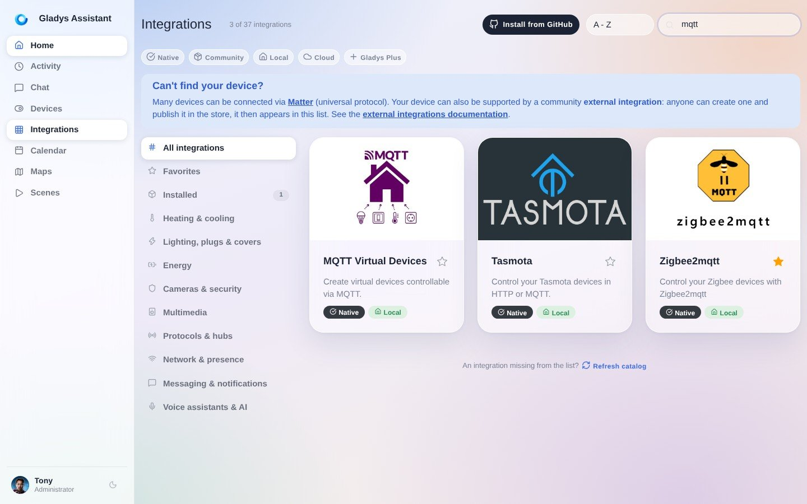
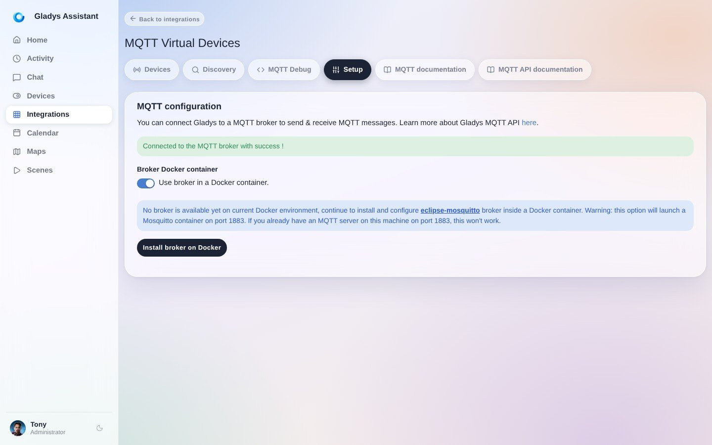
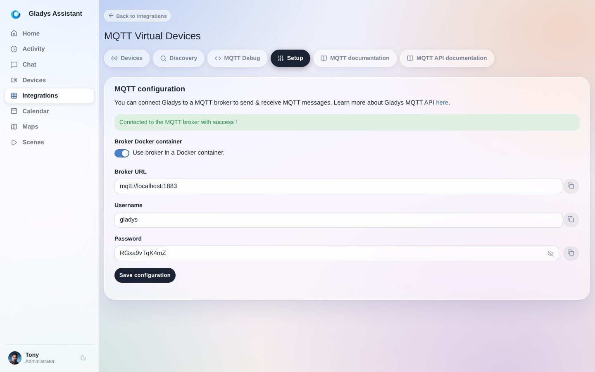
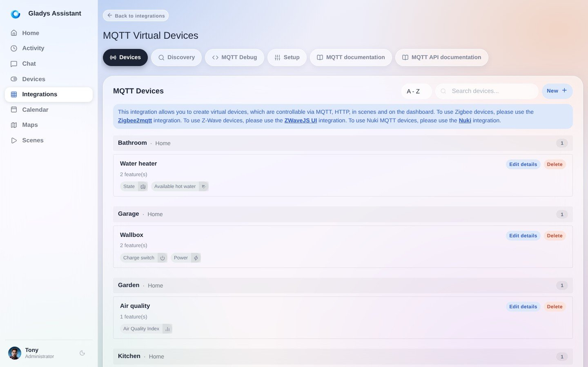
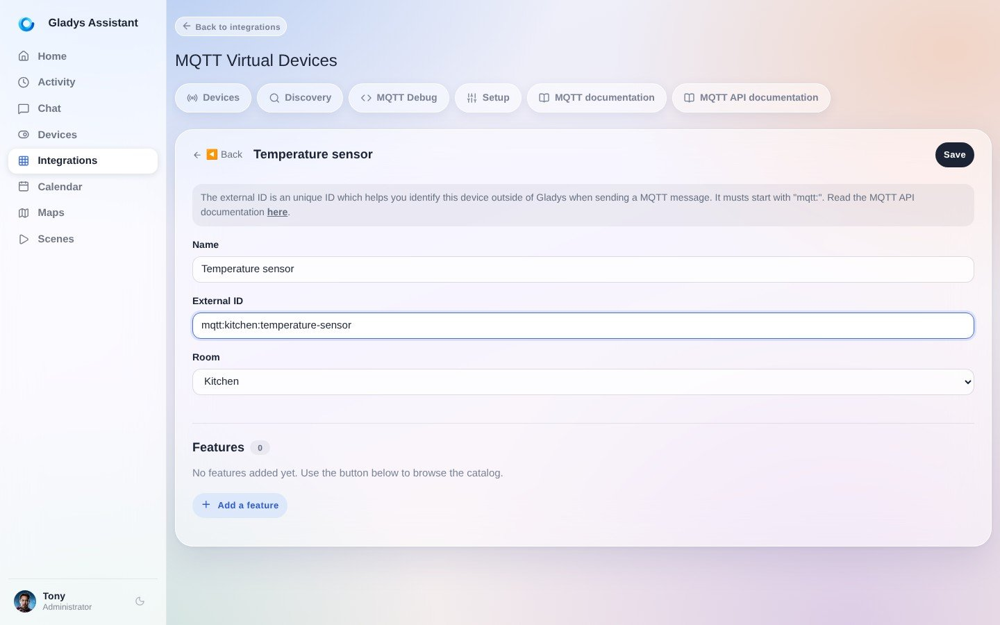
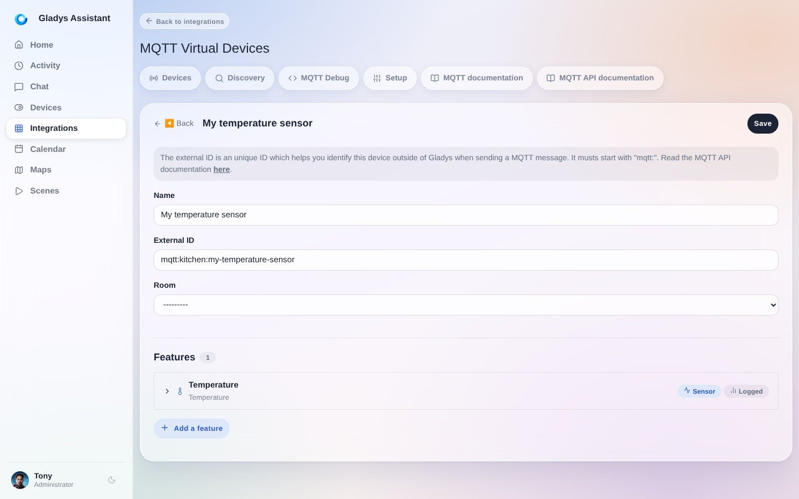
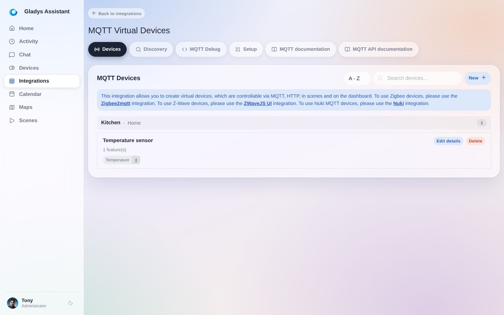
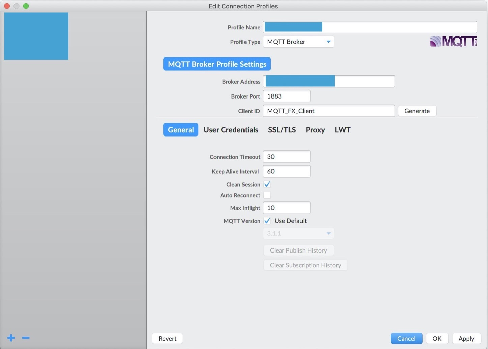
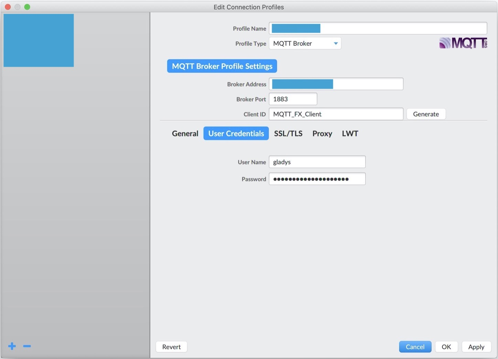
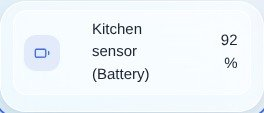

In diesem Tutorial erklären wir, wie MQTT in Gladys Assistant funktioniert.

MQTT ist ein „Publish/Subscribe“-Protokoll, das in der Hausautomation weit verbreitet ist. Es ist so beliebt, weil es sehr schlank ist und auf vielen DIY-Plattformen (Arduino, ESP8266 NodeMCU) zur Verfügung steht. Implementierungen gibt es für die meisten Programmiersprachen (JavaScript / Node.js, Python, PHP, C / C++, Java...).

Mit MQTT kannst du einen Wert von einem vernetzten Gerät **an** Gladys senden (z. B. von einem Temperatursensor, der alle 10 Minuten die Temperatur misst). Du kannst MQTT aber auch nutzen, um einen Steuerbefehl **von** Gladys an einen Aktor zu senden (z. B. den Befehl an einen Rollladenmotor, sich zu öffnen).

Gladys stellt daher eine MQTT-API in beide Richtungen bereit:

- „Gerät -> Gladys“
- „Gladys -> Gerät“

Die MQTT-API ist in der [MQTT-Dokumentation](/de/docs/api/mqtt-api) beschrieben.

## Einen MQTT-Broker in Gladys Assistant einrichten

Dieses Tutorial setzt voraus, dass du entweder (1) Gladys Assistant 4 mit dem offiziellen Raspbian-Image installiert hast, wie [hier beschrieben](/de/docs/), oder (2) Gladys mit Docker installiert hast.

Öffne zuerst in Gladys den Bereich `Integrationen` und dort die MQTT-Integration:

Wechsle dann in den Tab „Konfiguration“, um deinen MQTT-Broker einzurichten.

An dieser Stelle hast du 2 Möglichkeiten:

- ENTWEDER du lässt Gladys selbst einen MQTT-Broker starten (über Docker). Das ist die empfohlene Option, weil sie der einfachste Weg ist, MQTT in Gladys zu nutzen.
- ODER du richtest selbst einen MQTT-Broker ein (lokal oder entfernt). Das kann sinnvoll sein, wenn bereits ein MQTT-Broker auf einem Server läuft oder du einen Online-MQTT-Broker verwenden möchtest.

In diesem Tutorial nehmen wir Option 1 (Gladys startet den MQTT-Broker).

Du kannst die Erstellung des MQTT-Brokers also automatisch von Gladys durchführen lassen.

Je nach Internetverbindung und Leistung deines Rechners kann das zwischen einigen Sekunden und einigen Minuten dauern.

Mit einem Klick auf das kleine Auge siehst du das Passwort, das Gladys für deinen MQTT-Broker erzeugt hat.

Wir empfehlen dir, dieses Passwort irgendwo zu notieren.

Damit läuft ein MQTT-Broker, der mit Gladys verbunden ist!

## Ein MQTT-Gerät in Gladys anlegen

In diesem Tutorial nehmen wir als Beispiel einen Temperatursensor in der Küche, der alle 10 Minuten Temperaturwerte an Gladys sendet.

Öffne zuerst den Tab „Geräte“ der MQTT-Integration und klicke auf die Schaltfläche „Neu +“:

Fülle das Formular mit den Informationen zu deinem Gerät aus.

Zum Beispiel mit diesen Angaben:

- Name: „Temperatursensor“
- Externe ID: `mqtt:kitchen:temperature-sensor`. Sie darf keine Leerzeichen enthalten und muss mit `mqtt:` beginnen. Wir empfehlen dir, in deiner gesamten Gladys-Installation eine einheitliche Konvention zu verwenden, etwa `mqtt:raum_name:geraete_name`.
- Raum: „Küche“.

Als Nächstes fügen wir diesem Gerät Funktionen hinzu.

In Gladys kann ein „physisches“ Gerät nämlich mehrere „Funktionen“ haben. Manche Hersteller bieten „Multisensoren“ an (Temperatur/Luftfeuchtigkeit/Helligkeit ist ein Klassiker).

Suche in der Suchleiste nach „Temperatur“ und wähle „Temperatur / Temperatursensor“. Klicke auf „Funktion hinzufügen“.

Anschließend füllst du das Formular mit folgenden Angaben aus:

- Name: „Temperatur“. Dieser Name wird im Dashboard angezeigt.
- Externe ID der Funktion: `mqtt:kitchen:temperature-sensor:temperature`. Auch hier empfehlen wir eine Konvention, zum Beispiel `mqtt:raum_name:geraete_name:funktion_name`.
- Einheit: „°C“
- Minimalwert: -50 (nehmen wir an, dein Temperatursensor misst bis -50 °C)
- Maximalwert: 200 (nehmen wir an, dein Temperatursensor misst so hohe Werte!)
- Ist es ein Sensor?: Mit diesem Feld gibst du an, ob dein Gerät in Richtung „Gerät -> Gladys“ oder „Gladys -> Gerät“ arbeitet. Wählst du „Ja“, ist das Gerät „schreibgeschützt“ und sendet nur Werte an Gladys. Das ist bei unserem Temperatursensor der Fall. Wählst du „Nein“, ist das Gerät ein Aktor, den Gladys steuern kann.
- MQTT-Topic: Das ist das Topic, auf dem Gladys auf neue Werte für dieses Gerät „lauscht“. Wir empfehlen dir, es für später irgendwo zu kopieren.

Klicke auf „Speichern“. Du solltest nun einen Bildschirm wie diesen sehen:

## Das MQTT-Gerät testen

Wir empfehlen dir, dieses MQTT-Gerät mit einem MQTT-Client zu testen.

Du kannst zum Beispiel den MQTT-Client [MQTT X](https://mqttx.app/) verwenden.

Installiere und starte die Software und klicke dann auf „New connection“.

Fülle das Formular mit folgenden Angaben aus:

- Name: „MQTTGladys“. Dieser Name dient nur zur Anzeige in der Software.
- Host: Die IP-Adresse deines Raspberry Pi im Netzwerk. Für dieses Tutorial musst du dich im selben Netzwerk wie dein Raspberry Pi befinden.
- Port: 1883
- Username: `gladys`
- Password: Das Passwort, das Gladys im ersten Teil dieses Tutorials erzeugt hat.

:::note
Falls du das Passwort nicht notiert hast, findest du es wieder, indem du zur Konfiguration des MQTT-Moduls zurückkehrst und auf das kleine Auge im Passwortfeld klickst.
:::

Speichere die Konfiguration mit einem Klick auf „Connect“.

Trage in der unteren Leiste das MQTT-Topic ein, das du beim Anlegen der Funktion kopiert hast.

Gib im unteren Feld eine Temperatur ein, hier „21.2“, und klicke auf „Publish“:

Füge im Dashboard eine neue Box „Geräte im Raum“ hinzu und wähle deinen Raum aus.

Du solltest dein Gerät mit der gerade gesendeten Temperatur sehen:

Bravo!

## Weiterführende Informationen

Wenn du ein Programm schreiben möchtest, das Daten an deinen MQTT-Broker sendet: MQTT-Bibliotheken gibt es für alle Sprachen.

In Node.js kannst du zum Beispiel das [npm-Paket mqtt](https://www.npmjs.com/package/mqtt) verwenden.

Im Internet findest du jede Menge Tutorials für alle Plattformen :)
