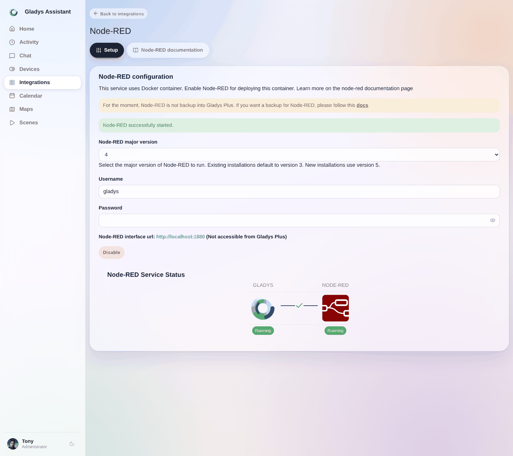
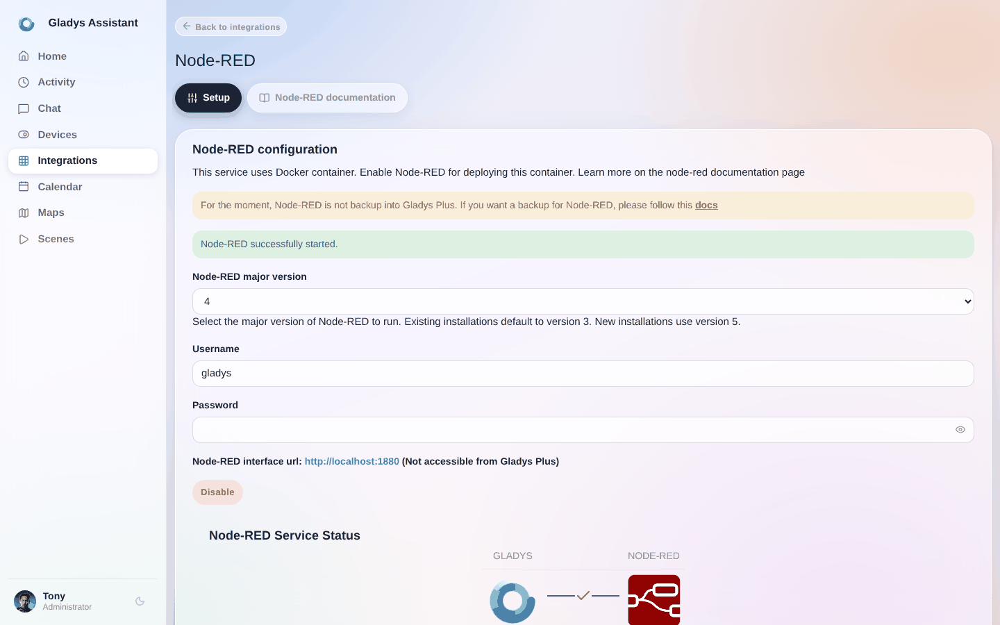
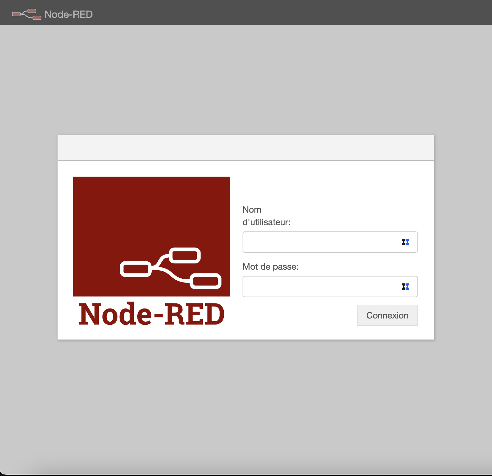
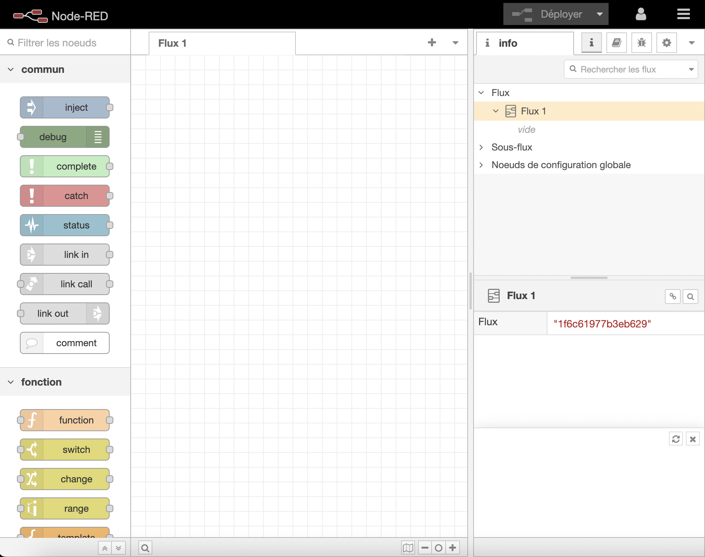

In diesem Tutorial zeigen wir dir, wie du [Node-RED](https://nodered.org/) in Gladys Assistant integrierst.

Damit kannst du Hardware-Geräte, APIs und Online-Dienste miteinander verbinden.

## Node-RED aktivieren

Öffne in Gladys `Integrationen / Node-RED`.

Gladys muss einen Container installieren. Keine Sorge, alles ist automatisiert.

Öffne den Bereich `Konfiguration` und klicke auf die Schaltfläche **Aktivieren**. Nach kurzer Zeit (die Dauer hängt von deinem Raspberry-Pi-Modell und deiner Bandbreite ab) solltest du alle initialisierten Elemente und die Verbindungen dazwischen in Grün sehen.

## Mit Node-RED verbinden

Du kannst die Node-RED-Oberfläche öffnen, indem du auf den Link klickst.
:warning: Achtung, der Link ist über Gladys Plus nicht erreichbar

Du landest auf deiner lokalen Node-RED-Instanz.

Zum Anmelden verwendest du die Zugangsdaten, die im Bereich `Konfiguration` angezeigt werden.

## Verwendung

Jetzt kannst du deine Node-RED-Flows erstellen

## Node-RED außerhalb von Gladys installieren

Wenn du Node-RED lieber selbst starten möchtest, folge unserem [Blogartikel hier](/de/blog/integrate-node-red-with-gladys-assistant-in-mqtt/).
