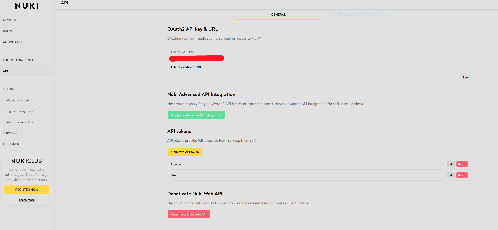
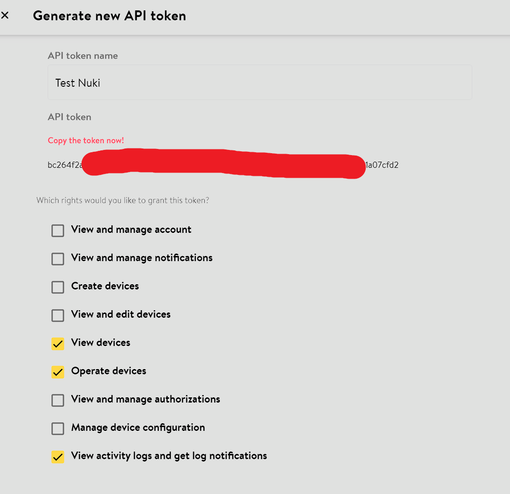
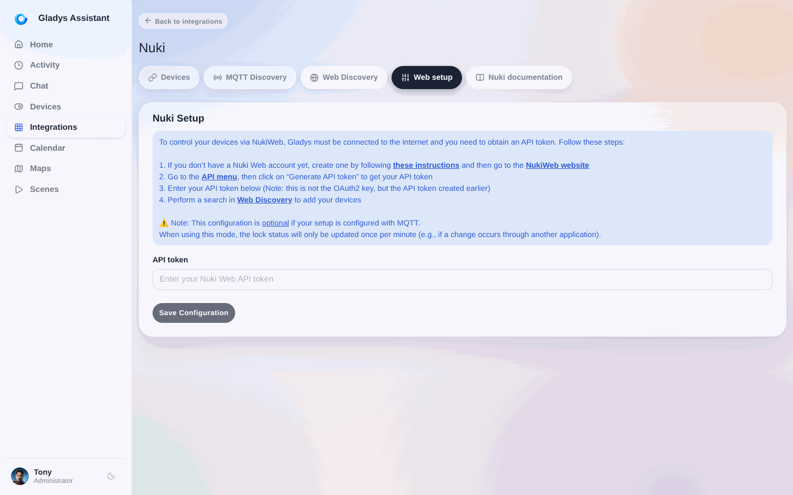
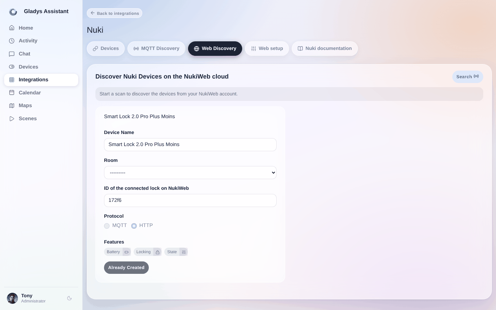
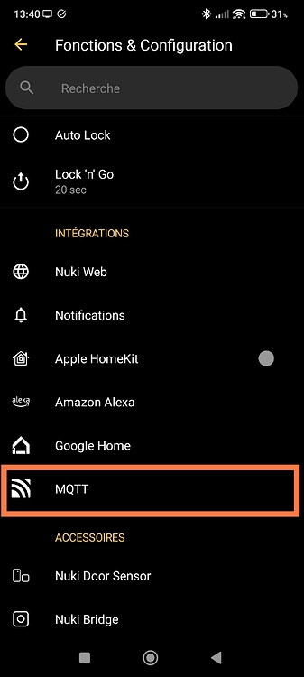
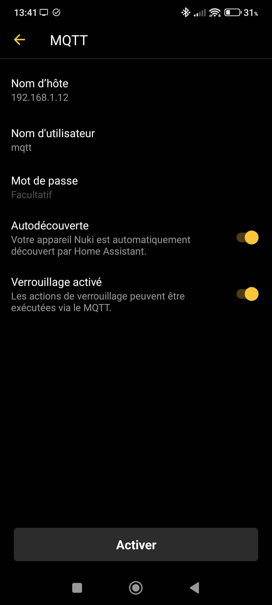
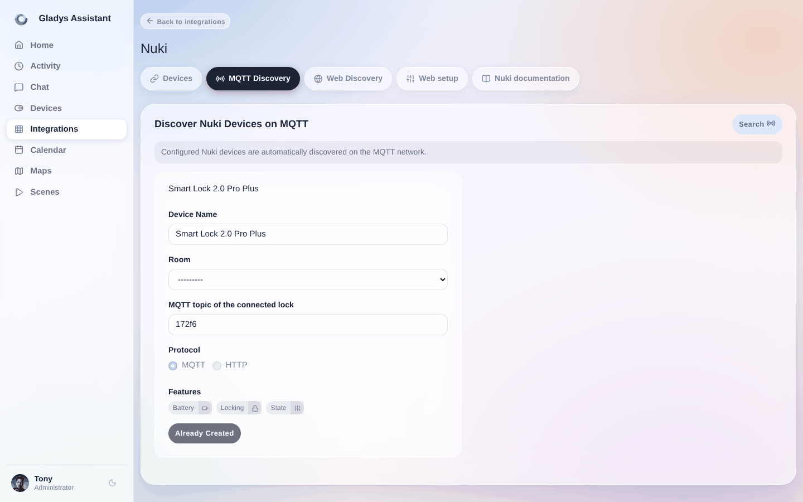
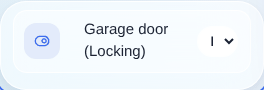

# Integration deines smarten Nuki-Schlosses in Gladys
Mit dieser Integration kannst du:
-   smarte Schlösser der Marke Nuki steuern: verriegeln, entriegeln
-   bestimmte Informationen an Gladys übermitteln (Batteriestand, Schlossstatus)  

Öffne in Gladys `Integrationen / Nuki`  
Es stehen zwei Arten der Integration zur Verfügung. Wir empfehlen, nur eine der beiden zu wählen.

## NukiWeb-API-Token

_Voraussetzung: Gladys muss jederzeit Internetzugang haben_

1. Aktiviere und konfiguriere dein Nuki-Web-Konto: [Nuki-Web-Konfiguration](https://help.nuki.io/hc/fr/articles/360016485718-Activer-et-d%C3%A9sactiver-un-compte-Nuki-Web#:~:text=Activez%20Nuki%20Web%20dans%20l,dans%20l'App%20de%20Nuki.)
  

  

2. Konfiguriere den Nuki-Dienst in Gladys, indem du das API-Token einträgst  

3. Führe einen HTTP-Scan durch  

  

## MQTT
_Voraussetzung: MQTT ist in Gladys eingerichtet und funktioniert_

1. Konfiguriere MQTT in der Nuki-App (verwende die lokale IP des MQTT-Brokers, nicht den Domainnamen): [Nuki-MQTT-Konfiguration](https://help.nuki.io/hc/fr/articles/14052016143249-Activation-et-configuration-via-l-App-Nuki)  
  

2. Öffne in Gladys direkt den Bereich zur Nuki-MQTT-Erkennung, um deine Geräte zu sehen  

Jetzt musst du nur noch das Dashboard konfigurieren:  

