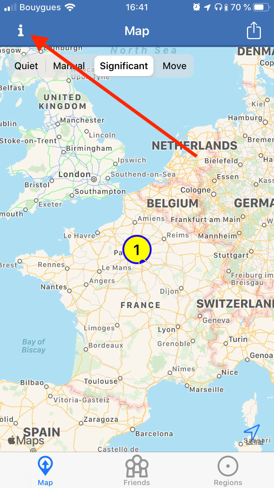
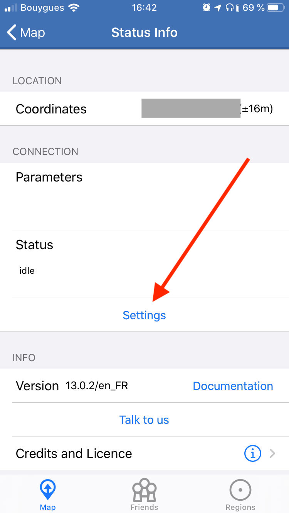
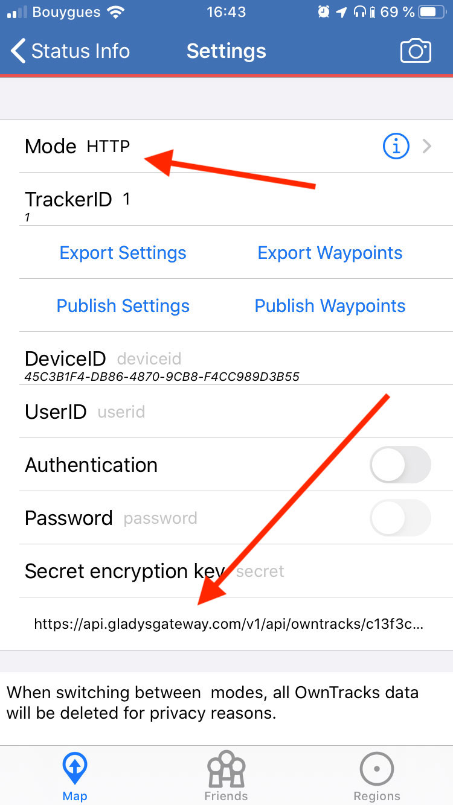

[Owntracks](https://owntracks.org/) ist eine Open-Source-App für Smartphones, die den Standort des Telefons regelmäßig an einen Server sendet.

Mit Gladys Plus kannst du Owntracks-Nachrichten empfangen und daraus Standorte in Gladys erstellen.

### Owntracks herunterladen

Lade zuerst Owntracks für iOS oder Android herunter.

### Einen API-Schlüssel in Gladys Plus erstellen

Öffne [plus.gladysassistant.com](https://plus.gladysassistant.com/) und melde dich an.

Gehe dann zu „Einstellungen“ => „Open API“ und erstelle einen Schlüssel.

### Owntracks einrichten

Klicke auf die Schaltfläche oben links:



Klicke auf „Settings“:



Wähle „HTTP“ und gib im Feld „URL“ Folgendes ein:

```
https://api.gladysgateway.com/v1/api/owntracks/[YOUR-API-KEY]
```

Fülle die Felder `UserID` und `DeviceID` mit Begriffen deiner Wahl aus (sie sind Pflichtfelder).

Ich habe „iphone“ als `DeviceID` und „pierre-gilles“ als `UserID` eingetragen.

Gladys erkennt anhand des API-Schlüssels, wer die Anfrage sendet.



### Deinen Standort in Gladys sehen

Deinen Standort solltest du jetzt in Gladys im Tab „Karten“ sehen.
