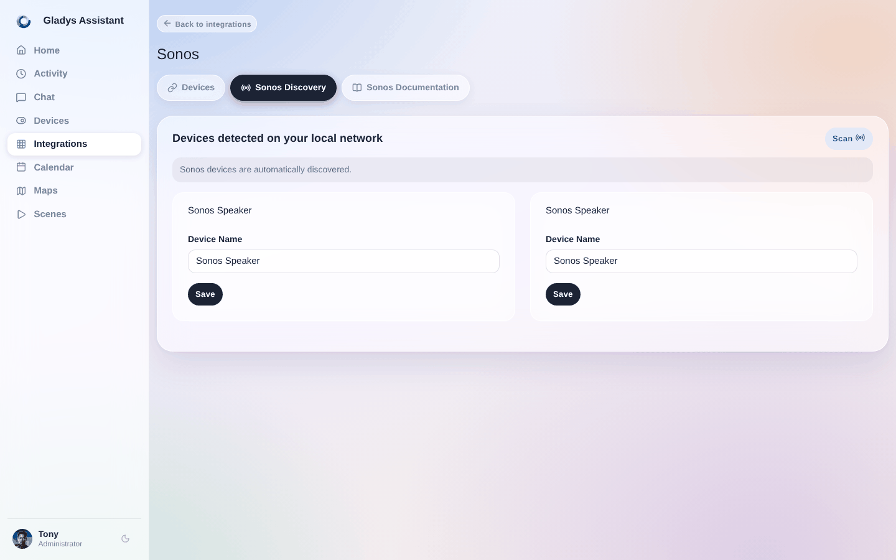
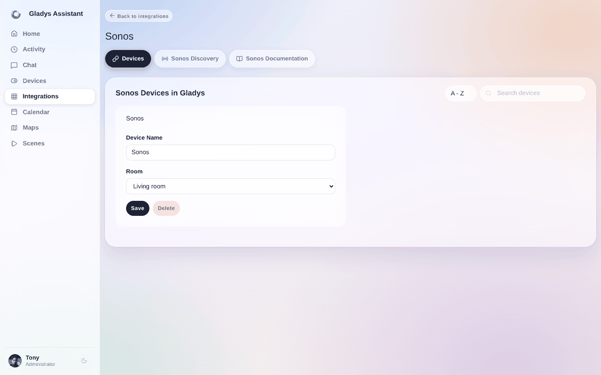
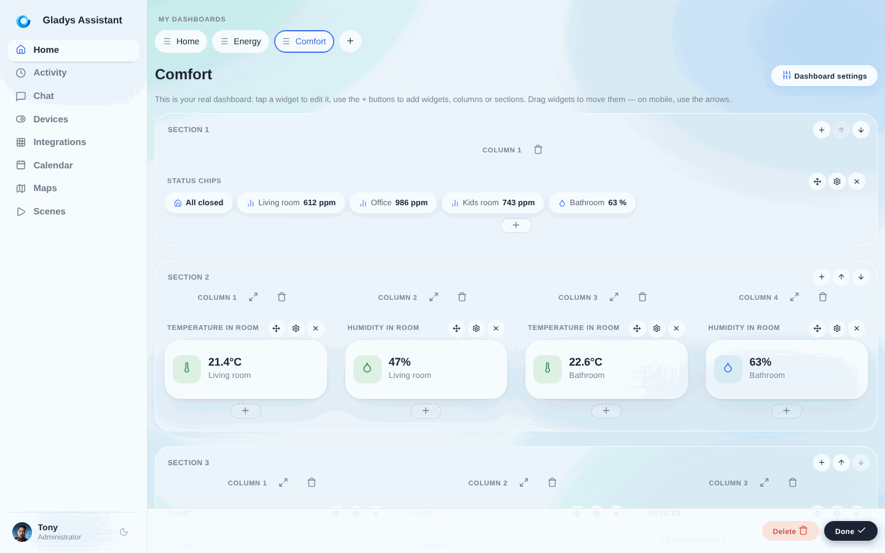
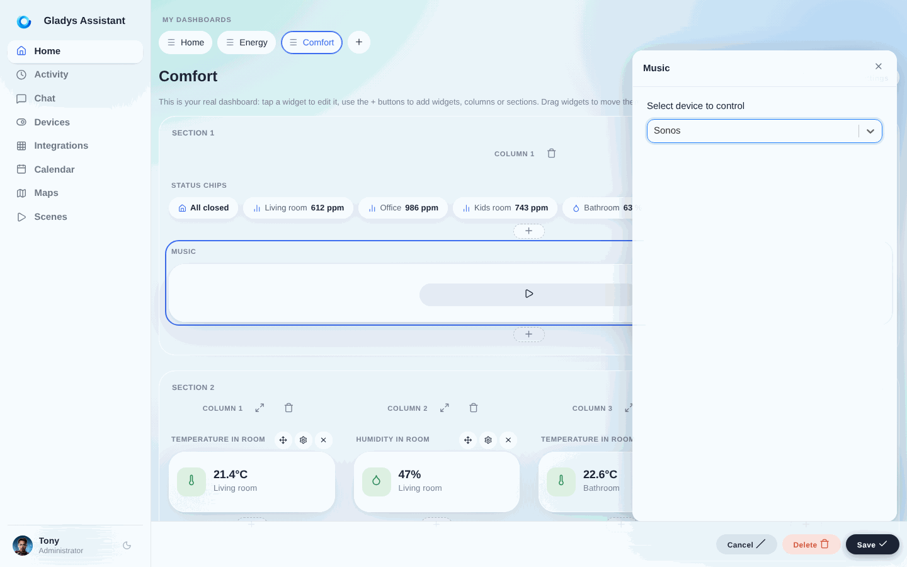

## Voraussetzungen

Du brauchst die Sonos-App, um deine Sonos-Lautsprecher einzurichten (Sonos Play 1, Sonos One, Sonos Playbar, Sonos Sub, Sonos Port, ...)

- [Sonos für Android](https://play.google.com/store/apps/details?id=com.sonos.acr2&hl=fr&gl=US)
- [Sonos für Apple](https://apps.apple.com/fr/app/sonos/id1488977981)

Wenn du in der Sonos-App eine Lautsprechergruppe erstellst, wird diese Gruppe in Gladys als ein einzelner Lautsprecher erkannt. Wenn du einen Sonos Port hast, wird er ebenfalls von der Integration erkannt.

## Einen Lautsprecher in Gladys hinzufügen

Nachdem du deine Lautsprecher in der Sonos-App hinzugefügt hast, kehre zu Gladys zurück:

1. öffne in Gladys die Seite `Integrationen -> Sonos`
2. wähle das Menü `Sonos-Erkennung`

   

3. klicke oben rechts auf den Button `Scannen` (falls das Gerät noch nicht in der Liste ist)
4. klicke schließlich bei den Lautsprechern, die du in Gladys einbinden möchtest, auf `Speichern`
5. fertig!

## Einen Lautsprecher umbenennen / einem Raum zuordnen

Bei Bedarf kannst du im Menü `Geräte` die Konfiguration deiner Lautsprecher anpassen oder ergänzen, indem du sie einem Raum zuordnest oder umbenennst.

## Musik über das Dashboard steuern

Jetzt kannst du deinem Dashboard ein **Musik-Widget** hinzufügen und deine Sonos-Lautsprecher mit dem Musikplayer steuern.

Gehe zum Gladys-Dashboard und klicke auf den Button `Bearbeiten`, um das Dashboard zu ändern.

Klicke auf `Hinzufügen +` und wähle dann das Widget `Musik` – du kannst es in eine Spalte verschieben.

Wähle deinen Lautsprecher aus und klicke auf `Speichern`.

Das war's! Dein Widget ist jetzt auf dem Dashboard sichtbar.

Wenn du Hilfe brauchst, schreib gerne einen Beitrag im [Forum](https://en-community.gladysassistant.com).
