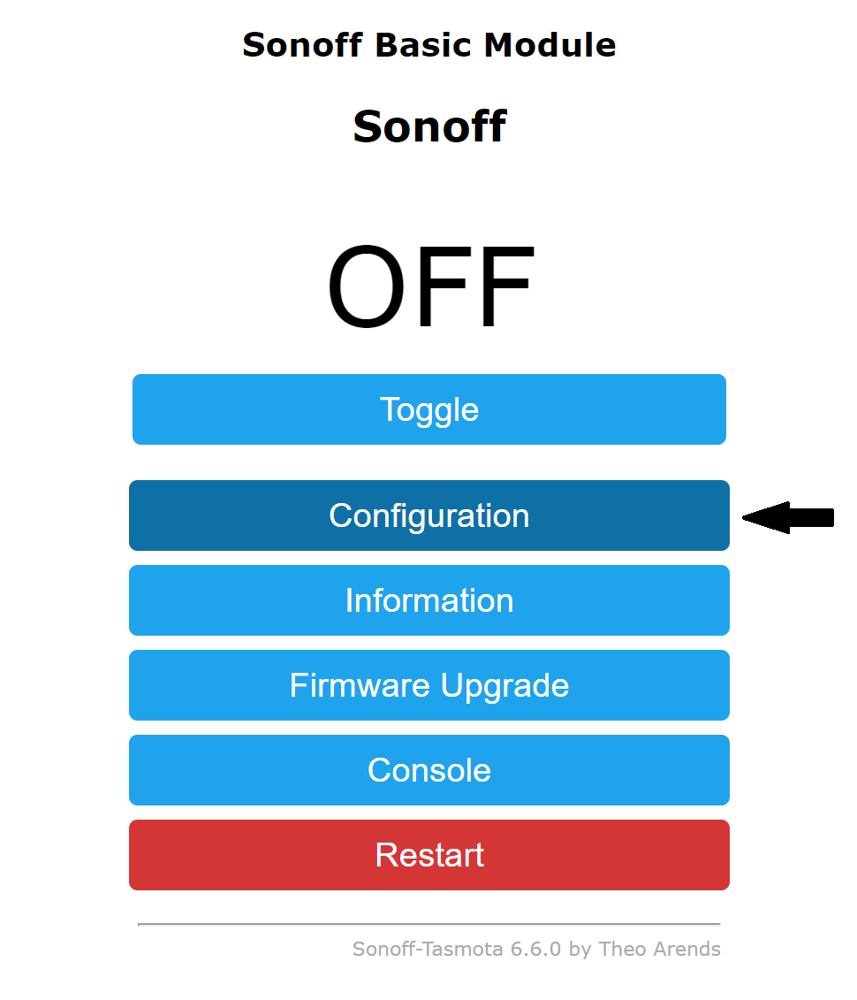
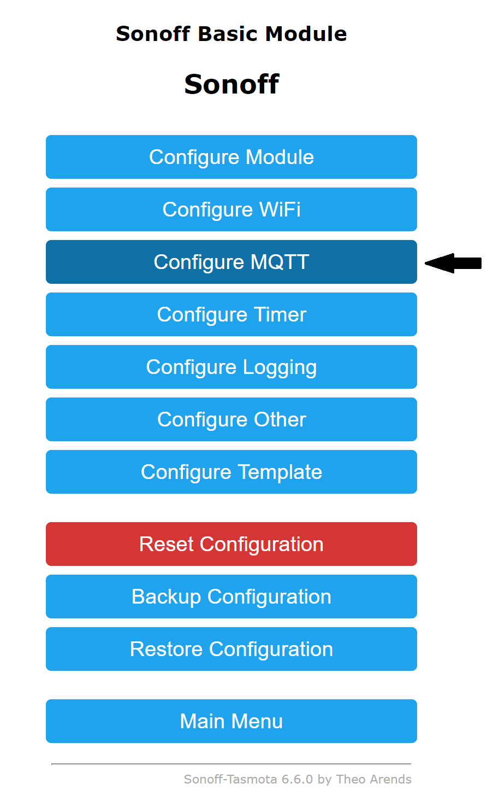
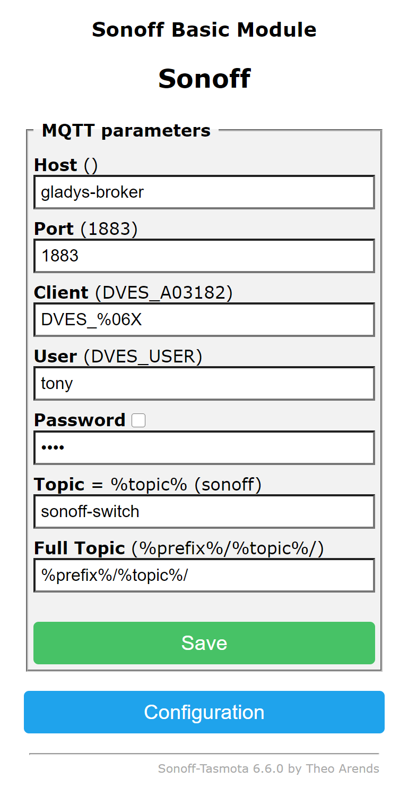

import JsonLd from '@site/src/components/seo/JsonLd';

[Tasmota](https://tasmota.github.io/docs/) ist eine kostenlose Open-Source-Firmware für Geräte auf Basis von ESP8266, ESP8285 und ESP32. Sie ersetzt die Cloud-Firmware des Herstellers auf smarten Steckdosen, Schaltern, Lampen und Sensoren, sodass diese **komplett lokal** laufen, ohne Herstellerkonto und ohne Abhängigkeit vom Internet, und stellt sie über MQTT, HTTP oder die serielle Schnittstelle bereit.

Da Tasmota einfaches MQTT spricht, passt es perfekt zu Gladys Assistant: Nach dem Flashen werden deine Geräte lokal in deinem eigenen Netzwerk erkannt und gesteuert, ohne Umweg über eine Drittanbieter-Cloud.

Um ein Tasmota-Gerät mit Gladys zu verbinden, sind drei Schritte nötig:

- dein Gerät mit der Tasmota-Firmware flashen
- MQTT auf dem Gerät einrichten
- es in Gladys unter `Integrationen / Tasmota` hinzufügen

## Warum Tasmota mit Gladys verwenden?

- **Vollständig lokal und privat**: Das Gerät „telefoniert“ nicht mehr zu den Servern des Herstellers nach Hause. Es kommuniziert nur noch mit deinem lokalen MQTT-Broker und Gladys.
- **Keine Cloud, kein Abo**: Tasmota ist kostenlos und Open Source und funktioniert auch dann weiter, wenn der ursprüngliche Hersteller seinen Dienst einstellt.
- **Günstige Hardware weiterverwenden**: Viele preiswerte smarte Steckdosen und Schalter (Sonoff und andere ESP-basierte Geräte) lassen sich neu flashen, statt sie wegzuwerfen.
- **Zuverlässig und schnell**: Lokale Befehle hängen nicht von deiner Internetverbindung ab, deine Automatisierungen laufen also sofort.

:::tip[Tasmota oder Zigbee?]
Tasmota läuft auf WLAN-Geräten, jedes davon verbindet sich also direkt mit deinem Router – praktisch für ein paar Steckdosen und Schalter mit Netzstrom. Für batteriebetriebene Sensoren und viele Geräte passt ein stromsparendes [Zigbee](./zigbee2mqtt.md)-Mesh meist besser. Beide arbeiten lokal, beide funktionieren hervorragend mit Gladys, und du kannst sie kombinieren. Wenn du dich für Zigbee entscheidest, wirf einen Blick in unseren [Kaufratgeber für Zigbee-Dongles](/de/best-zigbee-dongle/).
:::

## Dein Gerät mit Tasmota flashen

Am einfachsten installierst du Tasmota mit dem offiziellen **Web-Installer**: [tasmota.github.io/install](https://tasmota.github.io/install/). Er flasht dein Gerät direkt aus einem Chrome- oder Edge-Browser über USB (mithilfe der WebSerial-API), ohne dass du zusätzliche Software installieren musst.

Er unterstützt alle Geräte auf Basis von Espressif ESP8266, ESP8285, ESP32, ESP32-S und ESP32-C3.

Muss dein Gerät manuell geflasht werden, folge der [Tasmota-Installationsanleitung](https://tasmota.github.io/docs/Getting-Started/). Im Netz gibt es viele gerätespezifische Anleitungen; die passende für dein Modell findest du, wenn du nach seinem Namen plus „Tasmota“ suchst.

## MQTT auf dem Gerät einrichten

Öffne nach dem Flashen die Weboberfläche des Geräts (seine IP-Adresse in deinem Netzwerk) und richte MQTT ein, wie in der [Tasmota-MQTT-Dokumentation](https://tasmota.github.io/docs/MQTT/) beschrieben.

Klicke auf das Menü `Configuration`.

Klicke auf das Menü `Configure MQTT`.

Fülle dann das Konfigurationsformular mit den Daten deines MQTT-Brokers aus:

- `Host`: URL des MQTT-Brokers
- `Port`: Port des MQTT-Brokers
- `User`: Benutzer für die Verbindung zum MQTT-Broker
- `Password`: Passwort für die Verbindung zum MQTT-Broker
- `Topic`: eine eindeutige Kennung für dieses Gerät

:::note
Gladys bringt einen eigenen MQTT-Broker mit. Falls du noch keinen eingerichtet hast, installiere zuerst die [MQTT-Integration](./mqtt.md) in Gladys und richte deine Tasmota-Geräte dann darauf aus.
:::

## Das Gerät zu Gladys hinzufügen

Sobald das Gerät eingerichtet ist, kehre zu Gladys zurück:

1. öffne die Seite `Integrationen -> Tasmota`
2. wähle das Menü `MQTT-Erkennung`
3. klicke auf den Button `Scannen` (falls das Gerät noch nicht aufgelistet ist)
4. klicke dann auf `Speichern`
5. und voilà!

Dein Tasmota-Gerät lässt sich jetzt über Gladys steuern, in deine Dashboards einbinden und in deinen [Szenen](/de/docs/scenes/intro/) verwenden – alles lokal.

## Häufige Fragen

### Ist Tasmota mit Gladys Assistant kompatibel?

Ja. Tasmota kommuniziert über MQTT, und Gladys hat eine native Tasmota-Integration, die Tasmota-Geräte in deinem lokalen Netzwerk erkennt und steuert. Du flashst einfach die Firmware, richtest MQTT auf dem Gerät ein und suchst es unter `Integrationen / Tasmota`.

### Funktioniert Tasmota ohne Cloud oder Internet?

Ja. Genau darum geht es bei Tasmota: Es ersetzt die Cloud-Firmware des Herstellers durch lokale Steuerung über MQTT und HTTP. Nach dem Flashen und dem Einbinden in Gladys funktioniert dein Gerät komplett in deinem lokalen Netzwerk, auch ohne Internetverbindung.

### Auf welchen Geräten läuft Tasmota?

Jedes Gerät mit einem Espressif-Chip vom Typ ESP8266, ESP8285, ESP32, ESP32-S oder ESP32-C3 kann mit Tasmota geflasht werden. Dazu gehören viele smarte Steckdosen, Schalter, Relais, Lampen und Sensoren (zum Beispiel etliche Sonoff-Geräte).

### Wie flashe ich Tasmota?

Am einfachsten geht es mit dem offiziellen Web-Installer unter tasmota.github.io/install, der dein Gerät direkt aus einem Chrome- oder Edge-Browser über USB flasht, ohne dass du Software installieren musst. Manuelles Flashen nach der Tasmota-Installationsanleitung ist ebenfalls möglich.

### Brauche ich für Tasmota einen separaten MQTT-Broker?

Du brauchst einen MQTT-Broker, aber Gladys bringt einen mit. Installiere die MQTT-Integration in Gladys und trage diesen Broker in den MQTT-Einstellungen deiner Tasmota-Geräte ein. Gladys erkennt sie dann automatisch.

<JsonLd
  data={{
    "@context": "https://schema.org",
    "@type": "FAQPage",
    mainEntity: [
      {
        "@type": "Question",
        name: "Ist Tasmota mit Gladys Assistant kompatibel?",
        acceptedAnswer: {
          "@type": "Answer",
          text: "Ja. Tasmota kommuniziert über MQTT, und Gladys hat eine native Tasmota-Integration, die Tasmota-Geräte in deinem lokalen Netzwerk erkennt und steuert. Du flashst die Firmware, richtest MQTT auf dem Gerät ein und suchst es dann unter Integrationen / Tasmota.",
        },
      },
      {
        "@type": "Question",
        name: "Funktioniert Tasmota ohne Cloud oder Internet?",
        acceptedAnswer: {
          "@type": "Answer",
          text: "Ja. Tasmota ersetzt die Cloud-Firmware des Herstellers durch lokale Steuerung über MQTT und HTTP. Nach dem Flashen und dem Einbinden in Gladys funktioniert dein Gerät komplett in deinem lokalen Netzwerk, auch ohne Internetverbindung.",
        },
      },
      {
        "@type": "Question",
        name: "Auf welchen Geräten läuft Tasmota?",
        acceptedAnswer: {
          "@type": "Answer",
          text: "Jedes Gerät mit einem Espressif-Chip vom Typ ESP8266, ESP8285, ESP32, ESP32-S oder ESP32-C3 kann mit Tasmota geflasht werden. Dazu gehören viele smarte Steckdosen, Schalter, Relais, Lampen und Sensoren, zum Beispiel etliche Sonoff-Geräte.",
        },
      },
      {
        "@type": "Question",
        name: "Wie flashe ich Tasmota?",
        acceptedAnswer: {
          "@type": "Answer",
          text: "Am einfachsten geht es mit dem offiziellen Web-Installer unter tasmota.github.io/install, der dein Gerät direkt aus einem Chrome- oder Edge-Browser über USB flasht, ohne dass du Software installieren musst. Manuelles Flashen nach der Tasmota-Installationsanleitung ist ebenfalls möglich.",
        },
      },
      {
        "@type": "Question",
        name: "Brauche ich für Tasmota einen separaten MQTT-Broker?",
        acceptedAnswer: {
          "@type": "Answer",
          text: "Du brauchst einen MQTT-Broker, aber Gladys bringt einen mit. Installiere die MQTT-Integration in Gladys und trage diesen Broker in den MQTT-Einstellungen deiner Tasmota-Geräte ein, dann erkennt Gladys sie automatisch.",
        },
      },
    ],
  }}
/>
