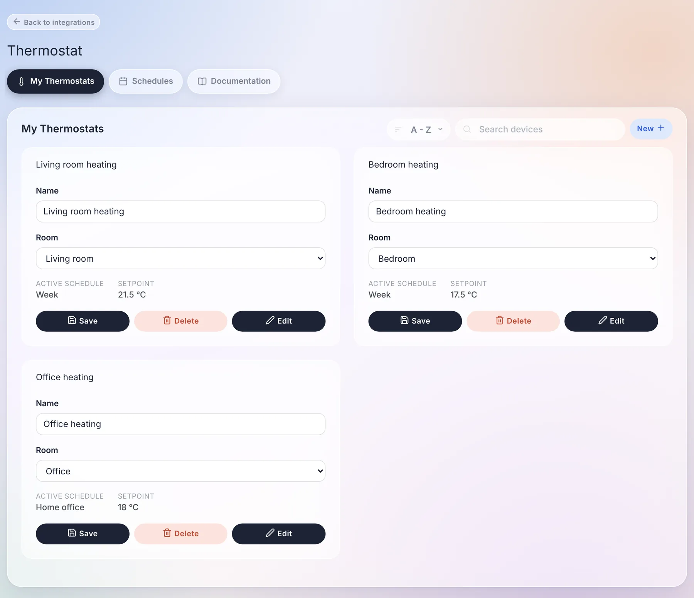
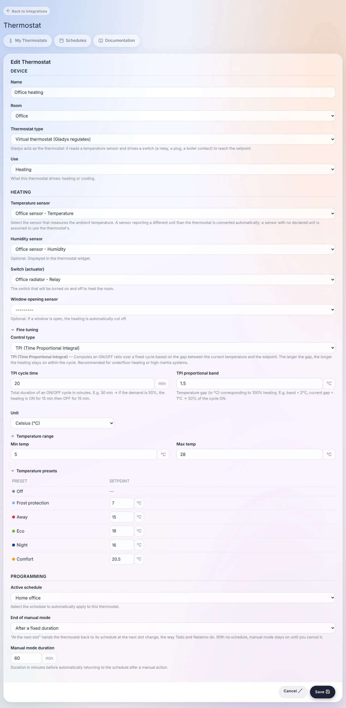
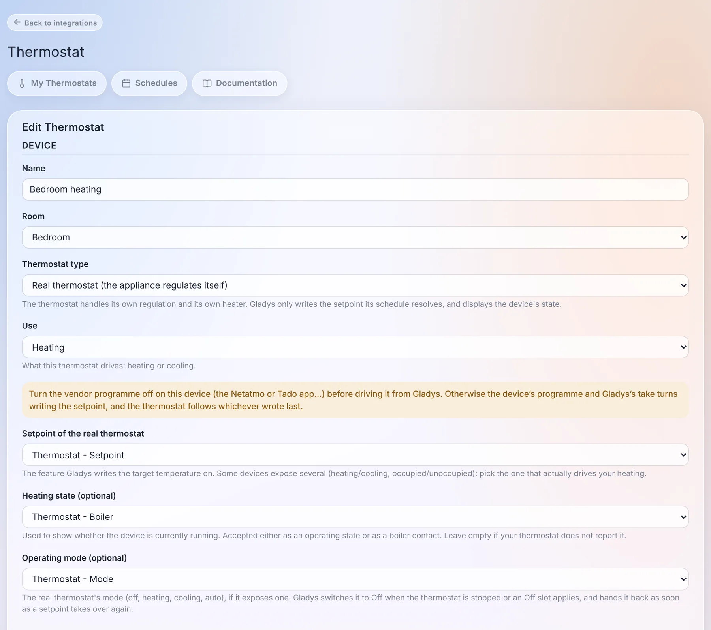
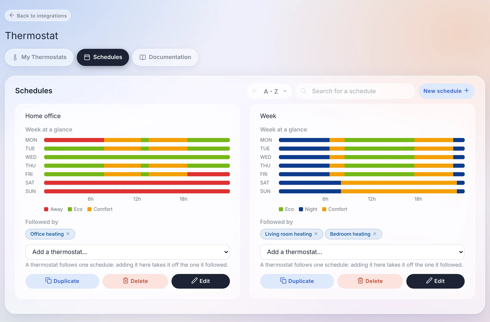
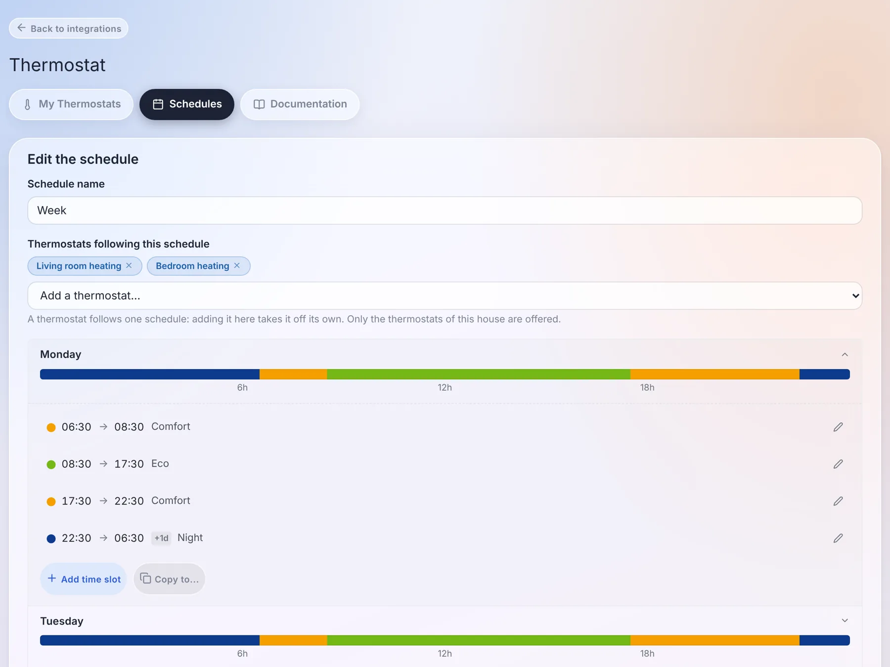

Die Integration „Thermostat“ kann zwei Dinge, verfügbar seit Gladys Assistant 5.2:

- **Gladys wird zum Thermostat.** Ein Temperatursensor und ein Schalter (ein Relais, eine smarte Steckdose, ein Heizkesselkontakt) reichen für eine geregelte Heizzone: Gladys liest die Temperatur und schaltet die Heizung ein und aus, um den Sollwert zu erreichen.
- **Gladys programmiert die Thermostate, die du schon hast.** Ein Netatmo, ein Zigbee-Heizkörperthermostat, ein Matter- oder MQTT-Thermostat regelt sich sehr gut selbst: Gladys schreibt seinen Sollwert nach einem Wochenplan, direkt neben dem Rest deines Zuhauses.

In beiden Fällen bekommst du dasselbe: Voreinstellungen (Frostschutz, Abwesend, Eco, Nacht, Komfort), Wochenpläne pro Haus, ein Dashboard-Widget und Gerätefunktionen, die Szenen, die KI und die Sprachassistenten lesen und schreiben können.

Alles läuft lokal, ohne Cloud.

## Ein Thermostat anlegen

Öffne `Integrationen / Thermostat`, Reiter „Meine Thermostate“, und klicke auf „Neu“.

Gib dem Thermostat einen Namen und einen Raum und wähle dann seinen **Typ**.

### Virtuelles Thermostat (Gladys regelt)

Gladys übernimmt die Rolle des Thermostats. Du brauchst:

- einen **Temperatursensor**, der die Raumtemperatur misst. Ein Sensor, der eine andere Einheit als das Thermostat meldet (°F und °C), wird automatisch umgerechnet;
- einen **Schalter (Aktor)**: das Relais, die Steckdose oder den Heizkesselkontakt, der die Heizung ein- und ausschaltet;
- optional einen **Feuchtigkeitssensor**, der im Widget angezeigt wird;
- optional einen **Fensterkontakt**: Wenn das Fenster aufgeht, wird die Heizung sofort abgeschaltet und läuft wieder an, wenn es geschlossen wird.

Unter „Feineinstellung“ wählst du, wie Gladys regelt:

- **Hysterese** (Standard): Die Heizung schaltet sich unter dem Sollwert minus Einschaltschwelle ein und über dem Sollwert plus Ausschaltschwelle aus. Bei einem Sollwert von 21 °C und Schwellen von 0,5 °C schaltet sie sich unter 20,5 °C ein und über 21,5 °C aus.
- **TPI** (Time Proportional Integral): Über einen festen Zyklus (standardmäßig 30 Minuten) bleibt die Heizung für einen Anteil des Zyklus eingeschaltet, der proportional zur Abweichung vom Sollwert ist. Je weiter der Raum vom Sollwert entfernt ist, desto länger heizt sie. Das vermeidet das Überschwingen träger Heizkörper.

### Echtes Thermostat (das Gerät regelt selbst)

Dein Thermostat regelt bereits selbst: Gladys schreibt nur den Sollwert aus ihrem Zeitplan und zeigt den Zustand des Geräts an. Du wählst:

- den **Sollwert des echten Thermostats**: die Funktion, auf die Gladys die Zieltemperatur schreibt. Manche Geräte bieten mehrere an (Heizen / Kühlen, anwesend / abwesend): Wähle diejenige, die deine Heizung tatsächlich steuert;
- den **Heizzustand** (optional), um im Widget anzuzeigen, ob das Gerät heizt. Ein Betriebszustand und ein Heizkesselkontakt funktionieren beide;
- den **Betriebsmodus** (optional), falls das Thermostat einen hat: Gladys schaltet ihn auf Aus, wenn das Thermostat gestoppt wird, und stellt ihn wieder her, sobald ein Sollwert übernimmt.

:::warning
Schalte das Herstellerprogramm auf dem Gerät ab (Netatmo-, Tado-App …), bevor du es über Gladys steuerst. Sonst schreiben das Programm des Geräts und das von Gladys abwechselnd den Sollwert, und das Thermostat folgt dem, der zuletzt geschrieben hat.
:::

Wenn du den Sollwert direkt am Gerät änderst (am Drehrad, in der App), sieht Gladys das und behandelt es als manuelle Änderung: Sie überschreibt sie nicht eine Minute später.

### Gemeinsame Einstellungen beider Typen

- **Verwendung**: Heizen oder Kühlen (zum Beispiel eine Klimaanlage).
- **Einheit** (°C oder °F) und **Temperaturbereich** des Drehrads. Bei einem echten Thermostat bietet Gladys an, den vom Gerät angegebenen Bereich zu übernehmen.
- **Temperatur-Voreinstellungen**: der Sollwert jeder Voreinstellung. Standardmäßig Frostschutz 7 °C, Abwesend 16 °C, Eco 18 °C, Nacht 17 °C und Komfort 21 °C.
- **Aktiver Zeitplan**: der Wochenplan, dem dieses Thermostat folgt.
- **Ende des manuellen Modus**: Wenn du die Temperatur von Hand änderst, nach welcher Zeit der Zeitplan wieder übernimmt. „Beim nächsten Zeitfenster des Zeitplans“ (Standard, wie bei Tado und Netatmo) oder „Nach einer festen Dauer“ in Minuten. Ohne Zeitplan bleibt eine manuelle Änderung bestehen, bis du sie wieder änderst, wie bei einem klassischen Thermostat.

## Die Wochenpläne

Klicke im Reiter „Zeitpläne“ auf „Neuer Zeitplan“.

Ein Zeitplan gehört zu einem **Haus**: Mit zwei Häusern hat jedes seine eigenen Zeitpläne, und zwei Häuser können jeweils ihre eigene „Woche“ haben. Füge für jeden Tag Zeitfenster hinzu („Zeitfenster hinzufügen“) mit Beginn, Ende und Voreinstellung. Ein Zeitfenster darf über Mitternacht gehen: Eine Nacht von 22:30 bis 06:30 ist ein einziges Zeitfenster, markiert mit „+1T“.

Ein paar Regeln machen das Bearbeiten einfach:

- **„Kopieren nach...“** kopiert einen Tag auf andere Tage: Lege den Montag an und kopiere ihn auf die ganze Woche.
- **Ein Zeitfenster hinzuzufügen schlägt nie fehl**: Das neue Zeitfenster nimmt seinen Platz ein und verkürzt oder teilt die Zeitfenster, die es überdeckt.
- **Ein Zeitfenster zu löschen verlängert das vorherige**: Das schaltet die Heizung nie ab. Um die Heizung für einen Zeitraum abzuschalten, nutze die Voreinstellung **Aus**.
- **Ein Tag ohne eigenes Zeitfenster behält die letzte Voreinstellung des Vortags.** Ein Zeitplan, dessen einziger Punkt Freitagabend „Abwesend“ ist, bleibt das ganze Wochenende auf Abwesend. Die Balken des Editors zeigen es genau so, wie es angewendet wird.

Füge unter „Thermostate, die diesem Zeitplan folgen“ die Thermostate des Hauses hinzu, die ihm folgen sollen. Ein Thermostat folgt immer nur einem Zeitplan: Fügst du es einem Zeitplan hinzu, wird es aus dem entfernt, dem es bisher gefolgt ist.

Die Uhrzeiten sind die deines Hauses, in der Zeitzone, die unter `Einstellungen / System` eingestellt ist.

## Das Dashboard-Widget

Füge auf deinem Dashboard ein Widget „Thermostat“ hinzu und wähle das Thermostat aus.

Das Widget zeigt die Raumtemperatur (und die Luftfeuchtigkeit), groß den Sollwert und einen Schein, wenn das Gerät heizt. Du kannst:

- am Rad drehen oder **+** und **−** nutzen, um den Sollwert zu ändern: Das ist eine manuelle Änderung, die bis zum eingestellten Ende gilt;
- in der Leiste unten eine **Voreinstellung** wählen: Aus, Frostschutz, Abwesend, Eco, Nacht oder Komfort. Bei einem Thermostat mit Zeitplan gilt die Voreinstellung bis zum nächsten Zeitfenster, danach übernimmt wieder der Zeitplan;
- im Banner lesen, was das Thermostat gerade tut: „Komfort bis 22:30“, wenn es seinem Zeitplan folgt, „Manueller Modus“ bei einer von Hand eingestellten Temperatur, „Fenster offen — Heizung ausgesetzt“, wenn ein Fenster offen ist. Das ✕ im Banner hebt den manuellen Modus auf.

## In deinen Szenen

Ein Thermostat dieser Integration ist ein Gerät wie jedes andere, mit einem **Sollwert**, einer **Voreinstellung** und einem **Modus**. Mit der Aktion „Gerätewert setzen“ kann eine Szene:

- eine **Voreinstellung** wählen, zum Beispiel „Abwesend“, wenn das Haus leer ist, oder „Komfort“, wenn die erste Person nach Hause kommt. Der Wert „Zeitplan“ gibt das Thermostat an seinen Zeitplan zurück;
- einen **Sollwert** schreiben, der wie eine manuelle Änderung wirkt;
- das Thermostat **stoppen** (Modus Aus) und wieder starten.

Dieselben Funktionen sehen auch die KI, MQTT, Gladys Plus und die Sprachassistenten.

## Gut zu wissen

- Gladys regelt jede Minute. Der Fensterkontakt wirkt sofort.
- Ein Thermostat kann kein anderes Thermostat dieser Integration steuern: Die Funktionsauswahl bietet nur Geräte anderer Integrationen an.
- Heizkörper mit **Steuerdraht** (fil pilote) werden als Aktor noch nicht unterstützt: Der Schalter eines virtuellen Thermostats ist ein Ein/Aus-Schalter. Zur Steuerung solcher Heizkörper siehe [die Seite zum Steuerdraht](/de/docs/integrations/pilot-wire).
- Ein umkehrbares Thermostat (Heizen und Kühlen) wird über einen einzigen Sollwert gesteuert: Lege zwei Thermostate an, wenn du beides programmieren willst.
