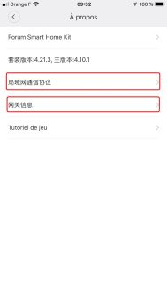
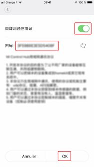
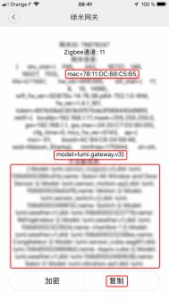

:::warning
2025: Diese Integration ist kaum noch sinnvoll; für diese Art von Geräten ist es einfacher, Zigbee oder Matter zu verwenden.
:::

## Entwicklermodus aktivieren

Durch das Aktivieren des Entwicklermodus erhält Gladys Zugriff auf die Xiaomi-API.

Um den Entwicklermodus zu aktivieren, musst du zuerst die App „Mi Home“ installieren:

- Starte die App.
- Stelle beim Anlegen deines Kontos die Region auf „Mainland China“ ein.
- Verbinde alle deine Geräte.
- Aktualisiere zum Schluss die Firmware.

## Das Gateway

Öffne das Gateway, indem du auf sein Symbol tippst. Folge dann diesen Schritten:

### Schritt 1

Tippe auf die 3 Punkte.

### Schritt 2

Tippe auf „About“ (Info).

### Schritt 3

Tippe mehrmals auf den roten Bereich, um zusätzliche Menüs einzublenden.

### Schritt 4

Das erste Menü führt dich zu Schritt 5, das zweite zu Schritt 6.

### Schritt 5

Aktiviere den Entwicklermodus über den Schalter, notiere dir das Passwort und tippe dann auf „OK“.

### Schritt 6

In diesem Menü findest du die MAC-Adresse deines Gateways, seine SID und eine hilfreiche Zuordnung zu dem Passwort, das du in Schritt 5 erhalten hast.

:::note
Die Zuordnung zum Passwort ist nützlich, wenn du mehrere Gateways hast.
:::

Jetzt bist du bereit, deine Xiaomi-Geräte in Gladys einzubinden!
