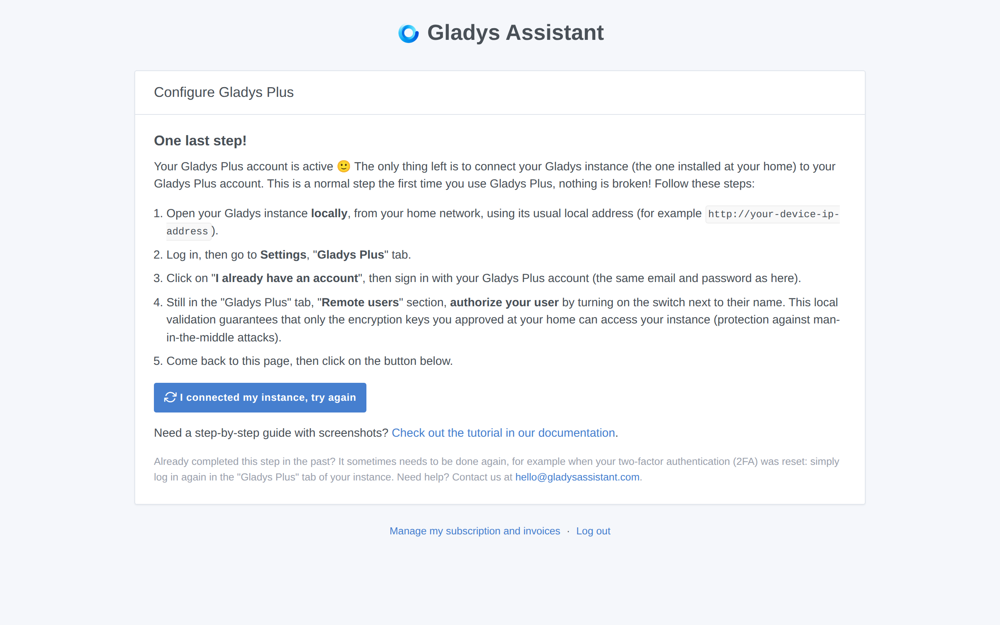
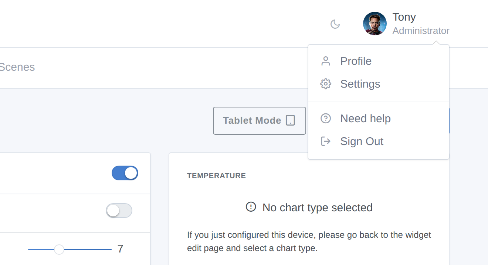
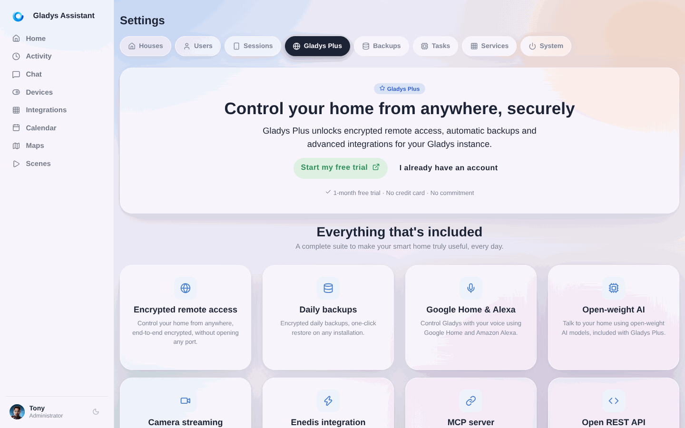
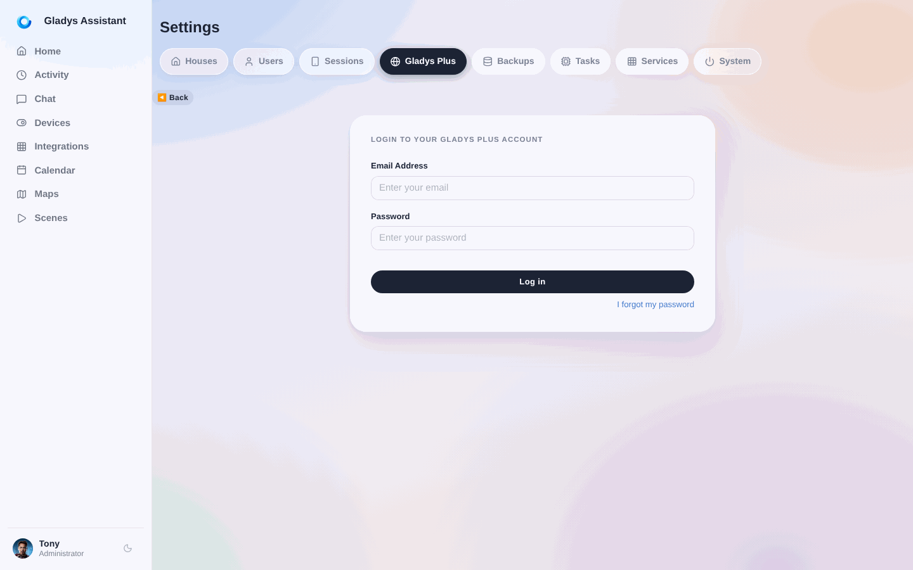
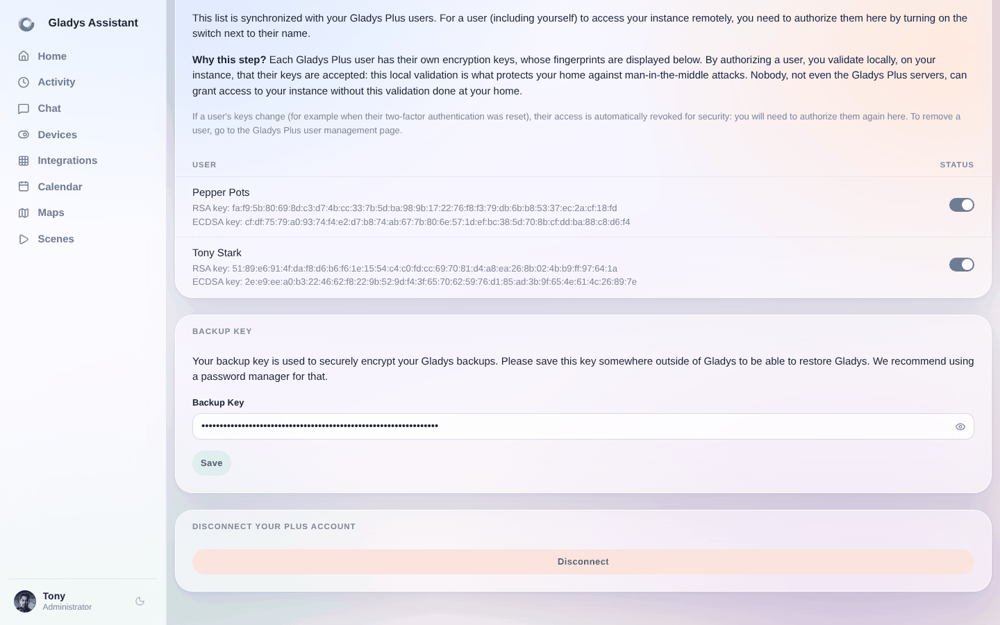

Wenn du ein [Gladys Plus](/de/plus/)-Konto erstellst, fehlt noch ein letzter Schritt: **die Verbindung deiner lokalen Gladys-Instanz (der Instanz, die bei dir zu Hause installiert ist) mit deinem Gladys-Plus-Konto.**

Solange dieser Schritt nicht erledigt ist, zeigt [plus.gladysassistant.com](https://plus.gladysassistant.com) die Seite „**Ein letzter Schritt!**“ an: Das ist völlig normal, nichts ist kaputt! Dein Gladys-Plus-Konto ist aktiv, es weiß nur noch nicht, mit welcher Gladys-Instanz es sich verbinden soll.

Dieses Tutorial führt dich mit Screenshots durch diesen Schritt.

## Voraussetzungen

- Eine Gladys-Instanz, die bei dir zu Hause installiert ist und läuft (siehe bei Bedarf die [Installationsdokumentation](/de/docs/)).
- Ein Gladys-Plus-Konto (erstellt auf [gladysassistant.com/plus](https://gladysassistant.com/plus/)).

## Schritt 1: Deine Gladys-Instanz lokal öffnen

Öffne deine Gladys-Instanz **aus deinem Heimnetzwerk** über ihre gewohnte lokale Adresse: zum Beispiel `http://192.168.1.30` (die IP-Adresse deines Raspberry Pi bzw. des Rechners, auf dem Gladys installiert ist) oder die Adresse, die dir deine Installationsmethode angezeigt hat.

Melde dich mit deinem **lokalen Gladys-Konto** an (dem Konto, das du bei der Installation von Gladys angelegt hast – es kann sich von deinem Gladys-Plus-Konto unterscheiden).

## Schritt 2: Die Einstellungen öffnen

Klicke oben rechts auf dein Profilbild und dann auf **„Einstellungen“**.

## Schritt 3: Den Tab „Gladys Plus“ öffnen

Klicke in den Einstellungen im linken Menü auf den Tab **„Gladys Plus“** und dann auf **„Ich habe bereits ein Konto“**.

## Schritt 4: Mit deinem Gladys-Plus-Konto anmelden

Gib die **E-Mail-Adresse und das Passwort deines Gladys-Plus-Kontos** ein (dieselben Zugangsdaten wie auf [plus.gladysassistant.com](https://plus.gladysassistant.com)) und klicke auf „Anmelden“.

Wenn du dich zum ersten Mal verbindest, fordert Gladys dich auf, die Zwei-Faktor-Authentifizierung (2FA) einzurichten, um dein Konto abzusichern, und zeigt dir anschließend deinen **Sicherungsschlüssel** an: Bewahre diesen Schlüssel an einem sicheren Ort außerhalb von Gladys auf (zum Beispiel in einem Passwortmanager) – du brauchst ihn, um deine verschlüsselten Backups wiederherzustellen.

## Schritt 5: Deinen Benutzer lokal autorisieren

Scrolle im Tab „Gladys Plus“ nach unten zum Abschnitt **„Remote-Benutzer“**: Dort sind alle Benutzer deines Gladys-Plus-Kontos aufgeführt. **Autorisiere deinen Benutzer, indem du den Schalter neben seinem Namen aktivierst.**

**Warum dieser Schritt?** Gladys Plus ist Ende-zu-Ende-verschlüsselt: Jeder Gladys-Plus-Benutzer hat seine eigenen Schlüssel, deren Fingerabdrücke unter seinem Namen angezeigt werden. Indem du einen Benutzer hier autorisierst, bestätigst du lokal auf deiner Instanz, dass seine Schlüssel akzeptiert werden. Genau diese lokale Bestätigung schützt dein Zuhause vor Man-in-the-Middle-Angriffen: Niemand – nicht einmal die Server von Gladys Plus – kann ohne diese bei dir zu Hause durchgeführte Bestätigung Zugriff auf deine Instanz gewähren.

Aus demselben Grund wird der Zugriff eines Benutzers automatisch widerrufen, wenn sich seine Schlüssel ändern (zum Beispiel weil seine Zwei-Faktor-Authentifizierung zurückgesetzt wurde). Er muss dann hier erneut autorisiert werden.

## Schritt 6: Zurück zu Gladys Plus

Deine Instanz ist jetzt verbunden! Geh zurück zu [plus.gladysassistant.com](https://plus.gladysassistant.com) und klicke auf der Seite „Ein letzter Schritt!“ auf die Schaltfläche **„Ich habe meine Instanz verbunden, erneut versuchen“**.

Anschließend wirst du aufgefordert, **deinen Gladys-Benutzer auszuwählen**: Wähle den lokalen Benutzer, den du mit deinem Gladys-Plus-Konto verknüpfen möchtest. Das war's – du kannst jetzt sicher aus der Ferne auf dein Zuhause zugreifen! 🎉

## Fehlerbehebung

- **Die Seite „Ein letzter Schritt!“ erscheint wieder, obwohl du diesen Schritt bereits erledigt hast**: Das kann passieren, wenn deine Zwei-Faktor-Authentifizierung (2FA) zurückgesetzt wurde. Melde dich einfach erneut im Tab „Gladys Plus“ deiner lokalen Instanz an (Schritte 1 bis 5 oben).
- **Fehler „Der Benutzer wurde nicht lokal autorisiert“**: Öffne in deiner lokalen Instanz die Einstellungen, Tab „Gladys Plus“, Abschnitt „Remote-Benutzer“, und aktiviere den Schalter neben dem Namen des Benutzers (siehe Schritt 5 oben).
- **Du brauchst Hilfe?** Schreib uns an [hello@gladysassistant.com](mailto:hello@gladysassistant.com) oder frag im [Community-Forum](https://community.gladysassistant.com/).
