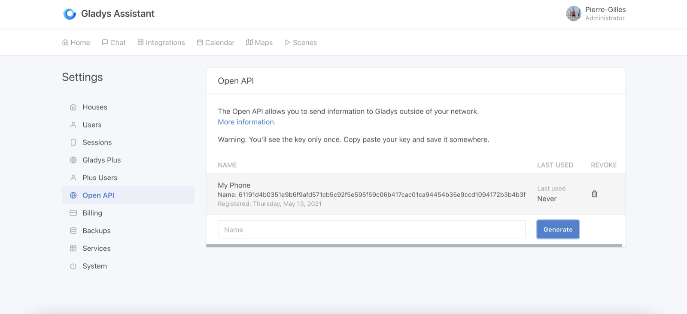
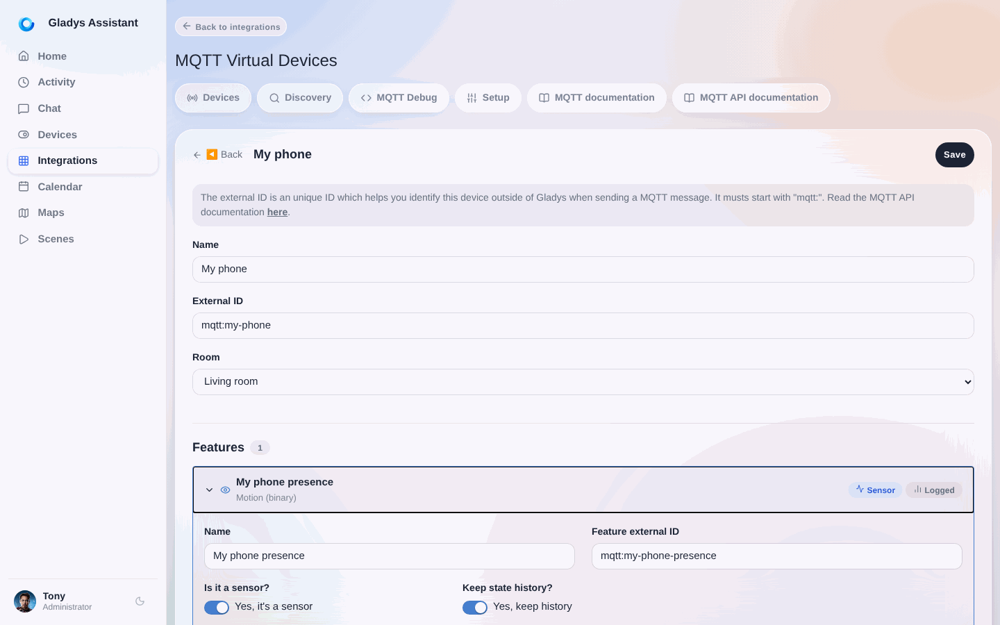
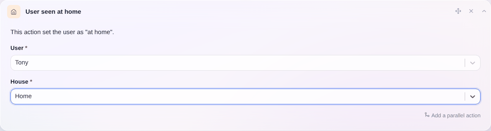
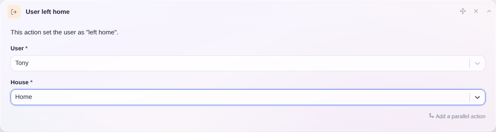
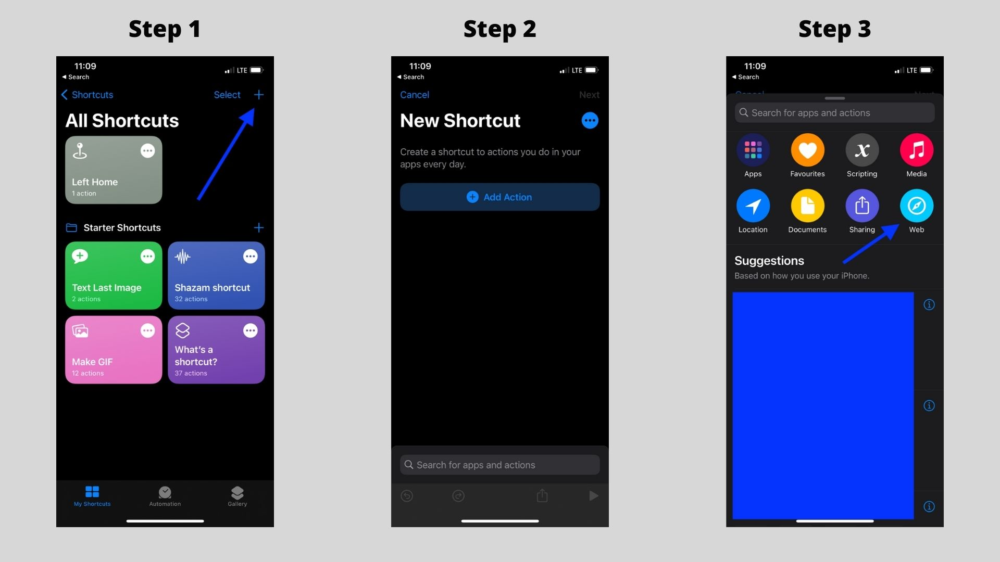
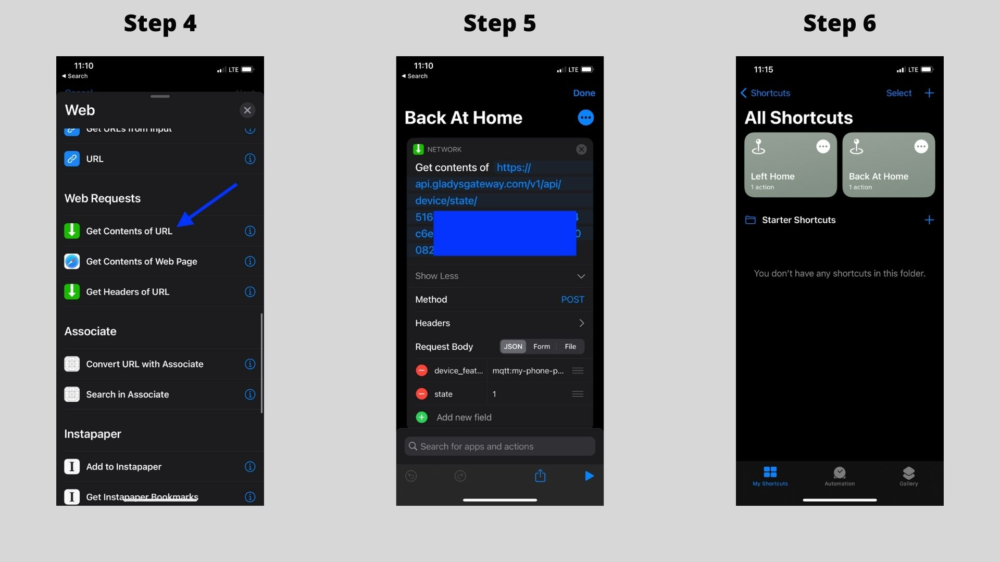
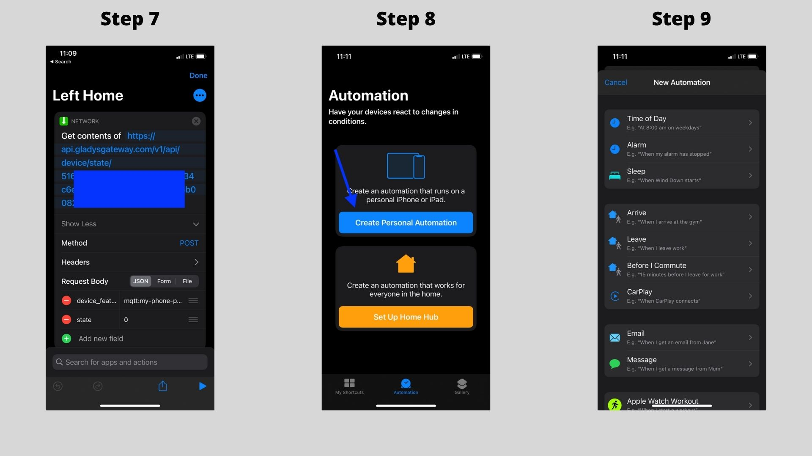
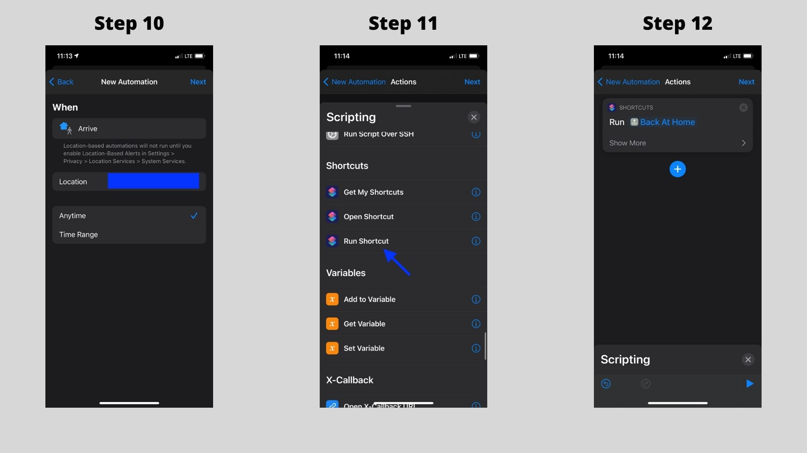
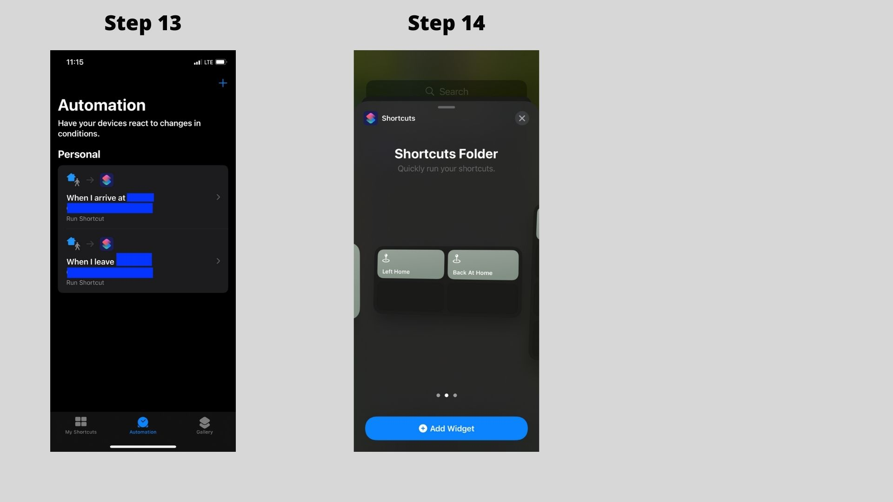

Wir bieten in Gladys eine Open API an, mit der Benutzer Daten von außerhalb ihres Netzwerks senden können.

Stell dir vor, ich möchte Daten von meinem Handy senden: meinen Standort, ein Ereignis, wenn ich nach Hause komme, meinen Akkustand, ein Ereignis, wenn mein Handy in der Nähe eines NFC-Tags ist, ein Ereignis, wenn ich eine Zone betrete – mit der Open API ist alles möglich.

## Voraussetzungen

Um die Open API zu nutzen, brauchst du ein kostenpflichtiges Gladys-Plus-Abo.

Du kannst es [hier](/de/plus) abschließen.

## Einen neuen API-Schlüssel erzeugen {/* #generate-a-new-api-key */}

Zuerst musst du in Gladys Plus einen neuen API-Schlüssel erstellen.

Öffne [https://plus.gladysassistant.com/dashboard/settings/gateway-open-api](https://plus.gladysassistant.com/dashboard/settings/gateway-open-api).

Gib einen Namen für das Gerät ein, das deinen API-Schlüssel verwenden wird.



Klicke auf „Erzeugen“, kopiere dann den API-Schlüssel und speichere ihn irgendwo: Er wird nie wieder angezeigt.

## Einen neuen Sensorwert senden

Jetzt senden wir einen neuen Sensorwert.

Szenario für dieses Tutorial: 

Angenommen, du möchtest ein Ereignis senden, wenn dein Handy zu Hause ist, und ein weiteres Ereignis, wenn dein Handy das Haus verlassen hat.

### Ein Gerät in Gladys erstellen

Mit der Integration „MQTT“ kannst du Geräte anlegen, selbst wenn du MQTT gar nicht nutzt.

Erstellen wir ein Gerät für dein Handy:



**Hinweis:** Gib an, dass dein Handy ein Bewegungssensor ist – das ist ein ideales binäres Gerät für diesen Anwendungsfall. Hier spielt das eigentlich keine Rolle, du wirst gleich sehen, wie wir es verwenden :)

Merk dir die „external_id“ der Funktion für später, wir brauchen sie für die API.

### Eine API-Anfrage senden

Jetzt senden wir eine API-Anfrage an die Open API, um zu melden: „Mein Handy ist zu Hause“.

Wir senden:

```
POST https://api.gladysgateway.com/v1/api/device/state/YOUR_OPEN_API_KEY

Body:
{
	"device_feature_external_id": "mqtt:my-phone-presence",
	"state": 1
}
```

Du kannst die API zum Beispiel mit [Insomnia](https://insomnia.rest/) ausprobieren.

Wenn du das Gegenteil melden möchtest (mein Handy hat das Haus verlassen), sendest du:

```
POST https://api.gladysgateway.com/v1/api/device/state/YOUR_OPEN_API_KEY

Body:
{
	"device_feature_external_id": "mqtt:my-phone-presence",
	"state": 0
}
```

### Eine Szene in Gladys erstellen, um deinen Benutzer auf „zu Hause“/„Haus verlassen“ zu setzen

Du kannst in Gladys 2 Szenen erstellen, die deinen Benutzer auf „Haus verlassen“ oder „zu Hause“ setzen, je nachdem, ob dein Handy in der Nähe deines Zuhauses ist:





## Diese API mit Tasker oder iOS-Kurzbefehlen auslösen

Unter Android kannst du das großartige [Tasker](https://play.google.com/store/apps/details?id=net.dinglisch.android.taskerm&hl=fr&gl=US) verwenden, um eine API-Anfrage zu senden, wenn du dein Haus betrittst oder verlässt (basierend auf allem Möglichen: GPS-Standort, NFC-Auslöser, WLAN-Erkennung oder was dir sonst einfällt).

Unter iOS kannst du die Kurzbefehle-App nutzen.

Beispiel mit iOS:

### Erster Schritt: Kurzbefehle installieren und einen neuen Kurzbefehl erstellen

Installiere die App „Kurzbefehle“ aus dem App Store. Sie stammt von Apple und ist kostenlos.

Erstelle dann einen neuen Kurzbefehl und füge eine neue Web-Aktion hinzu:



Kopiere die URL des Gateways und füge den JSON-Body hinzu.

- Das Attribut „device_feature_external_id“ muss ein Textfeld sein
- Das Attribut „state“ muss ein Zahlenfeld sein



Für das Ereignis „Haus verlassen“ kannst du einen weiteren Kurzbefehl erstellen, indem du den vorherigen duplizierst und 1 durch 0 ersetzt.



Jetzt können wir eine Automation erstellen, damit dieser Kurzbefehl automatisch ausgeführt wird, wenn du zu Hause ankommst:



Dasselbe kannst du für das Verlassen des Hauses einrichten.

Du kannst den Kurzbefehl auch zu deinem Home-Bildschirm hinzufügen, wenn du ihn manuell auslösen möchtest:



## Den Standort deines Handys mit Owntracks senden

Du kannst den Standort deines Handys auch über die Open API und Owntracks an Gladys senden:

[Lies das Tutorial in der Dokumentation](/de/docs/integrations/owntracks)
