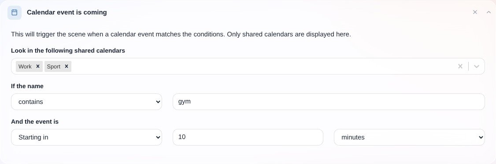
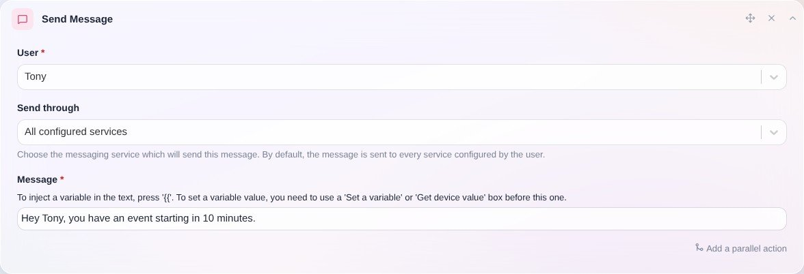

Dieser Auslöser ist sehr mächtig. Er nutzt die Kalender-Integration (zum Beispiel [CalDAV](/de/docs/integrations/caldav)) und ermöglicht es dir, eine Szene auszulösen, wenn ein Kalenderereignis bevorsteht oder endet.

Stell dir vor, du möchtest eine Szene starten, wenn du ins Fitnessstudio musst.

Mit diesem Auslöser kannst du in einer Szene alle Ereignisse im Kalender „Arbeit“ oder „Sport“ erfassen, die „Fitnessstudio“ im Titel enthalten.

Es gibt viele verschiedene Filter:

- beginnt mit
- endet mit
- ist genau
- enthält
- hat einen beliebigen Namen (wird unabhängig vom Namen des Ereignisses ausgelöst)

Das Ereignis, das die Szene ausgelöst hat, kannst du in allen folgenden Aktionen verwenden, zum Beispiel in der Aktion „Nachricht senden“:

