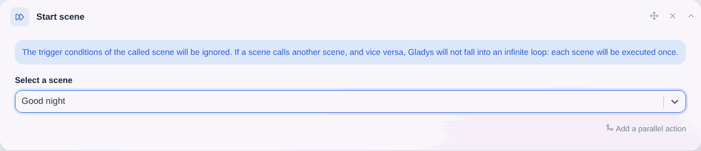

Du kannst eine Szene aus einer anderen heraus starten, indem du eine Szenen-Aktion hinzufügst.

Die verkettete Szene wird genau einmal ausgeführt; alle Auslösebedingungen dieser Szene werden dabei ignoriert.

Wird dieselbe Szene mehrmals in einer Kette hinzugefügt – selbst in unterschiedlichen Aktionsgruppen –, hat das keine Wirkung. So werden Endlosschleifen verhindert.

