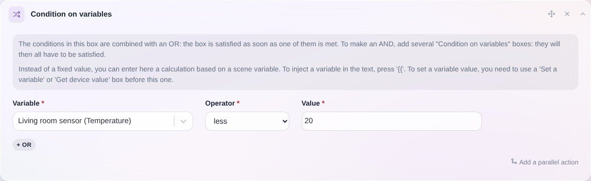

Mit dieser Aktion kannst du die Ausführung der Szene abhängig von einer bestimmten Bedingung fortsetzen (oder eben nicht).

Schauen wir uns ein Beispiel an.

## Die Szene mit einer Bedingung auf die Raumtemperatur fortsetzen

Angenommen, du möchtest eine Szene erstellen, die die Temperatur eines Raums abruft und das Szenario nur fortsetzt, wenn die Temperatur unter 20 °C liegt.

Im ersten Schritt fügst du deiner Szene die Aktion „Letzten Zustand abrufen“ hinzu und wählst den gewünschten Sensor aus.

Im nächsten Aktionsblock kannst du dann die Aktion „Nur fortfahren, wenn“ hinzufügen und die zuvor abgerufene Variable auswählen.

Mit der Bedingung `kitchen temperature sensor <20°C` sieht das so aus:

In dieser Aktion kannst du Variablen einfügen und mathematische Funktionen verwenden.

Siehe [Verfügbare mathematische Funktionen](/de/docs/scenes/math-functions).
