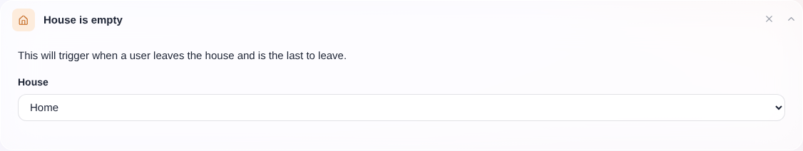
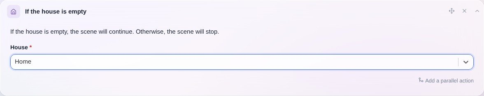

Dieser Auslöser wird aktiviert, wenn der letzte Benutzer das Haus verlässt.

Du kannst ihn auch innerhalb einer Szene verwenden, um nur fortzufahren, wenn das Haus leer ist.

## Als Auslöser

Wie du die Anwesenheit eines Benutzers zu Hause festlegst, erfährst du in unserem Tutorial zur [Bluetooth-Anwesenheit](/de/docs/integrations/bluetooth). Alternativ kannst du die Anwesenheit auch [in einer Szene](/de/docs/scenes/user-presence) setzen.

## In einer Szene

