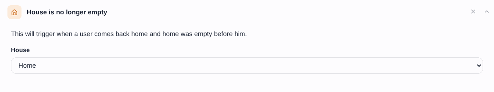
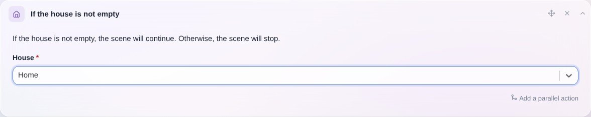

Dieser Auslöser wird aktiviert, wenn ein Benutzer nach Hause kommt und das Haus vorher leer war.

Du kannst ihn auch innerhalb einer Szene verwenden, um nur fortzufahren, wenn das Haus nicht leer ist.

## Als Auslöser

Wie du die Anwesenheit eines Benutzers zu Hause festlegst, erfährst du in unserem Tutorial zur [Bluetooth-Anwesenheit](/de/docs/integrations/bluetooth). Alternativ kannst du die Anwesenheit auch [in einer Szene](/de/docs/scenes/user-presence) setzen.

## In einer Szene

