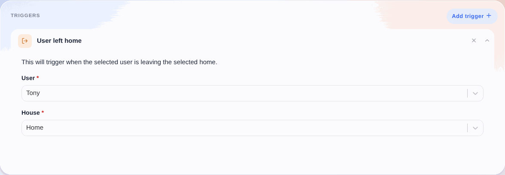

Dieser Auslöser wird aktiviert, wenn der ausgewählte Benutzer das Haus verlassen hat.

## Einfaches Beispiel

Wie du die Anwesenheit eines Benutzers zu Hause festlegst, erfährst du in unserem Tutorial zur [Bluetooth-Anwesenheit](/de/docs/integrations/bluetooth). Alternativ kannst du die Anwesenheit auch [in einer Szene](/de/docs/scenes/user-presence) setzen.
