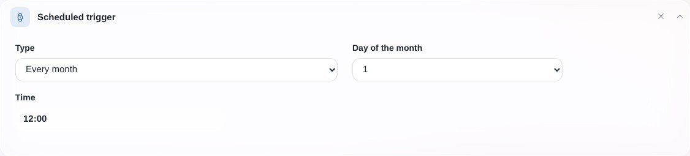
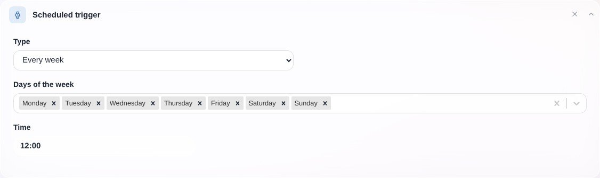
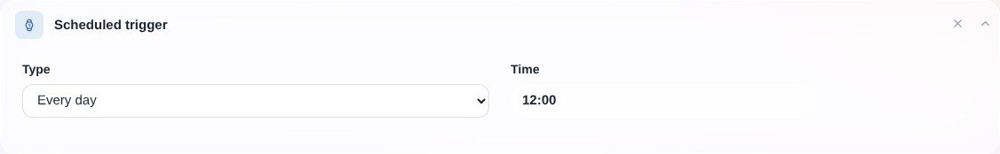
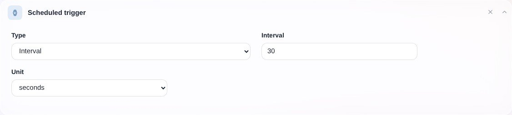
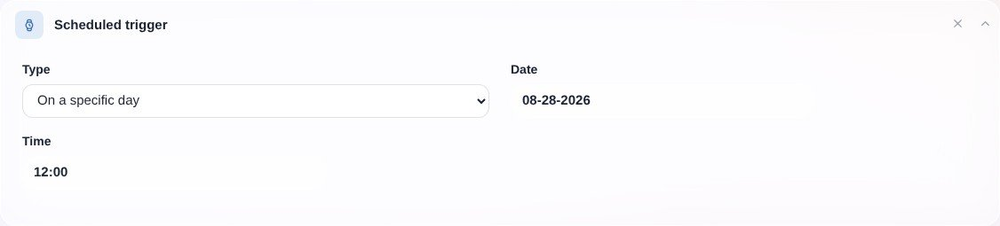

In der Hausautomation möchte man häufig eine Szene zeitlich planen: jeden Tag? Einmal am Tag? Einmal pro Woche? Einmal im Monat? Alle 15 Minuten?

Gladys bietet einen Auslöser, mit dem du die Ausführung einer Szene zeitlich planen kannst.

Es gibt 5 Arten der Zeitplanung:

- Jeden Monat
- Jede Woche
- Jeden Tag
- In Intervallen
- An einem bestimmten Tag

Schauen wir uns die verschiedenen Optionen an:

## Jeden Monat

Mit diesem Auslöser planst du die Ausführung einer Szene jeden Monat an einem bestimmten Tag des Monats.

Das ist zum Beispiel praktisch, wenn du eine Szene an jedem 1. des Monats ausführen möchtest.

## Jede Woche

Mit diesem Auslöser kannst du eine Szene an bestimmten Wochentagen zu einer bestimmten Uhrzeit ausführen lassen.

Er ist wahrscheinlich der am häufigsten genutzte Auslöser, da du damit beliebige Elemente deiner „Tagesroutine“ einrichten kannst.

Wenn du an jedem Wochentag (Montag bis Freitag) um 7 Uhr mit einer eigenen Szene aufwachen möchtest, sieht deine Szene so aus:

## Jeden Tag

Mit diesem Auslöser startest du eine Szene jeden Tag zu einer bestimmten Uhrzeit.

Praktisch für alle wiederkehrenden Aufgaben, die an jedem Wochentag anfallen.

## Intervall

Dieser Auslöser ist etwas Besonderes. Damit planst du eine Szene nicht nach „Tag“, sondern in einem bestimmten Intervall (z. B. alle 30 Sekunden, alle 15 Minuten, jede Stunde).

Beispiel:

## An einem bestimmten Datum

Mit diesem Auslöser planst du deine Szene an einem bestimmten Tag zu einer bestimmten Uhrzeit.

Beispiel: 4. Juni 2020 um 14:00 Uhr.

