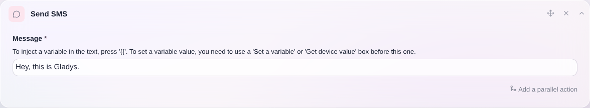
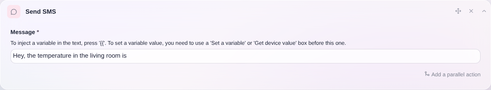

Mit dieser Aktion kannst du in einer Szene eine SMS an dein Handy senden – über den französischen Mobilfunkanbieter [Free Mobile](https://mobile.free.fr).

## Einfaches Beispiel

Eine SMS zu senden ist ganz einfach: Erstelle in einer Szene die Aktion „SMS senden“.

## Eine Variable in eine SMS einfügen

Angenommen, du möchtest dir eine Warnung schicken, wenn die Temperatur in deinem Zuhause zu niedrig ist.

Dabei möchtest du den aktuellen Temperaturwert in die Nachricht einfügen, damit du weißt, wie warm es gerade ist.

Füge dazu deiner Szene die Aktion „Letzten Zustand abrufen“ hinzu und wähle den Sensor aus, den du abfragen möchtest.

Weiter hinten in der Szene kannst du dann die Aktion „SMS senden“ hinzufügen. Tippe in der Nachricht `{{ ` und wähle die zuvor definierte Variable aus.

Wenn die Szene ausgeführt wird, solltest du den Wert in deiner Nachricht erhalten 🥳
