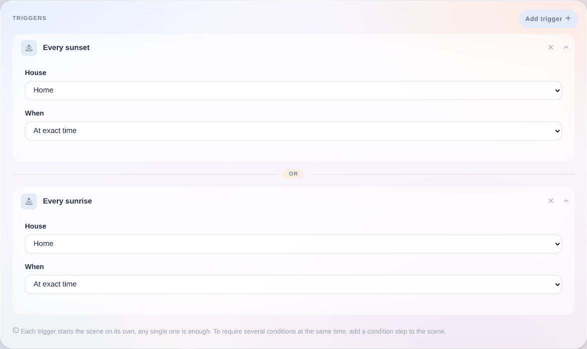
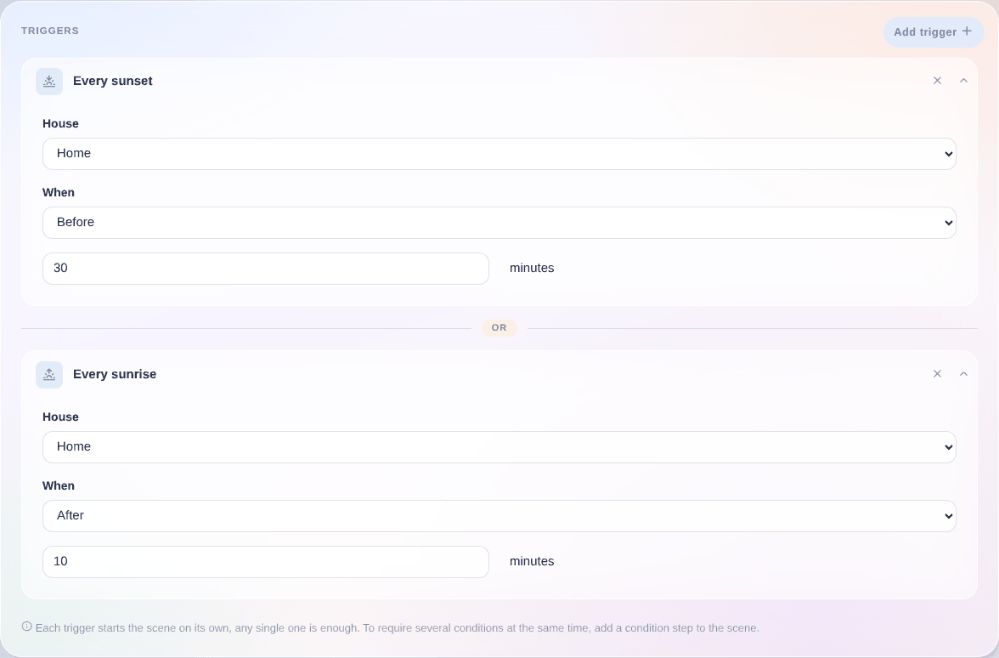

Du kannst eine Szene abhängig von Sonnenaufgang oder Sonnenuntergang auslösen. Das ist zum Beispiel praktisch, wenn du das Licht einschalten möchtest, sobald die Sonne untergeht, oder das Licht ausschalten möchtest, wenn die Sonne aufgeht.

## Genau bei Sonnenaufgang oder Sonnenuntergang

„Wenn die Sonne untergeht“ oder „Wenn die Sonne aufgeht“ löst die Szene genau in dem Moment aus, in dem die Sonne unter- oder aufgeht.

## Sonnenaufgang oder Sonnenuntergang mit Verzögerung

„30 Minuten bevor die Sonne untergeht“ oder „10 Minuten nachdem die Sonne aufgeht“ löst die Szene mit einem zeitlichen Versatz davor bzw. danach aus.
