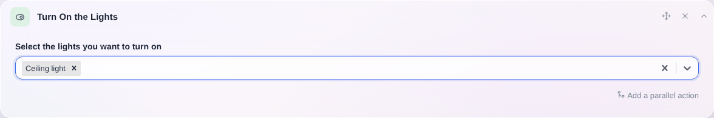

In der Hausautomation gehört das Steuern des Lichts oft zu den am häufigsten genutzten Aktionen.

- Mit Licht und Musik aufwachen?
- Alle Lichter ausschalten, wenn du das Haus verlässt?
- Das Licht einschalten, wenn du einen Raum betrittst?
- Ein Kinomodus, der das Licht im Wohnzimmer ausschaltet?

All das ist mit Gladys möglich. 😀

## Das Licht in einer Szene steuern

Wenn du in einer Szene Lichter einschalten möchtest, füge deiner Szene die Aktion „Licht einschalten“ hinzu und wähle die Lichter aus, die eingeschaltet werden sollen.

Um Lichter in einer Szene auszuschalten, füge deiner Szene die Aktion „Licht ausschalten“ hinzu und wähle die Lichter aus, die ausgeschaltet werden sollen.

