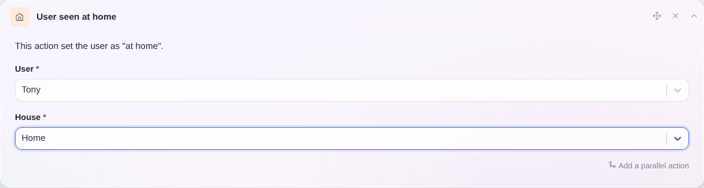
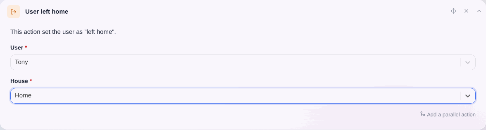

# Benutzeranwesenheit auf dem Dashboard

Auf dem Dashboard kann Gladys anzeigen, welche Benutzer im Haus anwesend oder abwesend sind.

Mit Szenen kannst du die An- oder Abwesenheit eines Benutzers festlegen.

- Das kann manuell geschehen, indem du die Szene startest, wenn du das Haus verlässt oder nach Hause kommst (nützlich, aber vielleicht etwas umständlich – Automatisierung ist besser!).
- Oder du automatisierst die Anwesenheitserkennung: Das kann ein Taster am Eingang sein, eine Bewegungserkennung, wenn du allein wohnst, eine Tasker-App, die eine MQTT-Nachricht sendet, sobald du mit dem WLAN zu Hause verbunden bist, oder ein Nut-Tracker. Du hast die Wahl!

Wir haben Tutorials zur [Bluetooth-Erkennung](/de/docs/integrations/bluetooth/) und zum [Netzwerkscan](/de/docs/integrations/lan-manager/).

## Den Benutzer in einer Szene als „Zu Hause anwesend“ festlegen

Mit dieser Aktion teilst du Gladys mit: „Der Benutzer wurde zu Hause erkannt.“

Mit dieser Information kann Gladys:

- ein Ereignis „Nach Hause gekommen“ auslösen, wenn der Benutzer vorher als abwesend markiert war.
- nichts tun, wenn der Benutzer bereits zu Hause war.

Um das einzurichten, erstellst du in einer Szene die Aktion „Benutzer zu Hause gesehen“:

## Den Benutzer in einer Szene als „Nicht zu Hause“ festlegen

Mit dieser Aktion teilst du Gladys mit: „Der Benutzer ist nicht in diesem Haus.“

Mit dieser Information kann Gladys:

- ein Ereignis „Haus verlassen“ auslösen, wenn der Benutzer vorher als zu Hause anwesend markiert war.
- nichts tun, wenn der Benutzer nicht als anwesend markiert war oder bereits als abwesend von **diesem** Haus markiert war.

Um das einzurichten, erstellst du in einer Szene die Aktion „Benutzer hat das Haus verlassen“:

