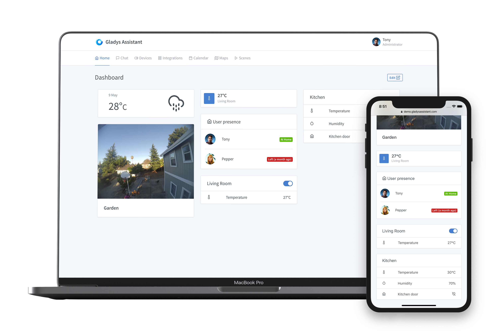
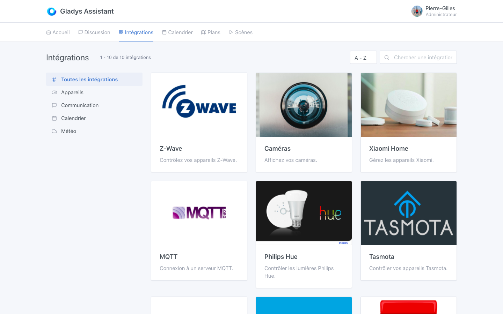
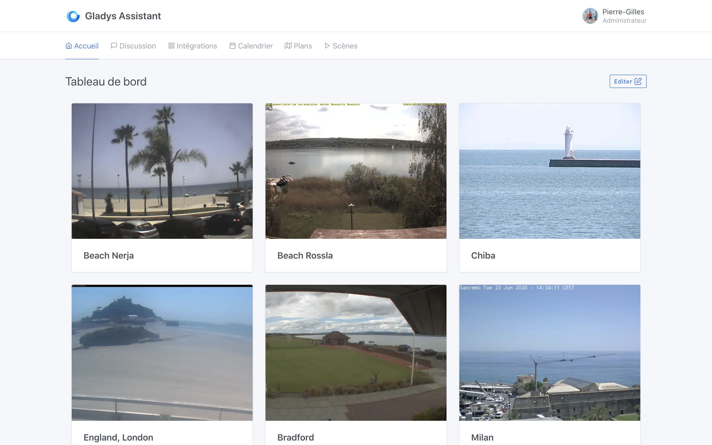
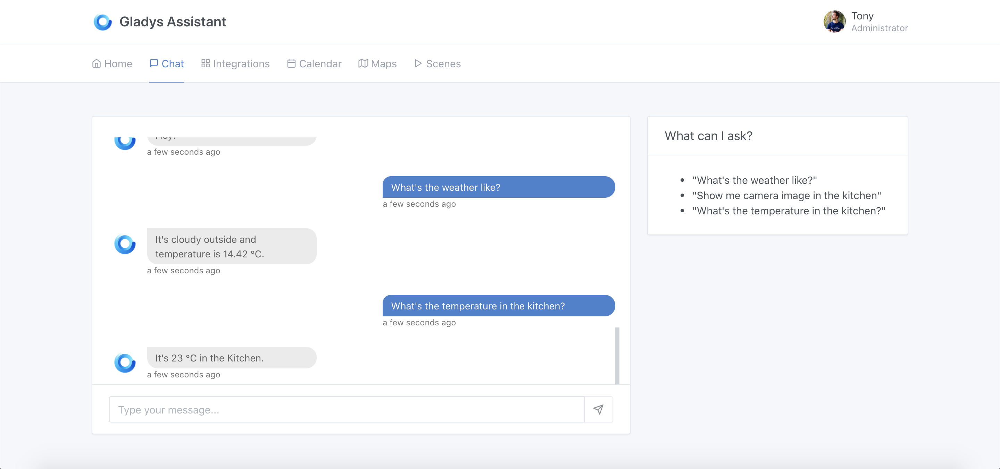
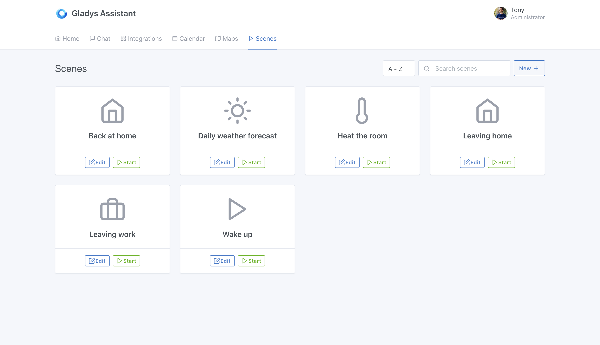

Hola a todos:

Hoy es un gran día. Tras casi 2 años de trabajo de toda la comunidad, Gladys Assistant 4 ya está disponible y, como siempre, ¡se puede descargar gratis!

Puedes lanzarte a la aventura siguiendo estos tutoriales:

- [Tutorial para Raspberry Pi](/es/docs/)
- [Instalación manual con Docker](/es/docs/installation/docker/)
- [Prueba Gladys Assistant en el sitio de demostración](https://demo.gladysassistant.com)

Ahora repasemos las decisiones que llevaron a esta cuarta versión de Gladys Assistant 🙂

{/* truncate */}

## La historia detrás de esta v4

En diciembre de 2018 me reuní con dos miembros de la comunidad para hablar del futuro del proyecto, y juntos definimos lo que queríamos para la siguiente versión principal de Gladys, Gladys Assistant 4. Después de esa reunión, redacté un manifiesto técnico que resumía nuestras conversaciones.

Gladys Assistant v3 se estaba quedando anticuado, tanto en el proceso de desarrollo como en las tecnologías utilizadas. Era un gran producto, pero los desarrollos eran cada vez más lentos y menos estables debido a decisiones técnicas que se remontaban a los inicios del proyecto.

Mantener este mamut era cada vez más difícil, y el atractivo del proyecto se resentía. Había muchos bugs "místicos" que volvían loco a todo el mundo. Era frustrante ver a todos luchando para hacer una simple actualización de Gladys v3, atascados en puntos de configuración que deberían haber sido automáticos.

**La conclusión era clara:** a largo plazo, era mejor empezar desde cero y aprender de todos esos años de experiencia, en lugar de poner parches con cinta adhesiva a un producto que no se había diseñado originalmente para que lo usaran tantas personas durante tantos años.

Durante 2 años trabajamos junto con la comunidad para lanzar la versión 4, diseñada con tecnologías que, en nuestra opinión, se adaptan mejor al mundo embebido.

Estos dos años han sido muy duros.

Muy duros porque durante 2 años el proyecto aparentemente no avanzó: ya no se desarrollaba la v3, pero la v4 tampoco estaba lista.

Muy duros porque durante al menos un año tuve la sensación de trabajar en el vacío, en un producto que nadie usaba.

Fue una auténtica travesía del desierto.

Pero hoy es el momento de la recompensa. El trabajo ha dado sus frutos y, gracias a la implicación de toda la comunidad, ¡Gladys Assistant 4 ya está disponible! 🎉

## Agradecimientos

Antes de presentar esta v4, quiero dar las gracias a todos los miembros de la comunidad que han hecho un trabajo enorme en esta versión.

- [Alexandre Trovato](https://community.gladysassistant.com/u/AlexTrovato/summary), "la máquina", capaz de proponer una pull request antes de que yo termine de responder a su mensaje 😁
- [Vincent Kulak](https://community.gladysassistant.com/u/vonox/summary), "el dios de Docker", que montó todo el proceso de build de Gladys Assistant 4.
- [Thibaut Courvoisier](https://community.gladysassistant.com/u/link39/summary), "el experto en Z-Wave", que permite a todos beneficiarse de su completa instalación Z-Wave y de su profundo conocimiento del protocolo.
- [Thomas Lemaistre](https://community.gladysassistant.com/u/terdious/summary), "el mayor usuario de Gladys de todos los tiempos", que lleva constantemente el producto al límite con su uso profesional para gestionar su camping.
- [Bertrand d'Aure](https://community.gladysassistant.com/u/bertrandda/summary), "Mr. CalDav", que desarrolla y mantiene la integración CalDav y se desvive para que funcione para todo el mundo.

Pero también a todos los demás colaboradores en GitHub: https://github.com/GladysAssistant/Gladys#contributors-

## Una interfaz rediseñada: limpia, elegante e increíblemente rápida

Gladys Assistant vuelve con una interfaz nueva, completamente rediseñada. La interfaz es más sencilla y se puede editar muy fácilmente con el ratón.

La interfaz debe su capacidad de respuesta al framework frontend [Preact](https://preactjs.com/) que utiliza Gladys Assistant 4. Un framework moderno y muy ligero, que garantiza una gran fluidez en Gladys.

Esta interfaz está diseñada como una PWA ([Progressive Web App](https://fr.wikipedia.org/wiki/Progressive_web_app)) y, por tanto, se puede instalar en el móvil como una app normal (iOS / Android / Mac / Windows / Linux).

Puedes probar la interfaz de Gladys Assistant 4 en [el sitio de demostración](https://demo.gladysassistant.com).

## Cientos de dispositivos domóticos ya compatibles

Desde hace varios meses, la comunidad de Gladys Assistant trabaja intensamente para llevar las integraciones de la v3 a la v4.

Hoy, ya hay cientos de dispositivos domóticos disponibles en Gladys Assistant 4.

A día de hoy, Gladys Assistant es compatible con estos dispositivos:

- Z-Wave
- Xiaomi ([doc](/es/docs/integrations/xiaomi/))
- Philips Hue ([doc](/es/docs/integrations/external/philips-hue/))
- Sonoff (Tasmota) ([doc](/es/docs/integrations/tasmota/))
- Cámaras RTSP, HTTP y USB ([doc](/es/docs/integrations/camera/))
- El protocolo MQTT ([doc](/es/docs/integrations/mqtt/))

Hay muchas integraciones en desarrollo que se sumarán a esta lista para poder controlar el máximo de dispositivos. Y como Gladys Assistant es de código abierto, puedes contribuir a esta lista enviando una PR en GitHub :)

## Gestión nativa de cámaras

La gestión de cámaras está integrada de forma nativa en Gladys Assistant 4, mediante los protocolos RTSP, HTTP y USB.

Gladys recoge las señales de todas las cámaras de la casa y las muestra en una única interfaz. La instancia de Gladys actúa como proxy y te permite ver tus cámaras fuera de tu red, sin tener que exponerlas a Internet. Las cámaras pueden permanecer seguras en local.

Los flujos de vídeo se comprimen para lograr el máximo rendimiento en la interfaz, incluso con un gran número de cámaras.

## Del machine learning al motor de conversación

Gladys Assistant también es un asistente con el que puedes conversar.

Gladys Assistant utiliza los últimos avances en procesamiento automático del lenguaje para entender tus peticiones (usamos [NLP.js](https://github.com/axa-group/nlp.js)).

Puedes preguntarle a Gladys Assistant, por ejemplo:

- "Enciende la luz del salón"
- "¿Qué temperatura hace en la cocina?"
- "¿Qué tiempo hace?"
- "Muéstrame la cámara de la cocina"
- ¡Y muchas otras preguntas a medida que la comunidad amplía el conjunto de datos!

El conjunto de datos utilizado para entrenar el modelo es totalmente de código abierto y lo alimenta la comunidad.

## Una API MQTT abierta para integrar dispositivos DIY

Gladys ofrece una API MQTT abierta para que cualquiera pueda integrar sus dispositivos DIY en Gladys.

Así, puedes enviar datos a Gladys desde un Arduino, un ESP8266, una Raspberry Pi remota o desde cualquier máquina compatible con el protocolo MQTT.

En la otra dirección, Gladys también puede controlar dispositivos MQTT.

Más información sobre [la integración MQTT](/es/docs/integrations/mqtt/).

## Un motor de escenas más potente que nunca

Gladys Assistant 4 te permite crear escenas complejas. Puedes encadenar acciones tanto en serie como en paralelo, con condiciones.

¿Una escena "Cine" para ajustar la iluminación del salón?

¿Una escena "Despertador" que pone en marcha la cafetera y enciende distintas luces desde el dormitorio hasta la cocina?

Todo es posible con el motor de escenas de Gladys Assistant 😄

El motor de escenas se ha probado con cargas elevadas y seguirá evolucionando en las próximas versiones del software.

Más información sobre [las escenas en Gladys Assistant 4](/es/docs/scenes/intro/).

## La privacidad en el centro del producto

Gladys Assistant almacena todos los datos del usuario en una base de datos SQLite local. No necesitas ninguna cuenta en línea para usar Gladys Assistant.

Sigues siendo el dueño y señor de tu instalación.

Gladys Assistant se instala fácilmente en cualquier Raspberry Pi mediante una imagen Raspbian preconfigurada con Gladys Assistant (descarga [en la documentación para Raspberry Pi](/es/docs/)).

También puedes instalar Gladys Assistant en cualquier máquina Linux: un NAS Synology, una Freebox Delta, un VPS, un servidor antiguo... todo es posible.

## Actualización automática y atómica: una estabilidad a prueba de todo

Uno de los objetivos principales de la v4 es ser un producto estable y robusto a largo plazo. Como el producto evoluciona con frecuencia, era necesario contar con un sistema de actualización automática que no pudiera poner en peligro la instalación de un usuario.

Por eso, Gladys Assistant se ejecuta en Docker, un sistema de contenedores Linux que permite distribuir la aplicación en forma de imagen que contiene la aplicación y sus dependencias. Usamos el excelente [Watchtower](https://github.com/nicholas-fedor/watchtower) para actualizar el contenedor automáticamente.

Así, la distribución de las actualizaciones de Gladys está automatizada y funciona de forma atómica.

Una actualización **no puede** quedarse a medias: o funciona, o falla.

## Mis ambiciones tras este lanzamiento

Mi ambición personal para esta versión es alcanzar **1000 usuarios activos** de esta v4 en los próximos 6 meses.

No es un objetivo poco realista; incluso parece una cifra pequeña, pero quiero centrarme en la calidad más que en la cantidad.

Solo como comparación: desde su lanzamiento, se han vendido 30 millones de Raspberry Pi.

1000 instancias de Gladys representan el 0,0033 % de las Raspberry Pi vendidas, y eso sin contar a todos los que ejecutan Gladys en un NAS, una Freebox o cualquier otro ordenador.

Así que es **un objetivo muy modesto**, y así es como debe ser.

Prefiero tener 1000 usuarios apasionados que adoren Gladys, la usen cada día y participen en la comunidad en línea, que 10 000 usuarios que simplemente usen el producto y nada más.

Creo que, antes de escalar, prefiero centrarme en crear ese núcleo de usuarios apasionados que es la fuerza de este proyecto. Cuando tengamos 1000 usuarios totalmente satisfechos, podremos ir a por el siguiente objetivo.

Iré publicando los avances hacia este objetivo en las redes sociales y seguramente escribiré un artículo de balance dentro de unos meses 🙂

¡Una vez más, gracias a todos por su ayuda y sus comentarios!

Si quieres unirte a nosotros y formar parte del núcleo de los 1000 usuarios de Gladys Assistant 4, el momento es ahora, y todo empieza en el [tutorial de instalación de Gladys Assistant](/es/docs/).

¡Hasta pronto!

Pierre-Gilles Leymarie
