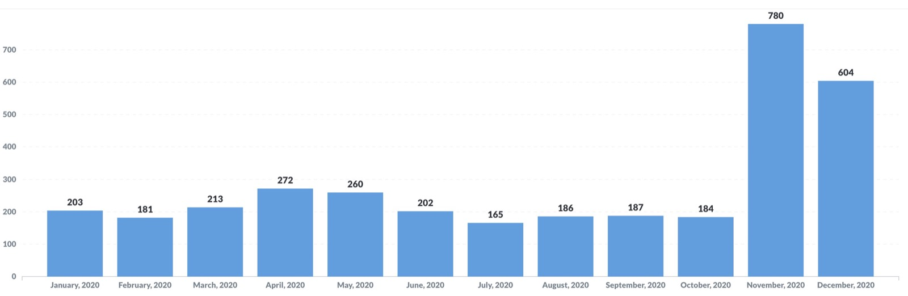
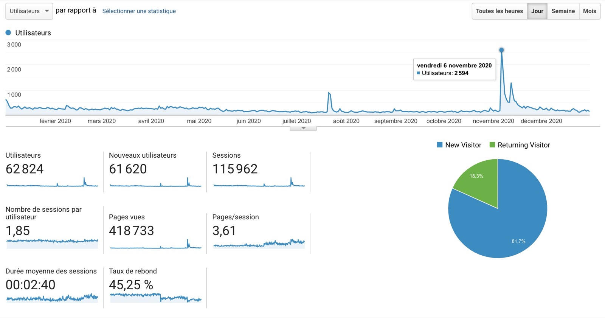

¡Hola a todos!

Como cada año, ¡ha llegado el momento de un nuevo balance anual de Gladys Assistant!

Vamos con el balance de 2020 :)

{/* truncate */}

## ¿Qué pasó en 2020?

El año 2020 estuvo lleno de novedades para el proyecto, ya que en noviembre [se lanzó la versión 4 de Gladys](/es/blog/lancement-gladys-assistant-4), una versión reescrita desde cero.

Mucha gente se unió a la comunidad tras este lanzamiento: 780 personas instalaron Gladys v4 el mismo mes de su lanzamiento, una cifra muy alentadora.

Aquí tienes las estadísticas de instalación de esta v4 para todo el año 2020. Antes de noviembre, la v4 todavía estaba en beta y solo se usaba internamente, lo que explica las bajas cifras de instalación. El pico está en noviembre y después se estabiliza en diciembre, porque mucha gente probó Gladys sin necesariamente usarlo de inmediato a largo plazo: es normal 🙂

Ahora, el producto recibe actualizaciones frecuentes de los 17 colaboradores de GitHub que participan en esta v4.

De media, sin contar las vacaciones, hubo **una nueva versión de Gladys por semana** durante todo el año.

## Algunas estadísticas

### La web de Gladys

Las visitas a la web bajaron a principios de año, pero se dispararon en noviembre tras el lanzamiento de la v4.

2.600 visitantes únicos en 1 día, ¡fue un gran día! La principal fuente de este tráfico fue el artículo de [Maison et Domotique](https://www.maison-et-domotique.com/123220-gladys-assistant-v4-solution-domotique-open-source/) sobre el tema, así como el de [Korben](https://korben.info/gladys-assistant.html) unos días después.

La tasa de rebote siguió bajando tras el lanzamiento de nuestra nueva web (tasa de rebote = el porcentaje de visitantes que abandonan la web sin interactuar con ella). Era bastante alta a principios de año (50 %) y ahora ronda el 22 %.

### Redes sociales

En las redes sociales:

- [@gladysassistant en Twitter](https://twitter.com/gladysassistant) tiene 2.746 seguidores
- [Gladys Assistant en Facebook](https://www.facebook.com/gladysassistant) suma 745 "me gusta"
- [@gladysassistant en Instagram](https://www.instagram.com/gladysassistant) reúne a 555 suscriptores

¡Y por último, 1.775 seguidores en [mi Twitter personal](https://twitter.com/pierregillesl)!

### La newsletter

En cuanto a la newsletter, 3.757 personas siguen la newsletter de Gladys Assistant.

- 3.242 suscriptores en francés
- 515 suscriptores en inglés

El año pasado envié unos 20 correos, es decir, entre 1 y 2 correos al mes.

Solo envío correos escritos a mano (¡con cariño!), contenido de calidad y no automatizado. Al igual que tú, soy totalmente alérgico al spam y me tomo el tiempo de escribir contenido relevante. ¡Espero que se note!

### Gladys Assistant en GitHub

Estamos en 1.556 estrellas ⭐ en el [repositorio de Gladys Assistant](https://github.com/GladysAssistant/Gladys).

¡Es un +16 % respecto al año pasado!

Cuento con todos para llegar a 10.000 🚀🚀 Si cada persona pudiera dedicar 5 segundos a darle una estrella al proyecto, sería simplemente genial 😍

## Proyectos y objetivos para 2021

Una vez alcanzado mi objetivo del año pasado (lanzar la v4), mi principal objetivo ahora es dar a conocer este producto y conseguir el mayor número posible de nuevos usuarios.

Por eso este año voy a dividir mi tiempo en dos misiones:

- **Evangelización del producto:** continuar mi trabajo con periodistas especializados, participar en conferencias (¡online!), escribir contenido. En resumen, conseguir que Gladys Assistant brille y se dé a conocer en el mayor número de sitios posible. ¡Estoy orgulloso de esta v4 y quiero que se use! Es un círculo virtuoso: cuantos más usuarios hay, más colaboradores hay, mejor se vuelve el producto, lo que a su vez atrae a nuevos usuarios.
- **Trabajo en el producto y en la documentación:** soy consciente de que el producto es nuevo y de que inevitablemente faltan algunas funcionalidades. Sin embargo, creo que hemos alcanzado un buen ritmo de desarrollo y que las herramientas y procesos que tenemos implantados (la sección de peticiones de funcionalidades en el foro, las issues de GitHub, CircleCI + CodeCov) nos permiten trabajar rápido y bien. Poco a poco, funcionalidad a funcionalidad, nos acercaremos a un software de domótica lo bastante completo y rico como para cubrir el 90 % de los casos. La documentación es un punto que me importa especialmente en esta v4. He puesto el listón muy alto en cuanto a la calidad de los tutoriales de la web, y me alegra ver que la comunidad escribe tutoriales aún más bonitos y completos que los míos 😄 Así es como podremos atraer a los próximos 1.000 usuarios.

En cualquier caso, ¡feliz año nuevo 2021 a todos! 🥳

Si todavía no has probado Gladys Assistant 4, ahora es el momento: ¡echa un vistazo a [la documentación](/es/docs/)!

Hasta pronto.

Pierre-Gilles
