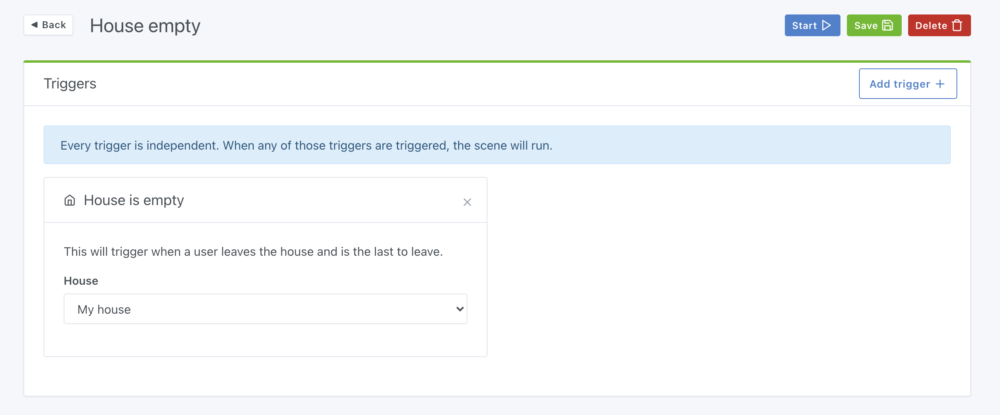
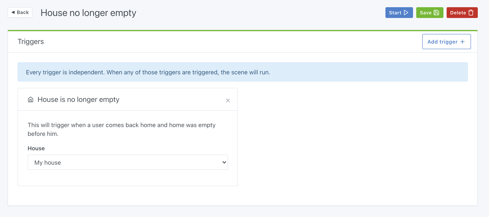
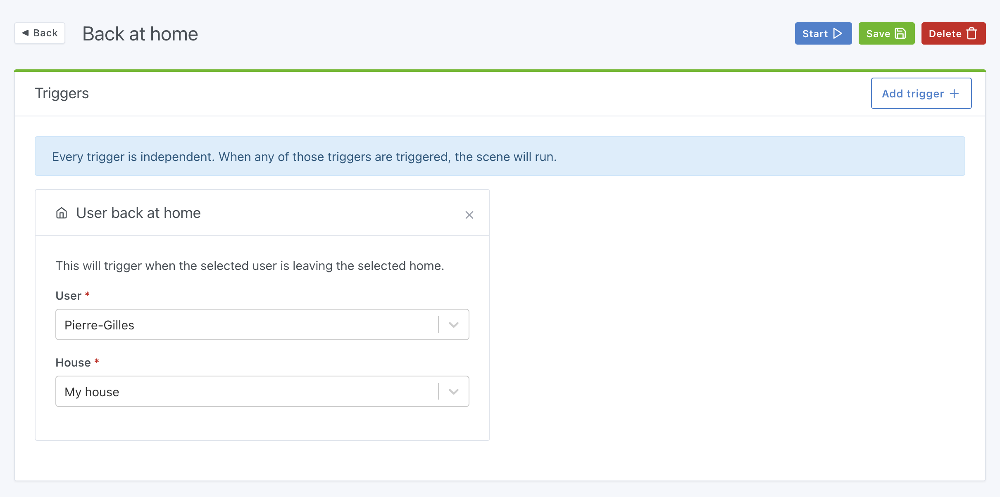
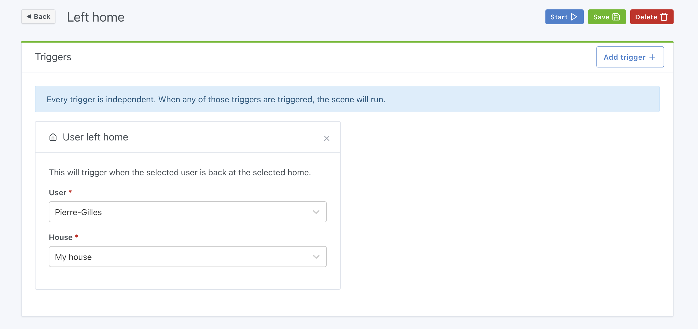
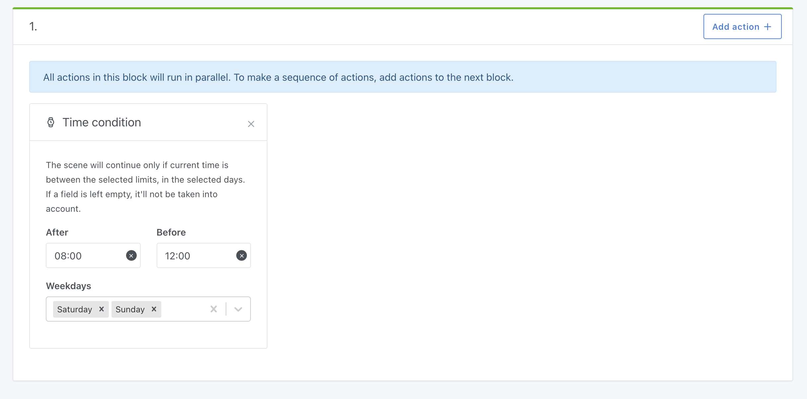
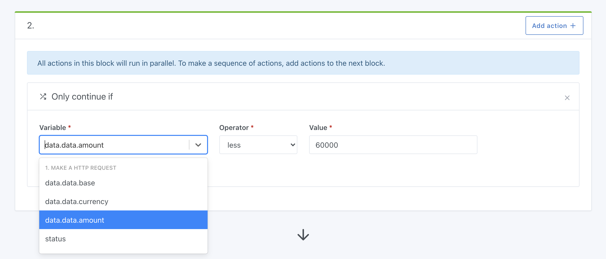

¡Hola a todos!

Hoy se publica Gladys Assistant v4.3, una nueva actualización que pone las escenas en el centro de atención.

Las escenas son la columna vertebral de la domótica.

Tener una casa conectada no consiste solo en controlarla a distancia: también se trata de automatizar lo que hacemos a diario, de aportar un toque de magia a nuestro hogar y de hacernos la vida más fácil.

{/* truncate */}

## Novedades de la versión 4.3

### Un nuevo disparador "Cuando la casa está vacía"

¿Quieres asegurarte de que todo esté apagado cuando la última persona salga de casa?

Ahora puedes crear una escena que se active cuando el último se vaya de casa.

La detección de presencia está disponible desde Gladys Assistant v4.1 y puede funcionar de distintas maneras:

- Por Bluetooth: existen llaveros Bluetooth como el Nut que Gladys detecta muy fácilmente. El principio es sencillo: cuando sales de casa, Gladys deja de "ver" el llavero Bluetooth y te marca como ausente; cuando vuelves, Gladys detecta el llavero y te marca como presente.
- En las escenas: puedes crear una escena que se active, por ejemplo, tras un cambio de estado de un sensor y que te marque como presente/ausente en casa. Así puedes decidir más o menos libremente cómo marcarte como presente/ausente en casa.

### Su contrario: "Cuando la casa ya no está vacía"

¿Prefieres crear otra escena que lo encienda todo cuando alguien llega a casa y la casa estaba vacía antes?

Es posible con el disparador "Cuando la casa ya no está vacía":

### Más preciso: el disparador "De vuelta en casa"

¿Quieres activar una escena solo cuando una persona concreta llega a casa?

Ahora hay un disparador "De vuelta en casa" que solo se activa cuando el usuario seleccionado vuelve a casa.

Muy práctico para crear una escena específica para cada persona de la casa.

### Y su contrario: "Ha salido de casa"

El mismo concepto, pero para cuando alguien sale de casa.

### Condición horaria

Aunque ya era posible crear una escena que se active con cierta recurrencia (con las [escenas programadas](/es/docs/scenes/scheduled-trigger)), hasta ahora no se podía añadir una condición horaria dentro de la escena.

Por ejemplo, imagina que quieres crear esta escena:

- "Cuando la temperatura del salón sea < 20 °C"
- Y "sea entre las 9 h y las 22 h"
- ENTONCES envíame el mensaje "La temperatura es demasiado baja"

¡Es posible con la condición horaria!

Ejemplo de una escena que solo se ejecutará entre las 8 h y las 12 h los fines de semana:

### Obtener el resultado de una petición HTTP

Desde Gladys v4.0.3, es posible hacer peticiones HTTP en las escenas.

Muy práctico para llamar a una API externa desde tus escenas.

A partir de ahora, puedes recuperar la respuesta de la llamada HTTP y usar el resultado de la petición en tus escenas.

Por ejemplo, imagina que quieres crear una escena que llame cada mañana a la API de Coinbase para obtener el precio del Bitcoin y te envíe un mensaje con el precio.

Ahora es posible, y aquí tienes un ejemplo en vídeo:

<video  width="100%" controls autoplay loop muted>
<source src="/img/articles/en/gladys-4-3/bitcoin-price.mp4" type="video/mp4" />
  Tu navegador no es compatible con la etiqueta de vídeo.
</video>

Por supuesto, esto es solo un ejemplo entre muchos.

Podrías consultar una API meteorológica, una API de tráfico, un sensor de tu casa, IFTTT y muchas otras cosas...

¡Y eso no es todo! Las variables obtenidas en la llamada HTTP se pueden usar en la condición "Continuar solo si", lo que te permite comprobar que se cumple una condición.

Ejemplos:

- Recibir un mensaje solo si la temperatura exterior es < 0 °C.
- Recibir una alerta si una acción que sigues cae más de un 20 %

### Corrección de errores y erratas en la interfaz

Muchos usuarios han señalado pequeñas faltas de ortografía en la interfaz o errores de diseño responsive.

Sin entrar en detalles, esta es la lista de los distintos commits de corrección de esta actualización:

- Fix #1147: make signup process more responsive [`#1147`](https://github.com/GladysAssistant/Gladys/issues/1147)
- Fix #1161: correct french typo [`#1161`](https://github.com/GladysAssistant/Gladys/issues/1161)
- Fix #1162: correct date format in french scheduled trigger [`#1162`](https://github.com/GladysAssistant/Gladys/issues/1162)
- Fix url in signup process [`8ee5793`](https://github.com/GladysAssistant/Gladys/commit/8ee5793bfa1b3153c8c26bc1e4e2c9b8f2144a8a)
- Add switch dimmer to supported feature types in dashboard box [`b740657`](https://github.com/GladysAssistant/Gladys/commit/b7406570a9e96d4590f78c05bca97a84b8978001)

## ¿Cómo actualizar?

Para actualizar Gladys, te recomendamos usar Watchtower: actualiza tu contenedor automáticamente en cuanto se publica una nueva versión. Consulta la [documentación](/es/docs/installation/docker#auto-upgrade-gladys-with-watchtower).

## Gracias a los colaboradores

Una vez más, gracias a todas las personas que han contribuido a esta versión: ya sea programando, proponiendo nuevas ideas en el foro o probando las nuevas funciones, ¡cada ayuda es valiosísima y hace que el producto sea más completo!
