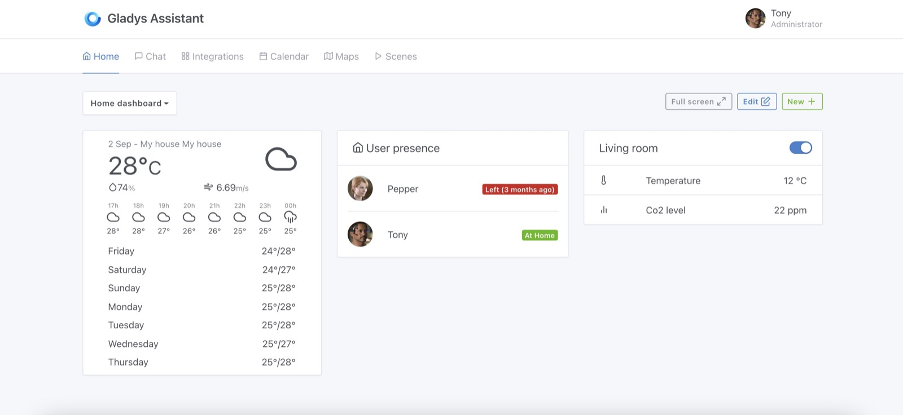
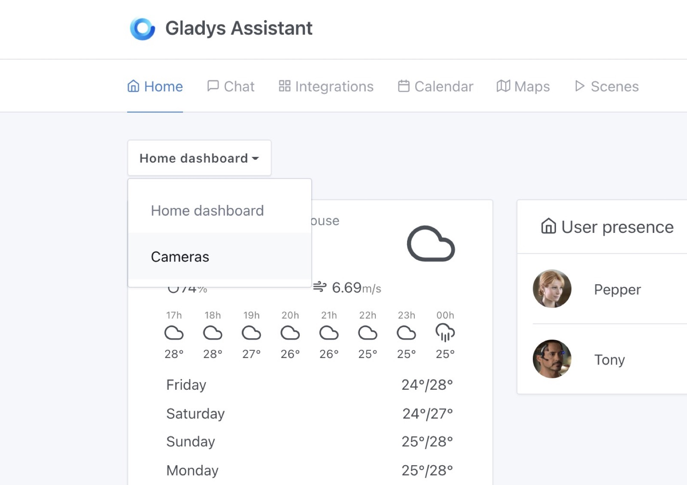
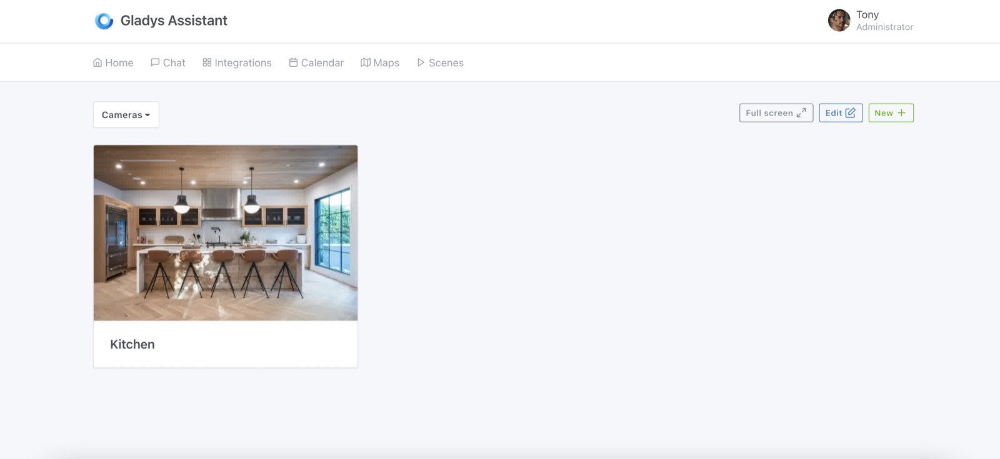
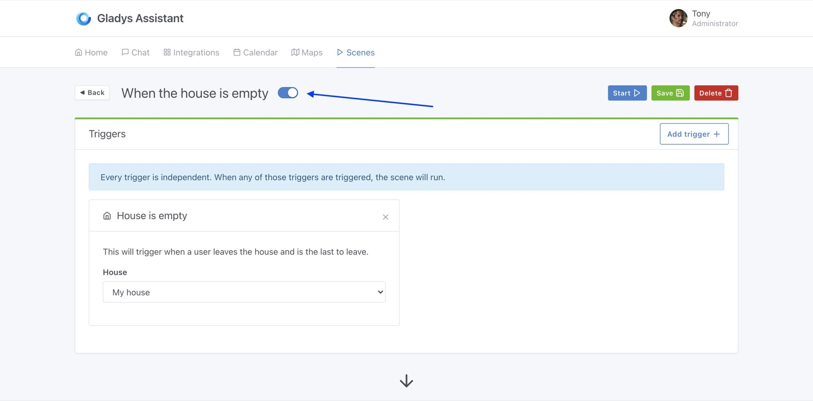
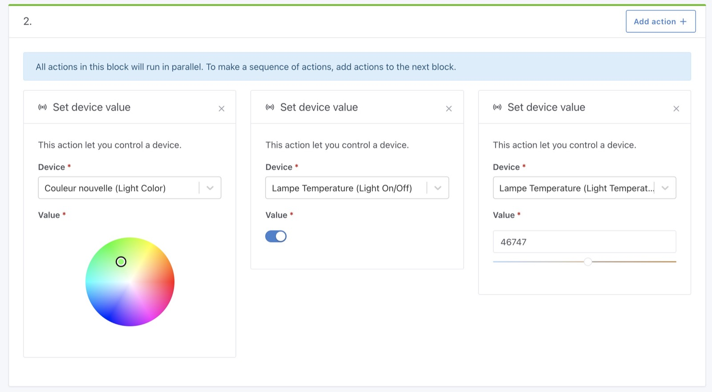
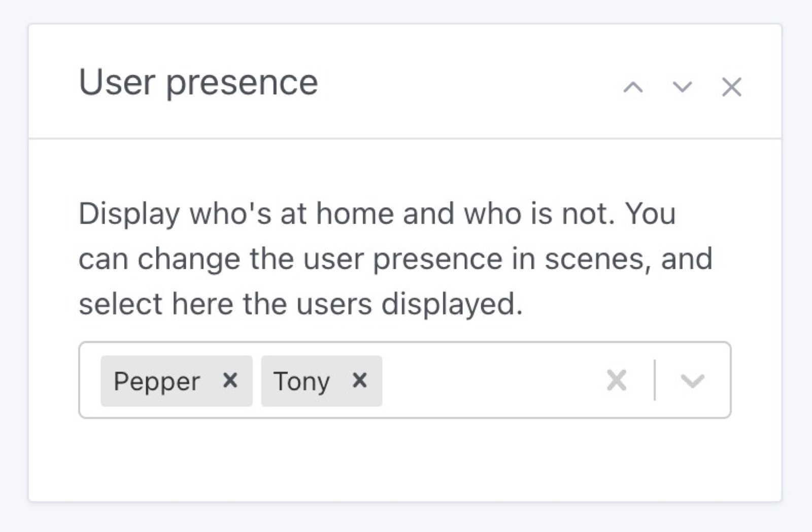

Hola a todos:

Hoy publicamos Gladys Assistant v4.5, ¡una versión que trae un montón de novedades a Gladys Assistant! ¡Te las enseño!

## ¿Qué hay de nuevo en Gladys Assistant 4.5?

### Varios paneles

Ahora puedes tener varios paneles en Gladys Assistant.

Puedes crear varios paneles, y cada uno tiene su propia URL, así que puedes guardar tus paneles favoritos como marcadores en tu navegador.

Puedes elegir el panel que quieres mostrar:

Y pasarás a otro panel, ¡así de fácil!

{/* truncate */}

### Desactivar una escena

Era una de las funciones más solicitadas: ¡ahora puedes desactivar una escena en Gladys Assistant! ¡Por fin!

Tanto si estás probando una escena, te vas de vacaciones o simplemente quieres desactivar una escena molesta: ¡ya puedes hacerlo!

### Nueva acción "Establecer el valor de un dispositivo" en las escenas

Ahora puedes controlar cualquier dispositivo en una escena:

- Puedes controlar el color de una lámpara
- Controlar la temperatura de color de una lámpara
- Controlar cualquier valor de varios niveles

Es muy potente, ¡y espero que te guste!

### Mejoras en el widget "Usuarios en casa" del panel

Un pequeño cambio: ahora puedes elegir qué usuarios se muestran en el widget "Usuarios en casa" del panel.

### Muchas mejoras de rendimiento

Como el foro estuvo muy tranquilo este verano, me tomé el tiempo de trabajar en algunas tareas a más largo plazo.

Migré preact-cli (la herramienta que usamos para compilar el frontend de Gladys) a su nueva versión 3.x. No fue fácil, pero sin duda valió la pena, porque redujo muchísimo el tamaño del bundle de JavaScript.

También trabajé bastante en eliminar algunas librerías pesadas que no eran realmente necesarias en el frontend, ¡para hacerlo más ligero y rápido!

Espero que disfrutes de la nueva velocidad :)

### Una primera alfa de la integración con Google Home en Gladys Plus

Estoy trabajando en la integración de [Gladys Plus](/es/plus) con Google Home. El objetivo es poder controlar tus dispositivos:

- En la app Google Home
- Por voz con un dispositivo Google Home
- Con el Asistente de Google en tu móvil

[Aquí tienes una breve demo de la integración en Twitter](https://twitter.com/pierregillesl/status/1405786308329365504).

Si te interesa probarla, ¡envíame un mensaje en [el foro](https://community.gladysassistant.com/)!

### Nuevos dispositivos Zigbee2mqtt compatibles

Se han añadido algunos dispositivos Zigbee2mqtt nuevos:

- Sensor de calidad del aire TuYa TS0601 y función de CO2 [`#1247`](https://github.com/GladysAssistant/Gladys/pull/1247)
- Philips Hue 929002241201 [`#1259`](https://github.com/GladysAssistant/Gladys/pull/1259)
- Función de color de luz [`#1203`](https://github.com/GladysAssistant/Gladys/pull/1203)

### Corrección de un bug de Bluetooth

Había un bug recurrente por el que Gladys no podía conectarse al driver de Bluetooth porque el driver no estaba "listo".

Esto ya está corregido en Gladys Assistant v4.5.

Más información en este commit: Bluetooth check state before scan + stop presence scanner [`#1194`](https://github.com/GladysAssistant/Gladys/pull/1194)

## ¿Cómo actualizar?

Para actualizar Gladys, te recomendamos usar Watchtower: actualiza tu contenedor automáticamente en cuanto se publica una nueva versión. Consulta la [documentación](/es/docs/installation/docker#auto-upgrade-gladys-with-watchtower).

## Gracias a los colaboradores

¡Gracias a todos los que han contribuido a esta versión y han dado su opinión en el foro!

Si quieres hablar de esta versión, ¡estás más que invitado al [foro](https://community.gladysassistant.com/)!
