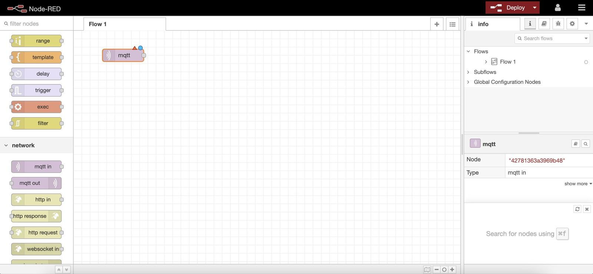
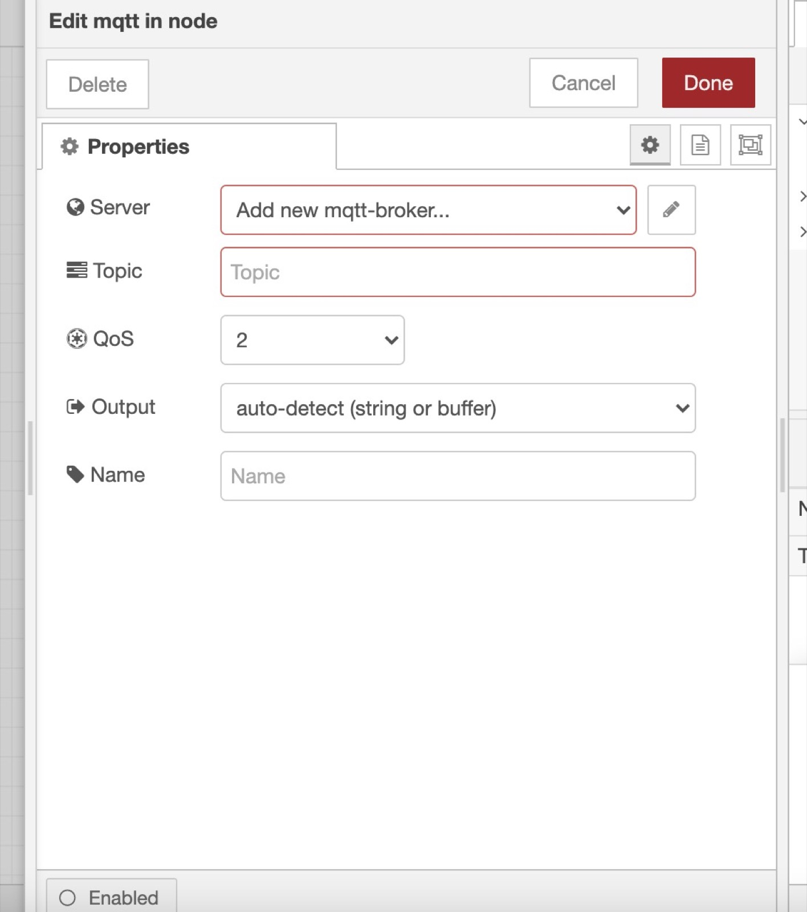
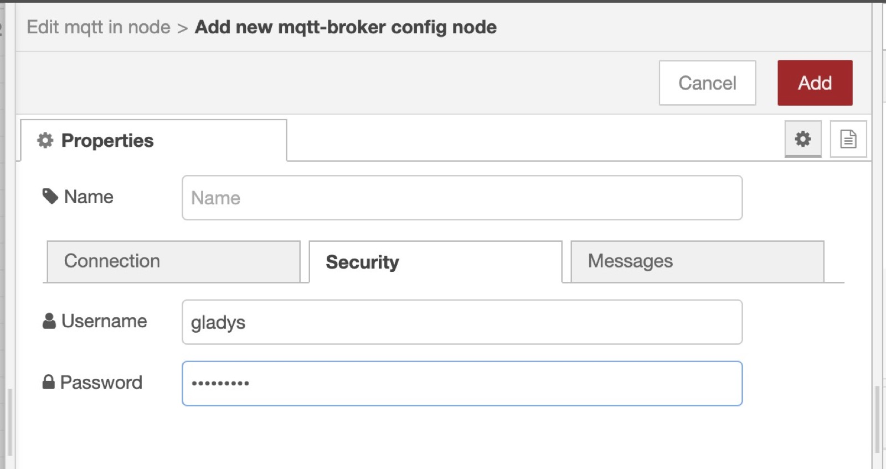
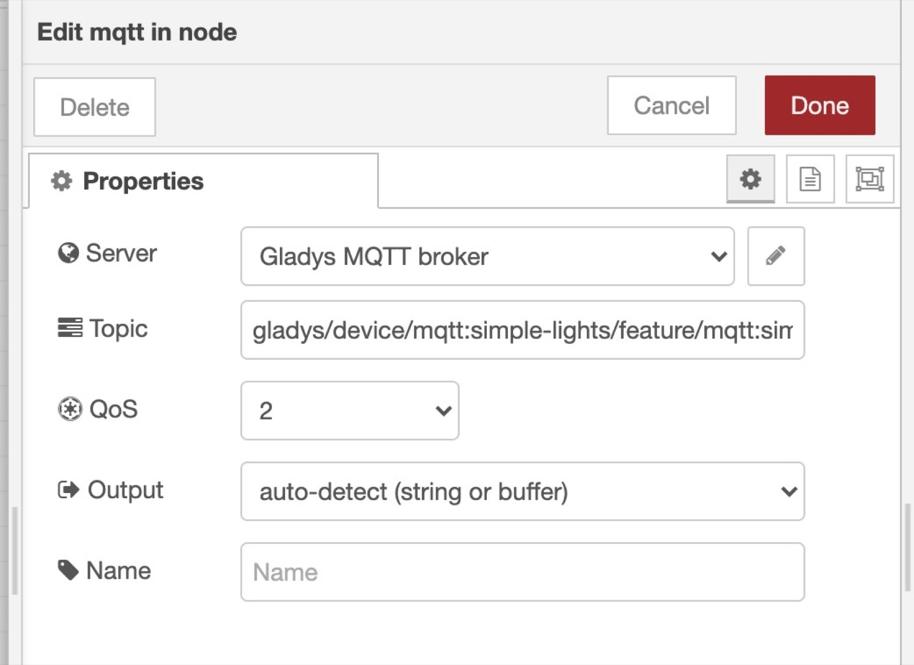
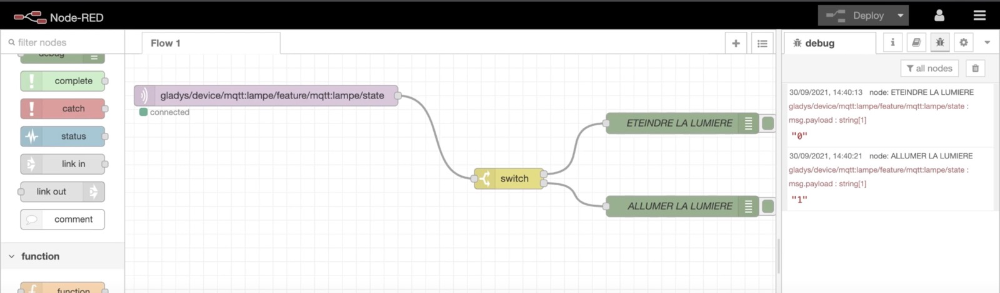
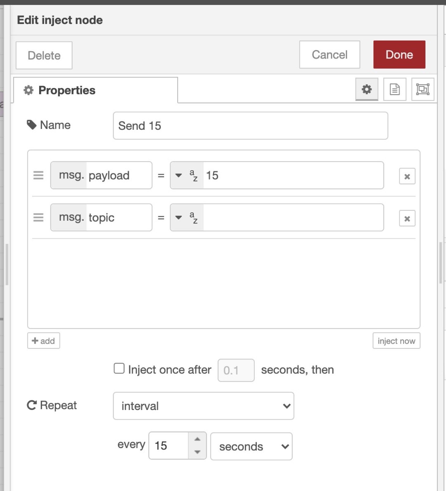
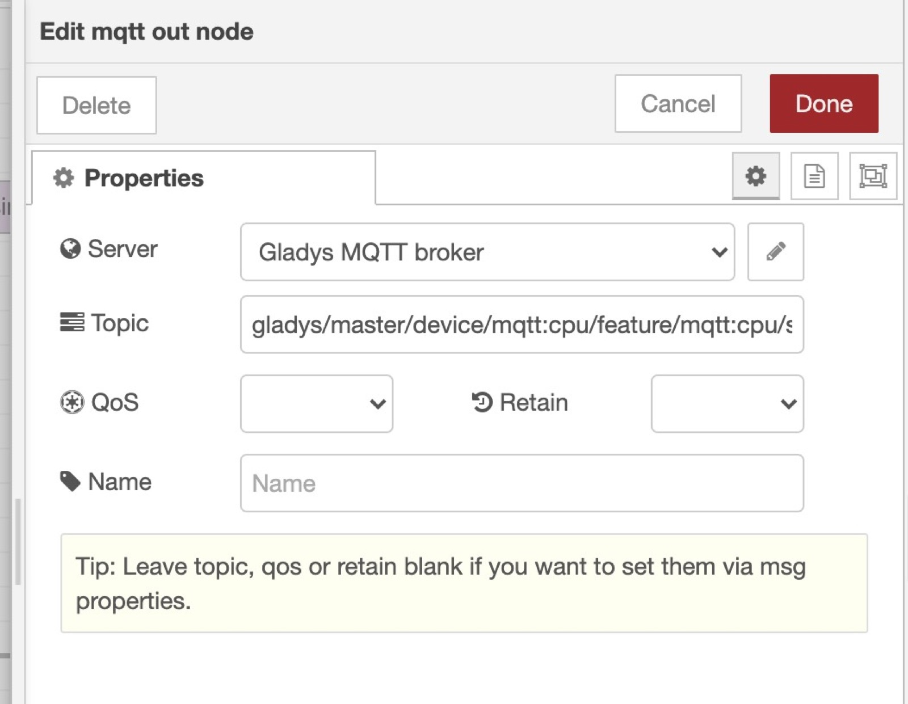

¡Hola!

En este tutorial quiero mostrarte que es posible integrar Gladys Assistant con otros programas de código abierto geniales, como Node-RED.

{/* truncate */}

## Arrancar Gladys Assistant

Para este tutorial necesitas una instancia de Gladys Assistant.

Puedes instalar Gladys Assistant en una Raspberry Pi con nuestra imagen de Raspberry Pi OS preconfigurada, o usar Docker para lanzar un contenedor de Gladys.

Para empezar, sigue nuestra [documentación](/es/docs/).

## Arrancar Node-RED

Usaremos Docker para instalar Node-RED.

### Arrancar la imagen Docker de Node-RED

Node-RED tiene una sección [Getting Started](https://nodered.org/docs/getting-started/) en su sitio web, pero si simplemente quieres usar Docker, puedes ejecutar este comando:

```
docker run -d \
--log-opt max-size=10m \
--restart=always \
--privileged \
-u root \
--network=host \
--name node_red \
-v /var/lib/node-red:/data \
nodered/node-red
```

**Algunos detalles:**

- Hemos usado el modo "privileged" por si quieres ejecutar módulos de domótica en tu máquina que a veces necesitan más permisos para acceder al sistema. Si no lo necesitas, puedes quitarlo sin problema.
- "-u root" sirve para arrancar el contenedor con el usuario "root". Puedes cambiar "root" por el usuario actual de tu máquina Linux. En una Raspberry Pi, probablemente será "pi".
- "/var/lib/node-red": la carpeta donde se guardarán los datos de Node-RED.

### Proteger Node-RED

Por defecto, Node-RED está abierto. Tenemos que protegerlo para que no pueda usarlo cualquiera.

El administrador de Node-RED se configura desde la línea de comandos.

Primero tienes que generar el hash de tu contraseña ejecutando el siguiente comando:

```
docker exec -it node_red node-red admin hash-pw
```

Introduce tu contraseña.

A continuación, se mostrará una cadena como esta:

```
$2b$08$6yOj6Z/ya7eDdn3eKwy4WukuyHUxiJOcZyHFiHPaCQBckKpLxUPly
```

Es una versión hasheada de la contraseña "test".

Abre el archivo `/var/lib/node-red/settings.js` con:

```
nano /var/lib/node-red/settings.js
```

Si no funciona, puede que nano no esté instalado en tu máquina.

En Ubuntu/Debian, ejecuta:

```
sudo apt-get -y install nano
```

Ve a las líneas que contienen:

```
//adminAuth: {
//    type: "credentials",
//    users: [{
//        username: "admin",
//        password: "$2a$08$zZWtXTja0fB1pzD4sHCMyOCMYz2Z6dNbM6tl8sJogENOMcxWV9DN.",
//        permissions: "*"
//    }]
//},
```

Descomenta esas líneas y sustituye la contraseña por la contraseña hasheada que generaste antes.

Deberías tener algo parecido a esto:

```
adminAuth: {
    type: "credentials",
    users: [{
        username: "admin",
        password: "$2b$08$6yOj6Z/ya7eDdn3eKwy4WukuyHUxiJOcZyHFiHPaCQBckKpLxUPly",
        permissions: "*"
    }]
},
```

Ahora reinicia Node-RED con el comando:

```
docker restart node_red
```

¡Y listo, Node-RED debería estar protegido!

### Acceder a Node-RED

¡Enhorabuena, Node-RED debería estar disponible en `IP_DE_TU_MAQUINA:1880`!

Deberías ver una pantalla de inicio de sesión.

Aquí, usa las credenciales que configuraste antes en el archivo settings.js.

En mi caso son:

```
Username: admin
Password: test
```



## Configurar MQTT en Gladys Assistant

Ahora ve a Gladys Assistant y haz clic en "Integraciones" => "MQTT".

Ve a la pestaña "Configuración" y haz clic en el gran botón azul "Instalar el broker en Docker" para configurar automáticamente un broker MQTT.

También puedes usar un broker MQTT que ya hayas configurado previamente.

### Crear un dispositivo MQTT en Gladys Assistant

De vuelta en la pestaña "Dispositivos" de la integración MQTT, puedes crear un nuevo dispositivo:

- Nombre: "Lámpara"
- ID externo: "mqtt-lamp"
- Habitación: "Cocina"
- Funciones: añade una función "Luz encendida/apagada" para poder controlar la lámpara
  - Nombre: "Lámpara"
  - ID externo de la función: "mqtt-lamp"
  - Valor mínimo: 0
  - Valor máximo: 1
  - ¿Es un sensor? No

Copia el topic MQTT que se muestra, ¡lo necesitarás más adelante!

## Controlar un dispositivo en Node-RED desde Gladys Assistant

En Node-RED, puedes crear un nodo "mqtt in" para recibir datos de Gladys por MQTT.

Tienes que añadir el broker MQTT que acabamos de configurar en Gladys haciendo clic en el pequeño botón de edición (el icono del lápiz junto a "Add new mqtt-broker"):



- El servidor es `mqtt://localhost`
- Usuario: gladys
- Contraseña: copia la contraseña generada en Gladys.



Por último, pega el topic MQTT que copiamos de Gladys al crear el dispositivo:



Ahora que este nodo está listo, puedes conectarle prácticamente cualquier cosa: se ejecutará cada vez que se reciba un valor en este topic MQTT.

Podrías conectar un simple nodo de debug para ver los datos que llegan, o un nodo switch para realizar una acción distinta según si Gladys envía "0" (apagar) o "1" (encender).

Ejemplo:



## Enviar el valor de un sensor desde Node-RED a Gladys Assistant

Ahora haremos el escenario inverso en Node-RED: enviar datos desde Node-RED a Gladys.

Imaginemos que quiero medir el uso de CPU de mi máquina y enviarlo a Gladys cada 10 segundos.

### Crear un dispositivo MQTT en Gladys

Puedo crear en Gladys un dispositivo MQTT "Uso de CPU":

- Nombre: "CPU"
- ID externo: "mqtt-cpu"
- Habitación: "Cocina"
- Funciones: añade una función "Desconocido" (puedes elegir cualquiera, es solo para el ejemplo)
  - Nombre: "CPU"
  - ID externo de la función: "mqtt-cpu"
  - Valor mínimo: 0
  - Valor máximo: 100
  - ¿Es un sensor? Sí

Copia el topic MQTT que se muestra, ¡lo necesitarás más adelante!

### Enviar un valor desde Node-RED cada 15 segundos

Añade un nodo "Inject" en Node-RED.

Asigna a `msg.payload` un valor cualquiera (aquí he puesto 15).

Añade al final del nodo un intervalo de repetición de 15 segundos.



Ahora añade un nodo "mqtt out" y pega el topic MQTT que guardamos antes al crear el dispositivo CPU.



Conecta el nodo "Inject" al nodo "mqtt out" y haz clic en "Deploy".

¡Ahora verás que cada 15 segundos Node-RED envía el valor "15" a Gladys por MQTT!

Puedes comprobarlo creando un panel y mostrando en él el dispositivo que acabamos de crear.

## Para ir más allá

El objetivo de usar Node-RED aquí es poder controlar dispositivos que todavía no son compatibles con Gladys, así que te conviene echar un vistazo a los módulos de Node-RED para añadir nuevas compatibilidades a Gladys.

Puedes buscarlos en su [sitio web](https://flows.nodered.org/search?type=node&sort=downloads).

Después, en Node-RED, haz clic en el menú de arriba a la derecha y luego en "Manage palette" para instalar nuevos módulos.

Luego podrás usar los módulos instalados en Node-RED desde el panel izquierdo.
