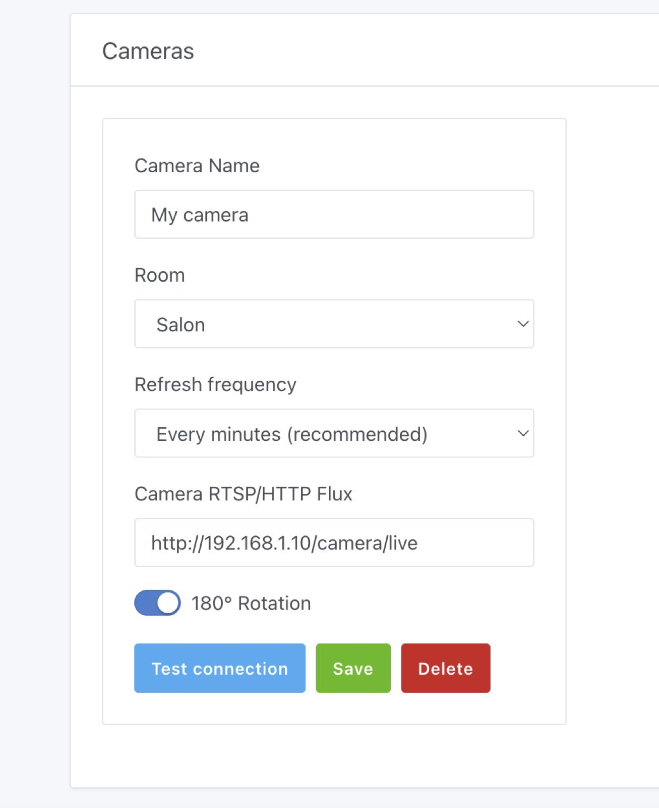
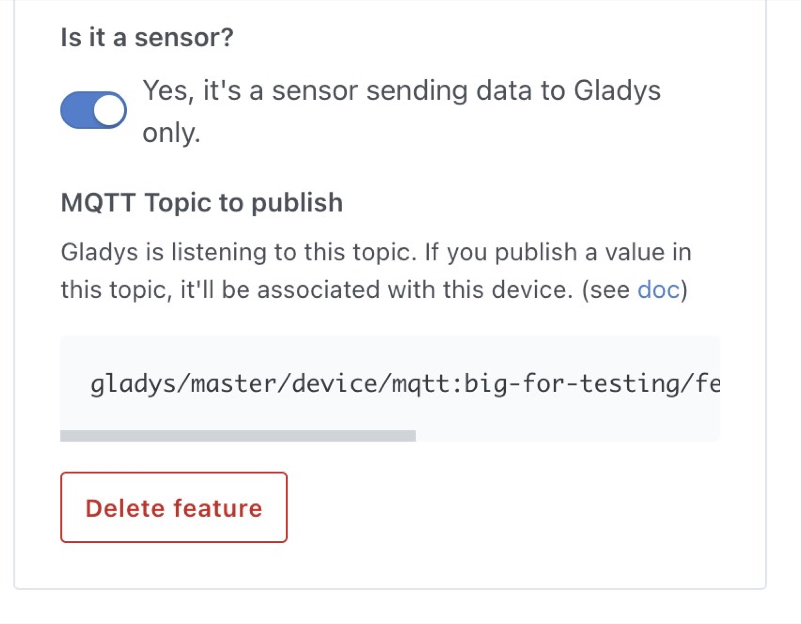
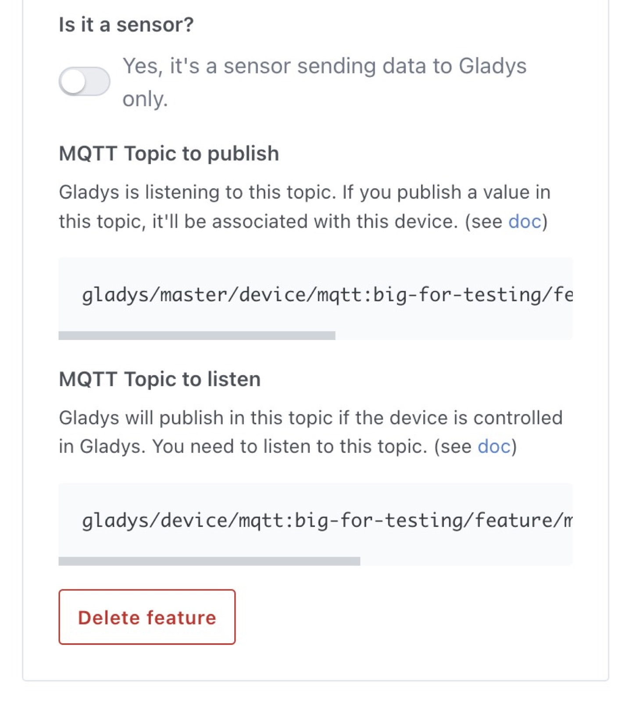

¡Hola a todos!

Hoy me alegra publicar una nueva versión de Gladys: Gladys Assistant v4.8 🥳

Esta versión se centra sobre todo en la integración de calendarios, pero también trae muchas mejoras de experiencia de usuario en Gladys.

{/* truncate */}

## ¿Qué hay de nuevo en Gladys Assistant 4.8?

### Disparador de escena cuando se acerca un evento del calendario

Es una gran función que por fin hace que los calendarios sean realmente útiles en Gladys.

Ahora puedes activar una escena cuando se acerca un evento concreto del calendario.

¿Quieres recibir un recordatorio cuando tengas que ir al trabajo? ¿O que te despierten suavemente a la hora adecuada?

Necesitas tener al menos un calendario conectado a Gladys (compatibles: calendarios de iCloud, Google Calendar, calendarios de Synology o cualquier calendario CalDAV mediante nuestra [integración CalDAV](/es/docs/integrations/caldav/)).

Crea una nueva escena y añade un disparador "Se acerca un evento del calendario":

Puedes filtrar por el nombre del evento (contiene "gimnasio", empieza por "Reunión", cualquier nombre ¡y más!)

Después, en la escena puedes usar la información del evento que ha activado la escena, por ejemplo en una acción "Enviar un mensaje":

### Condición de escena cuando un evento del calendario está en curso

Ahora imagina que quieres añadir una condición a una escena para que solo se ejecute cuando estás en el trabajo, en una reunión o de vacaciones.

Para ello, puedes usar la condición "Condición sobre eventos del calendario" en las escenas.

Igual que con el disparador, puedes filtrar por el nombre.

Y, por supuesto, puedes usar el evento en las acciones siguientes de la misma escena.

### Girar la imagen de la cámara 180°

Gracias a la [Pull Request de VonOx en GitHub](https://github.com/GladysAssistant/Gladys/pull/1297), ahora puedes girar la imagen de una cámara en Gladys:

### Mejoras de experiencia de usuario en MQTT

Una pequeña mejora que marcará una gran diferencia para entender cómo funciona MQTT: los topics MQTT de publicación y suscripción se muestran ahora directamente en la interfaz para los dispositivos que no son sensores.

Para los sensores MQTT, se ve así:

Para cualquier dispositivo que no sea un sensor:

### Zigbee2mqtt: sensores de CO y función de alarma

Gracias al trabajo de Alexandre Trovato en GitHub ([aquí](https://github.com/GladysAssistant/Gladys/pull/1417) y [aquí](https://github.com/GladysAssistant/Gladys/pull/1420)), ahora puedes añadir un sensor de CO mediante Zigbee2mqtt y usar la función de alarma en Gladys.

## ¿Cómo actualizar?

Para actualizar Gladys, te recomendamos usar Watchtower: actualiza tu contenedor automáticamente en cuanto se publica una nueva versión. Consulta la [documentación](/es/docs/installation/docker#auto-upgrade-gladys-with-watchtower).

## Gracias a los colaboradores

¡Gracias a todas las personas que han contribuido a esta versión y han compartido sus comentarios en el foro!

Si quieres hablar de esta versión, ¡estás más que invitado al [foro](https://community.gladysassistant.com/)!

## Apóyanos

Si quieres apoyarnos, hay muchas formas de hacerlo:

- Responde a mensajes en el foro y comparte tus comentarios.
- Ayúdanos a mejorar la documentación.
- Desarrolla nuevas funciones/integraciones para Gladys: somos 100 % código abierto.
- Haz una [donación puntual](https://www.buymeacoffee.com/gladysassistant).
- Suscríbete a nuestra [suscripción mensual a Gladys Plus](/es/plus).
