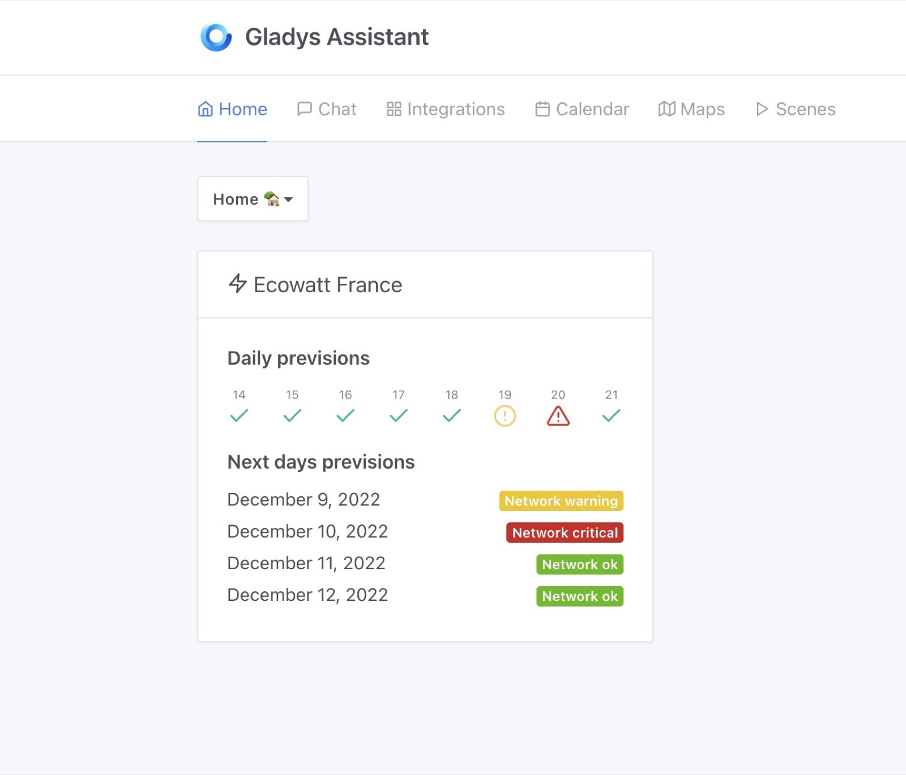
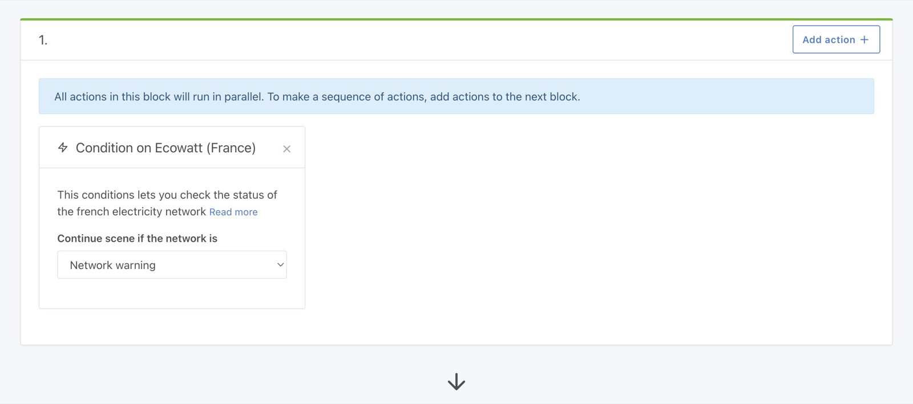

Gladys Assistant 4.13 ya está disponible, ¡y es una gran versión!

Hemos mejorado mucho la experiencia de los desarrolladores, hemos actualizado Gladys a Node.js 18 (¡desde la 14!) y ofrecemos una nueva integración para los usuarios de Francia.

{/* truncate */}

## ¿Qué hay de nuevo en Gladys Assistant 4.13?

### Integración Ecowatt

En Francia, este invierno preocupa que la producción eléctrica no sea suficiente para cubrir el consumo en las horas punta.

Nuestro operador de la red eléctrica ha creado una API que indica a los ciudadanos las horas del día en las que la red está más saturada.

Hemos integrado esta API en Gladys para que nuestros usuarios de Francia puedan reducir automáticamente su consumo eléctrico cuando la red más lo necesita.

En tu panel de control puedes ver el estado de la red eléctrica y las previsiones:

En las escenas, puedes reducir automáticamente tu consumo cuando la red está más saturada:

### Actualización a Node.js 18 LTS

Gladys ahora se basa en Node.js 18 LTS.

Esto ha tenido un gran impacto en la velocidad de nuestra CI, porque al actualizar pudimos eliminar muchos polyfills compilados.

Por ejemplo, usábamos un polyfill de Webcrypto para el cifrado de extremo a extremo de Gladys Plus, y a partir de Node.js 16 la API Webcrypto está disponible de forma nativa en Node.

Resultado: ¡nuestros tests han pasado de 16 minutos a solo 6 minutos!

### Fin de la compatibilidad con Open-Zwave

Ya no admitimos open-zwave, porque esta integración no compilaba en Node.js > 14.

Como Node 14 llega al final de su vida útil el año que viene, era imprescindible actualizar para mantener Gladys seguro.

Estamos trabajando en una nueva integración basada en Zwave-JS-UI, pero mientras tanto te recomendamos usar Node-RED + Gladys + Zwave-JS-UI.

## ¿Cómo actualizar?

Para actualizar Gladys, te recomendamos usar Watchtower: actualiza tu contenedor automáticamente en cuanto se publica una nueva versión. Consulta la [documentación](/es/docs/installation/docker#auto-upgrade-gladys-with-watchtower).

## Gracias a los colaboradores

Gracias a todos los que han contribuido a esta versión y han dado su opinión.

Si quieres hablar de esta versión, ¡eres bienvenido en el [foro](https://community.gladysassistant.com/)!

## Apóyanos

Si quieres apoyarnos, hay muchas formas de hacerlo:

- Responde mensajes en el foro y danos tu opinión.
- Ayúdanos a mejorar la documentación.
- Desarrolla nuevas funciones/integraciones para Gladys: somos 100 % código abierto.
- Suscríbete a [Gladys Plus](/es/plus).
