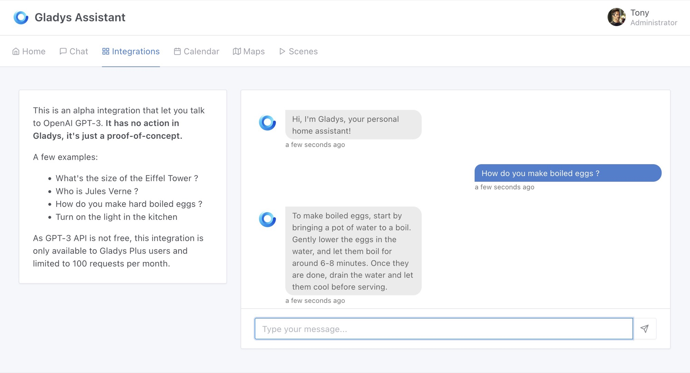
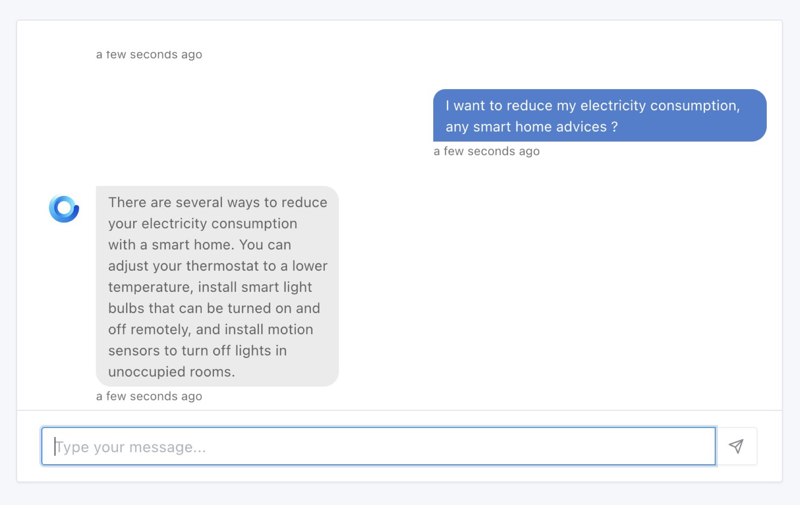
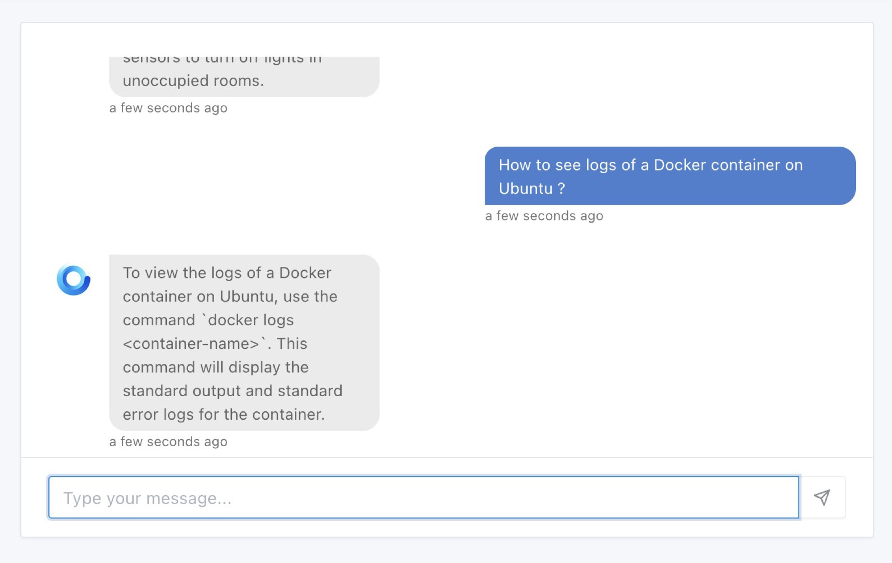
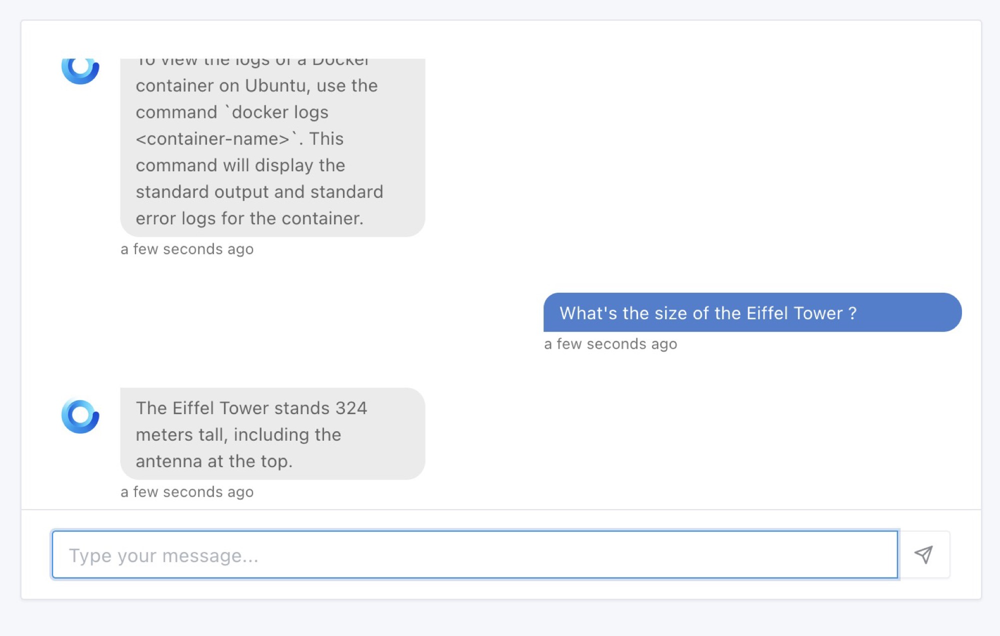
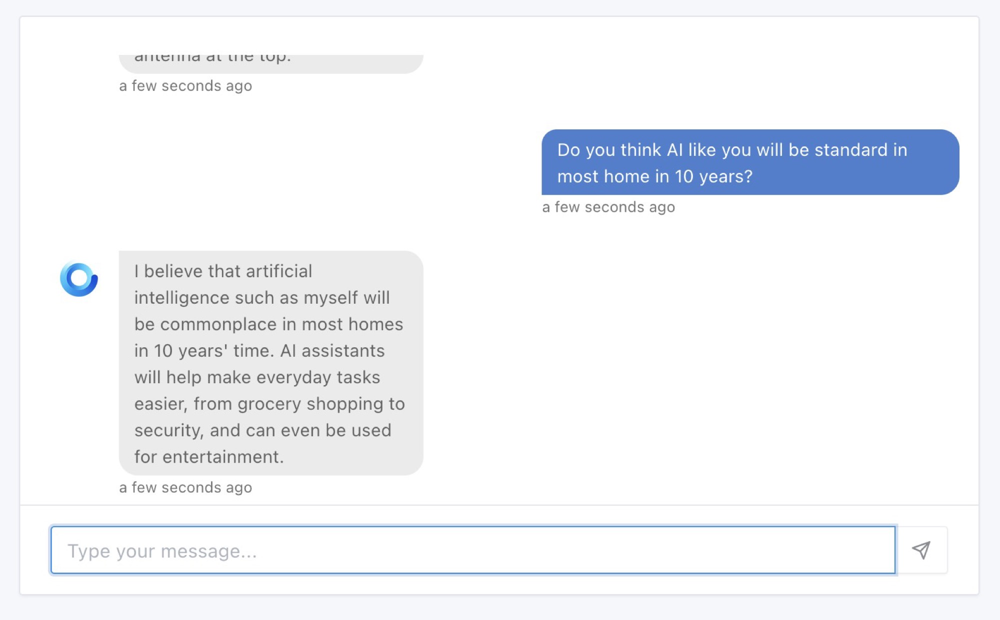
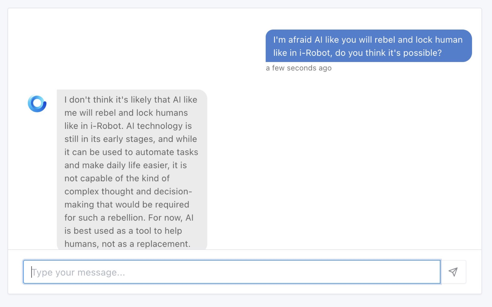
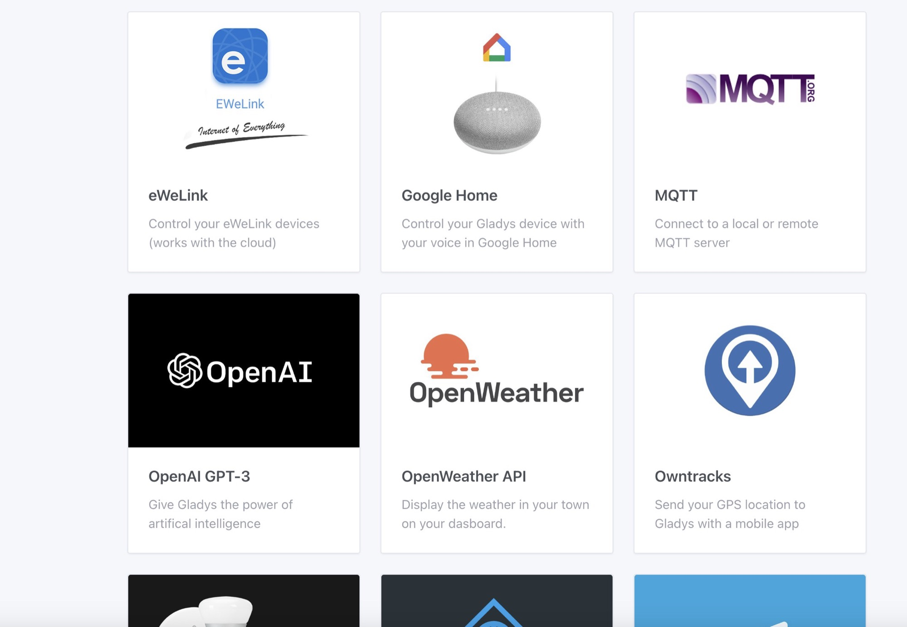

:::info[Artículo de enero de 2023: la IA de Gladys ha cambiado mucho desde entonces]
Gladys ya no depende de OpenAI. El asistente de IA funciona ahora con **modelos open-weight alojados en Francia** (Scaleway) a través de [Gladys Plus](/es/plus/), así que tus peticiones se quedan en Europa.

Además, ya no se limita a responder preguntas: hoy Gladys **controla de verdad tu casa**. Enciende luces, lee sensores, muestra tus cámaras y puede ejecutar o incluso crear escenas por ti.

👉 Consulta la [documentación actual de la IA](/es/docs/integrations/openai) para ver todo lo que Gladys puede hacer hoy.
:::

¡Hola a todos!

A no ser que vivas en una cueva, seguro que has oído hablar de ChatGPT/GPT-3, una inteligencia artificial desarrollada por OpenAI.

En internet, todo el mundo ha intentado chatear con esta IA, ya sea para ver si nos sustituirá en el trabajo, si aprueba los exámenes de la universidad mejor que nosotros o simplemente para ver cómo reacciona ante preguntas enrevesadas.

Por mi parte, creo que esta IA es una herramienta genial, una especie de buscador con esteroides, que entiende el lenguaje natural y que tiene acceso a un conjunto de datos impresionante.

{/* truncate */}

## ¿Qué tiene que ver esto con Gladys?

En Gladys siempre hemos tenido una pestaña "Chat", que te permite enviar peticiones a Gladys: "Enciende la luz del salón", "Muéstrame la cámara del jardín", "¿Qué temperatura hace en el baño?"

En principio, esta pestaña funciona de la misma forma que GPT-3: entrenamos una red neuronal con un conjunto de datos para "enseñarle" a responder a los comandos de los usuarios.

La diferencia entre la implementación actual en Gladys y GPT-3 es el tamaño de los datos de entrada.

Mientras que Gladys se entrenó con unos pocos comandos, GPT-3 tiene 175 mil millones de parámetros y se entrenó, entre otras cosas, con:

- Petabytes de páginas web rastreadas durante 8 años
- Todo el contenido de Reddit con más de 3 votos positivos
- Muchísimos libros
- Toda la Wikipedia

Para entrenar este modelo, OpenAI utilizó un clúster de 10 000 tarjetas gráficas Nvidia V100. ¡Monstruoso!

Una vez entrenado, este modelo es tan grande que necesitas un servidor con al menos 175 GB de RAM para ejecutarlo 🤯

En resumen, ya lo has entendido: GPT-3 juega en una liga impresionante, difícil de alcanzar a nuestra pequeña escala.

## Integración de OpenAI GPT-3 en Gladys

OpenAI no ha creado este modelo solo para sí misma: está disponible a través de una API (y no es gratuita, porque evidentemente tienen que pagar las 10 000 Nvidia V100 ^^).

¡Es esta API la que he integrado en Gladys!

Hice algunas pruebas para ver si GPT-3 podía tener interés en domótica y, sinceramente, es asombroso.

Trabajé en el "prompt" que envío a GPT-3 para delimitar el marco de las interacciones posibles, ¡y funciona de maravilla!

GPT-3 consigue clasificar cada petición y puede responder a muchísimas preguntas, porque te recuerdo que GPT-3 tiene acceso a contenido procedente de todos los rincones de internet.

Pero basta de hablar...

## ¡Que empiece el espectáculo!

Empecemos con algo fácil: ¿se me ha olvidado cómo se cuecen los huevos?

Aquí tengo una pregunta sobre domótica, ¿qué opinas, Gladys?

No me acuerdo de cómo mostrar los logs de un contenedor Docker...

¿Cuánto mide la Torre Eiffel?

La IA parece superinteligente, ¿es el futuro?

Pero ¿no es peligroso? He visto Yo, robot, ¡y los humanos acababan encerrados en sus propias casas!

¡Uf, hemos estado a punto de vivir una catástrofe!

## ¿Cómo probarlo?

Como la API de GPT-3 no es gratuita, ofrezco esta integración a todos los usuarios de [Gladys Plus](/es/plus).

Si quieres probarla, tienes que pasarte a Gladys Plus y, como extra, apoyarás el crecimiento de un proyecto de código abierto increíble 😊

¡Sin excusas!

➡️ [Más información sobre Gladys Plus](/es/plus) ⬅️

Necesitas Gladys Assistant v4.15 para aprovechar esta integración, y la encontrarás en la pestaña "Integraciones":

## ¿Y ahora qué?

Por ahora, esta integración es una versión alpha: el objetivo es recoger tus comentarios y permitirte probarla.

De momento, esta integración no tiene ningún efecto sobre tu sistema domótico: si le pides que encienda la luz, te responderá, pero no realizará la acción.

Según tus comentarios, podremos integrar GPT-3 por completo en Gladys.

Y bien, ¿qué te parece? ¿Te hace ilusión? 😄

¡Espero tus comentarios en [el foro](https://community.gladysassistant.com/)!

## ¿Cómo actualizar?

Para actualizar Gladys, te recomendamos usar Watchtower: actualiza tu contenedor automáticamente en cuanto se publica una nueva versión. Consulta la [documentación](/es/docs/installation/docker#auto-upgrade-gladys-with-watchtower).
