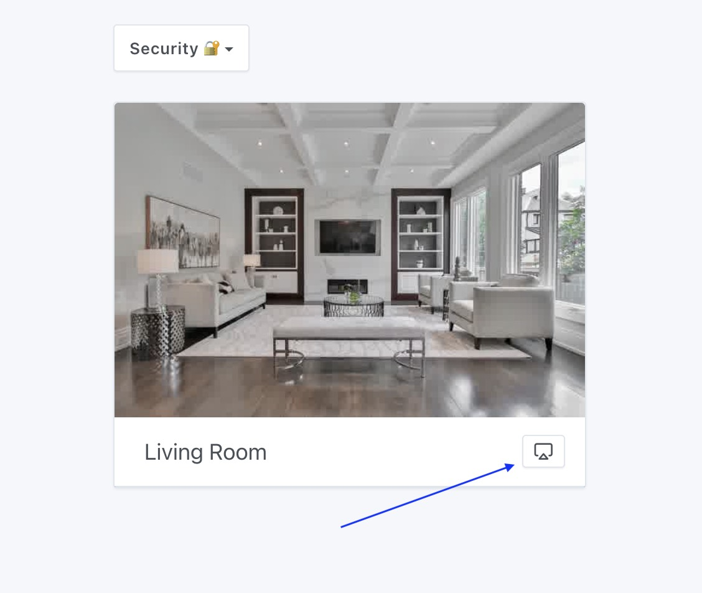
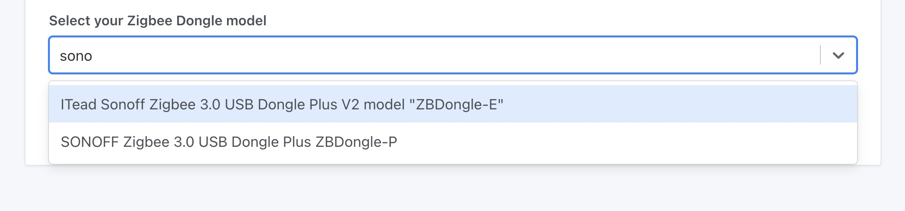
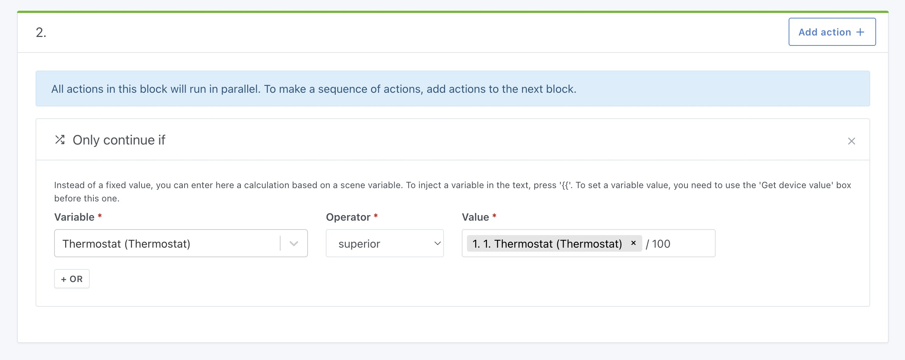
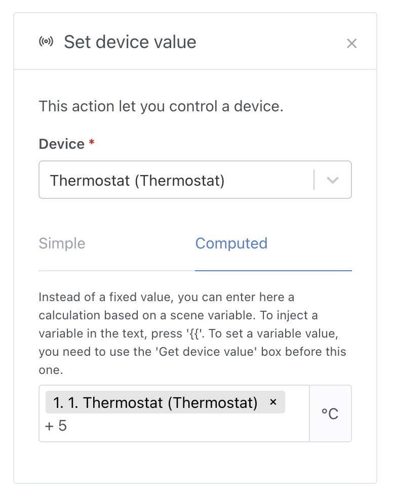
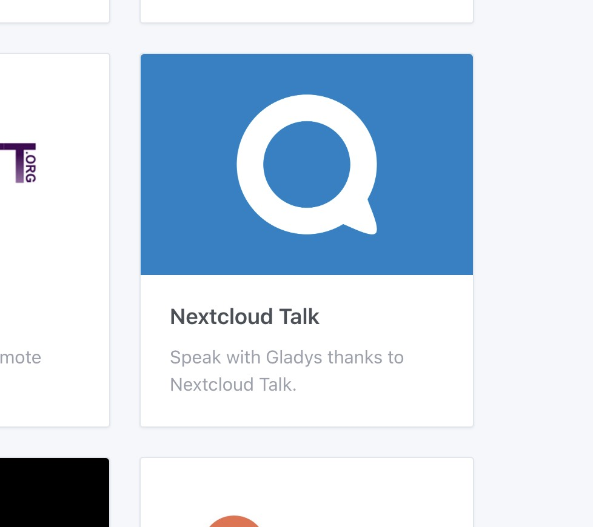

¡Hola a todos!

Hoy me alegra presentarte Gladys Assistant 4.23, ¡una nueva versión con un montón de novedades!

## Streaming de cámaras en directo

La gran novedad de esta versión es la posibilidad de ver tus cámaras en directo en el panel, ya sea en local o de forma remota a través de Gladys Plus.

El flujo de vídeo se cifra de extremo a extremo para garantizar tu privacidad, como siempre 😉

{/* truncate */}

**Nota:** esta función requiere bastantes recursos (reproducir un flujo de vídeo, comprimirlo y cifrarlo en directo consume recursos). Si la retransmisión no arranca o tarda demasiado en arrancar, puede que tu máquina no sea lo bastante potente. Por ejemplo, las Raspberry Pi de 32 bits no tienen potencia suficiente para ello.

## Selección del modelo de dongle Zigbee

En la integración Zigbee, ahora puedes seleccionar el modelo de dongle Zigbee que utilizas, ¡y el archivo de configuración de Zigbee2mqtt se actualizará automáticamente!

Gracias a AlexTrovato por el desarrollo 👏

## Cálculos en las escenas

En las escenas, ahora puedes hacer cálculos matemáticos en 2 lugares:

En la condición "Continuar solo si", puedes comparar varias variables entre sí haciendo un cálculo matemático:

En la acción "Controlar un dispositivo", puedes usar una variable y un cálculo matemático para obtener el valor que se enviará al dispositivo.

¡Muy útil para crear escenas dinámicas que se adaptan a la ejecución de la escena!

Gracias @bertrandda por el desarrollo 👏

## Integración NextCloud Talk

¡Nueva integración! Esta integración te permite usar NextCloud Talk para chatear con Gladys, de la misma forma que funciona la integración de Telegram.

Gracias @bertrandda por el desarrollo 👏

## Mejoras y correcciones varias

- Proceso de creación de cuenta mejorado: más ágil, más sencillo y con menos datos que rellenar.
- La integración HomeKit ahora es compatible con los sensores de apertura de puertas/ventanas
- El panel muestra los nombres de los sensores de forma más clara ([#1749](https://github.com/GladysAssistant/Gladys/pull/1749))
- Corregido un error en la acción "Petición HTTP" que no permitía enviar una petición POST con el cuerpo vacío ([#1772](https://github.com/GladysAssistant/Gladys/pull/1772))

## ¿Cómo actualizar?

Para actualizar Gladys, te recomendamos usar Watchtower: actualiza tu contenedor automáticamente en cuanto se publica una nueva versión. Consulta la [documentación](/es/docs/installation/docker#auto-upgrade-gladys-with-watchtower).

## Gracias a los colaboradores

Gracias a todos los que han contribuido a esta versión y han compartido sus comentarios.

Si quieres hablar de esta versión, ¡eres bienvenido en el [foro](https://community.gladysassistant.com/)!

## Apóyanos

Si quieres apoyarnos, hay muchas formas de hacerlo:

- Responde a mensajes en el foro y comparte tus comentarios.
- Ayúdanos a mejorar la documentación.
- Desarrolla nuevas funciones/integraciones para Gladys: somos 100 % código abierto.
- Suscríbete a [Gladys Plus](/es/plus).
