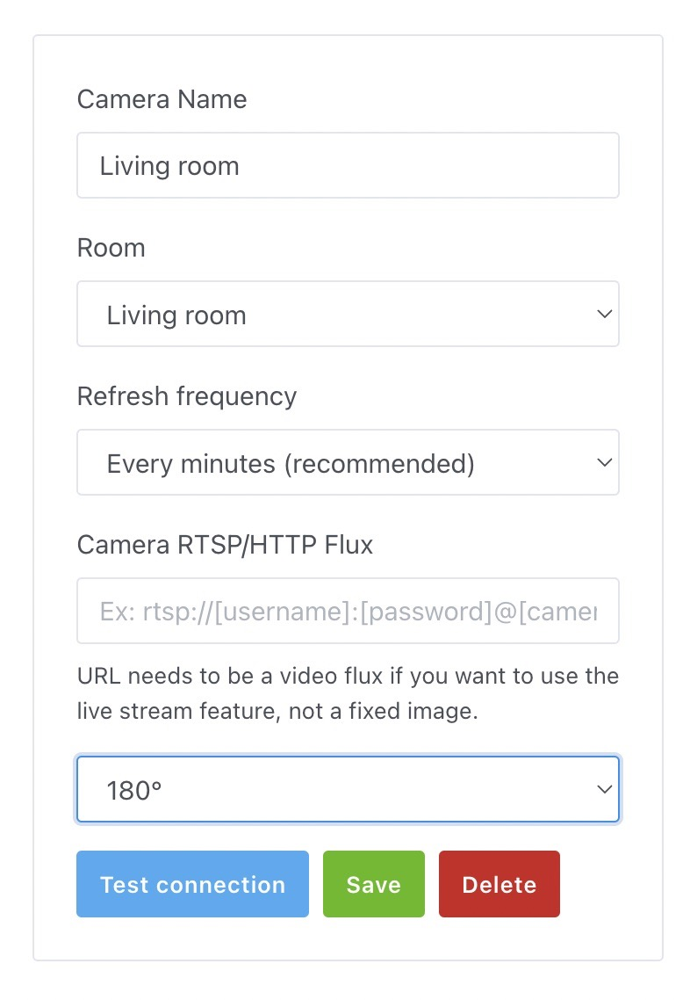

¡Hola a todos!

Hoy me complace anunciar Gladys Assistant 4.26, una versión que trae la compatibilidad con los dispositivos Tuya.

Ya era posible usar ciertos dispositivos Tuya Zigbee con Gladys a través de nuestra integración Zigbee2mqtt, pero ahora los enchufes y bombillas conectados por Wi-Fi también son compatibles gracias a una integración oficial de Tuya 🎉🎉

{/* truncate */}

## Dispositivos compatibles

Por ahora solo admitimos 2 tipos de dispositivos: enchufes y luces.

Por ejemplo:

Los enchufes Tuya como este [enchufe con medición de consumo por 12 $](https://amzn.to/44EvMHp) son compatibles.

¡Las luces compatibles con Tuya como el [pack de 4 bombillas Dalattin por 20,99 $](https://amzn.to/3JSinnc) son compatibles!

Para configurar estos dispositivos, puedes seguir el tutorial [de la documentación de Gladys](/es/docs/integrations/external/tuya/).

Si tienes otros dispositivos Tuya que todavía no son compatibles, pásate por [el foro](https://community.gladysassistant.com/) para hablar de ellos.

Muchas gracias a Lokkye, del foro, por este desarrollo 🙌

## Rotación de las imágenes de cámara

Ahora es posible girar una imagen de cámara 90°, 180° y 270°, tanto en el panel como en las retransmisiones de vídeo en directo.

Gracias a Lokkye por este desarrollo 🙌

## ¿Cómo actualizar?

Para actualizar Gladys, te recomendamos usar Watchtower: actualiza tu contenedor automáticamente en cuanto se publica una nueva versión. Consulta la [documentación](/es/docs/installation/docker#auto-upgrade-gladys-with-watchtower).

## Apóyanos

Si quieres apoyarnos, hay muchas formas de hacerlo:

- Responde a mensajes en el foro y da tu opinión.
- Ayúdanos a mejorar la documentación.
- Desarrolla nuevas funciones o integraciones para Gladys, somos 100 % código abierto.
- Suscríbete a [Gladys Plus](/es/plus/)
