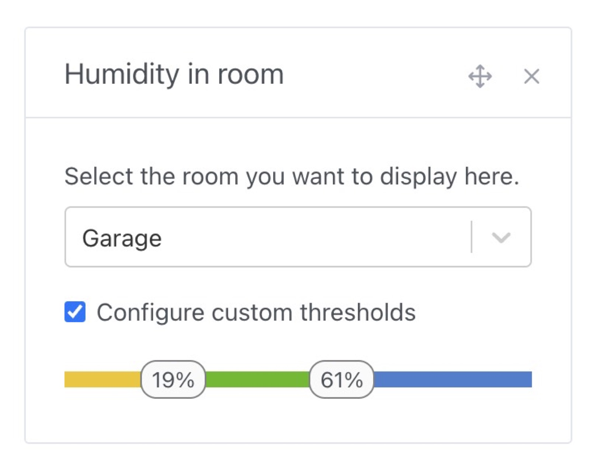
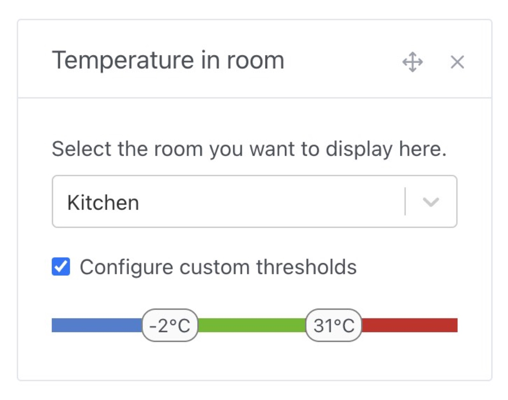
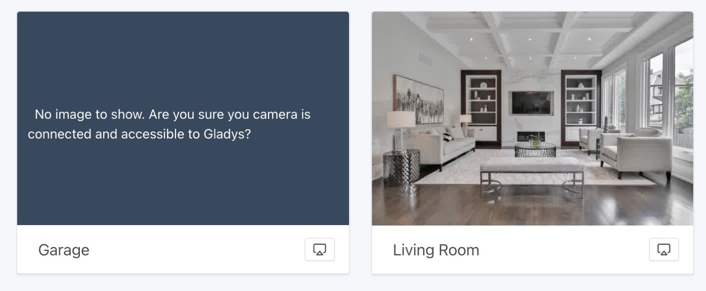

¡Hola a todos!

Otra actualización de Gladys con muchas novedades 🥳

### Integración con los aires acondicionados Mitsubishi

¡Ahora puedes conectar tus aires acondicionados Mitsubishi (conectados mediante MELCloud) a Gladys!


Gracias a @Lokkye por el desarrollo 🙌

{/* truncate */}

### Modo pantalla completa para tabletas con Gladys

Si usas Gladys en una tableta táctil en algún lugar de tu casa, probablemente quieras mostrar el panel de Gladys a pantalla completa, sin la posibilidad de salir de esa pantalla.

Ahora es posible gracias a un parámetro que se añade a la URL:

```
?fullscreen=force
```

Para aprovechar mejor los dispositivos de tipo "tableta en la pared", la duración de las sesiones de conexión se ha ampliado a 1 año.

(Las sesiones se pueden revocar en cualquier momento desde los ajustes de Gladys).

### Definir los límites de los widgets de temperatura/humedad de la habitación

Ahora puedes definir a partir de qué límite cambian los colores de los widgets "Temperatura/Humedad".

¡Un dormitorio no tiene necesariamente los mismos límites que un baño o un terrario!

Al editar un panel, ahora puedes definir umbrales personalizados:





Gracias @Lokkye por este desarrollo 🙌

### Las imágenes de las cámaras caducan

A partir de ahora, las imágenes de cámara caducadas ya no se mostrarán en el panel:



### Gestión de persianas Tuya

La integración Tuya se lanzó este verano y se acaba de añadir un nuevo tipo de dispositivo: las persianas enrollables.

Gracias @Lokkye por este desarrollo 🙌

### Muchas correcciones

- En las integraciones MQTT, Nextcloud Talk y Tasmota, los navegadores ya no rellenarán automáticamente los campos de contraseña (para evitar errores de autocompletado) ([#1881](https://github.com/GladysAssistant/Gladys/pull/1881))
- En el panel, algunos dispositivos ya no tienen fecha de caducidad de sus valores (detector de humo, detector de fugas de agua, botón y texto)
- Traducciones mejoradas en la integración OpenWeather ([#1897](https://github.com/GladysAssistant/Gladys/pull/1897))
- En las escenas, en la acción "Controlar un dispositivo", los dispositivos binarios se inicializan por defecto a 0 en lugar de "valor vacío" ([#1901](https://github.com/GladysAssistant/Gladys/pull/1901))
- En la integración MQTT, se muestra un mensaje de error cuando se crea un dispositivo con el mismo ID externo que un dispositivo existente ([#1902](https://github.com/GladysAssistant/Gladys/pull/1902))
- Mejor validación de los estados de tipo "string" ([#1894](https://github.com/GladysAssistant/Gladys/pull/1894))

El CHANGELOG completo está disponible [aquí](https://github.com/GladysAssistant/Gladys/releases/tag/v4.29.0).

## ¿Cómo actualizar?

Para actualizar Gladys, te recomendamos usar Watchtower: actualiza tu contenedor automáticamente en cuanto se publica una nueva versión. Consulta la [documentación](/es/docs/installation/docker#auto-upgrade-gladys-with-watchtower).

## Apóyanos

Si quieres apoyarnos, hay muchas formas de hacerlo:

- Responder a mensajes en el foro y compartir tus comentarios.
- Ayudarnos a mejorar la documentación.
- Desarrollar nuevas funciones/integraciones para Gladys: somos 100 % código abierto.
- Suscribirte a [Gladys Plus](/es/plus/)
