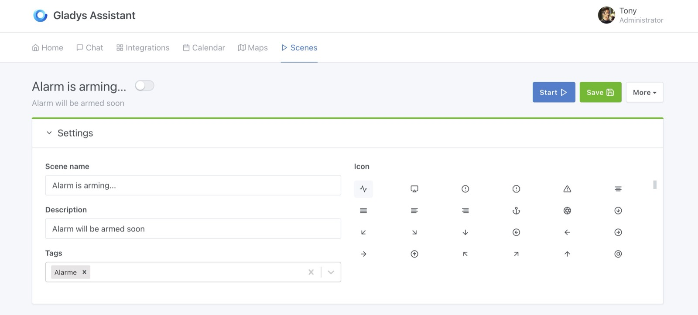
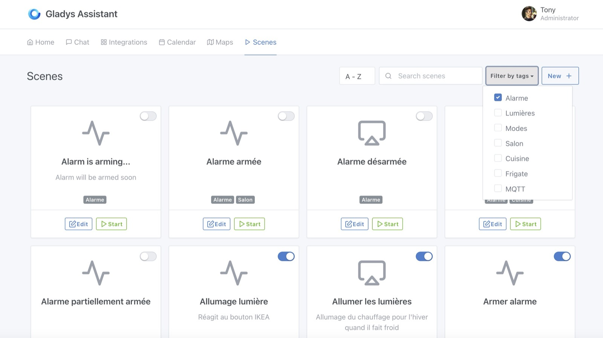
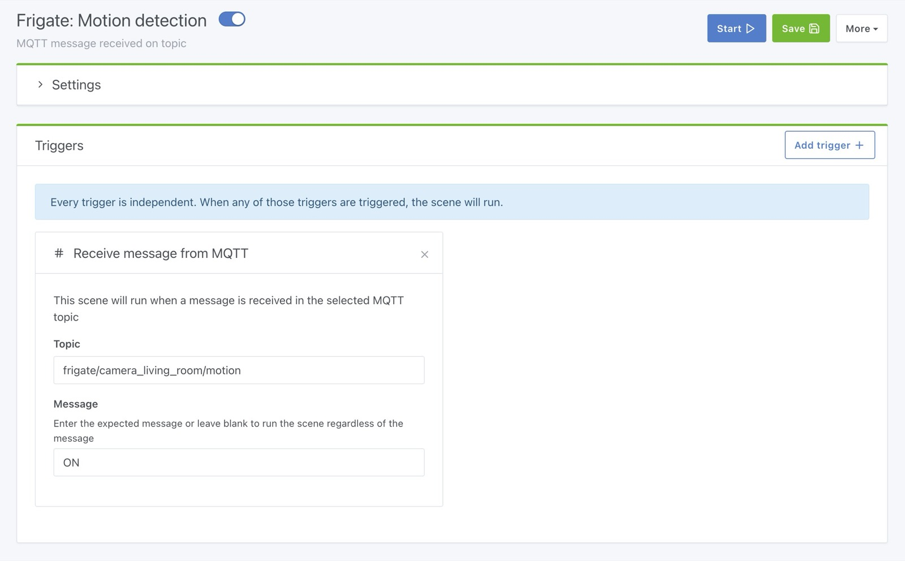
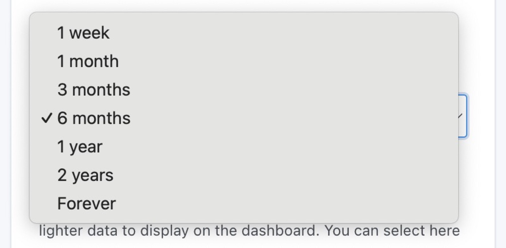
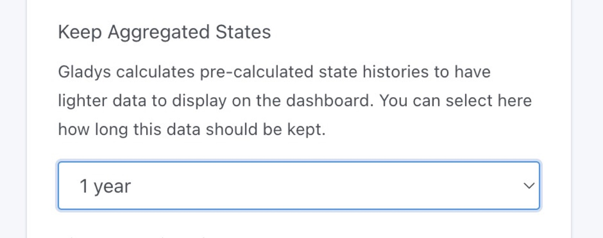
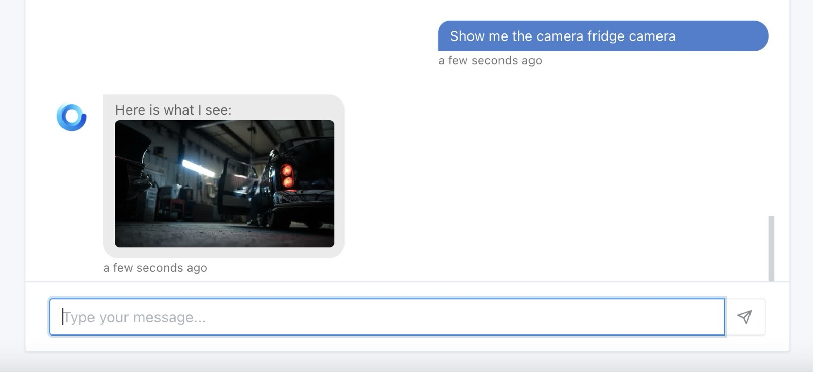

Hola a todos:

A finales de octubre presenté [Gladys Assistant 4.30](/es/blog/gladys-4-30-alarm-mode/), ¡una versión que trajo una alarma completa a Gladys!

Hoy publico Gladys Assistant 4.31, una versión con muchas novedades y correcciones a raíz de sus comentarios sobre el modo alarma 🎉🎉

## Filtro por etiquetas en las escenas

Muchos de ustedes pedían un mecanismo para filtrar el número cada vez mayor de escenas en sus instancias, ¡y @Lokkye lo ha hecho realidad!

{/* truncate */}

Ahora puedes añadir una o varias etiquetas a tus escenas:

Y después filtrar tus escenas por etiqueta:

Así puedes organizar tus escenas más fácilmente (por habitación, por función).

## Nuevo disparador: recepción de un mensaje MQTT

¡Ahora es posible lanzar una escena al recibir un mensaje MQTT personalizado!

El objetivo de este disparador es permitir integraciones externas sencillas a los usuarios avanzados, sin tener que pasar necesariamente por Node-RED.

Por ejemplo, si usas [Frigate](https://docs.frigate.video/integrations/mqtt/) y quieres recibir un mensaje MQTT en Gladys cuando una cámara detecta movimiento, ¡ya puedes hacerlo!

Esto es solo un ejemplo: puedes ir mucho más allá y, por ejemplo, escribir scripts que llamen a Gladys a través de este disparador.

## Limpieza de los estados de los sensores en la base de datos

Al instalar Gladys, normalmente elegiste durante cuánto tiempo se conservan los estados de los sensores.

Hoy añado nuevas duraciones para este parámetro en Gladys:

Y he añadido un nuevo parámetro, "Conservar los estados agregados", que te permite indicar a Gladys durante cuánto tiempo debe conservar los estados precalculados para mostrarlos en el panel de control:

La idea de este parámetro es poder conservar, por ejemplo, "6 meses de datos en bruto" + "1 año de datos agregados", para no guardar los datos en bruto demasiado tiempo y, aun así, seguir viendo el último año en el panel de control.

**Nota:** si tu base de datos de Gladys es grande, plantéate cambiar este ajuste. ¡La próxima limpieza se realizará a las 4 de la madrugada del día siguiente!

## Nuevo archivo docker-compose.yml

Cyril ha trabajado en el archivo [docker-compose.yml](https://github.com/GladysAssistant/Gladys/blob/master/docker/docker-compose.yml) que ofrecemos en la web para instalar Gladys.

¡Ahora está totalmente actualizado!

## Philips Hue: escaneo híbrido + añadir un puente manualmente

Algunos usuarios tenían problemas para usar la integración Philips Hue porque Gladys no detectaba su puente Philips Hue en la red local.

Cyril ha desarrollado un nuevo escaneo "híbrido" que realiza un escaneo "N-UpNp" además del escaneo "UpNp" que ya hacíamos.

Si Gladys sigue sin detectar tu puente Philips Hue, puedes añadirlo manualmente mediante su dirección IP.

## Chat: mostrar una cámara por su nombre

Ahora puedes mostrar una cámara en el chat llamándola por su nombre (y no necesariamente por el nombre de la habitación).

Por ejemplo, si tu cámara se llama "Cámara de la nevera", puedes pedirle a Gladys que la muestre:

Si preguntas "Muéstrame la cámara del salón" y hay varias cámaras en el salón, Gladys te enviará ahora todas las imágenes.

## Correcciones

- Inversión de las etiquetas de los sensores de apertura de puertas en las escenas: "abierto" pasa a ser "cerrado" y "cerrado" pasa a ser "abierto" (¡era un error!). No tienes que cambiar nada en tus escenas existentes si funcionaban: solo ha cambiado la etiqueta, no el valor.
- El nombre del widget "Alarma" ahora es opcional. Si se deja vacío, la barra de título se oculta.
- En la alarma, cuando se indica el parámetro `?fullscreen=force`, ahora se mantiene a pesar de las redirecciones a la pantalla de bloqueo, así como después de desbloquear la alarma.

El CHANGELOG completo está disponible [aquí](https://github.com/GladysAssistant/Gladys/releases/tag/v4.31.0).

## ¿Cómo actualizar?

Para actualizar Gladys, te recomendamos usar Watchtower: actualiza tu contenedor automáticamente en cuanto se publica una nueva versión. Consulta la [documentación](/es/docs/installation/docker#auto-upgrade-gladys-with-watchtower).

## Apóyanos

Si quieres apoyarnos, hay muchas formas de hacerlo:

- Responde a mensajes en el foro y da tu opinión.
- Ayúdanos a mejorar la documentación.
- Desarrolla nuevas funciones/integraciones para Gladys: somos 100 % código abierto.
- Suscríbete a [Gladys Plus](/es/plus/)
