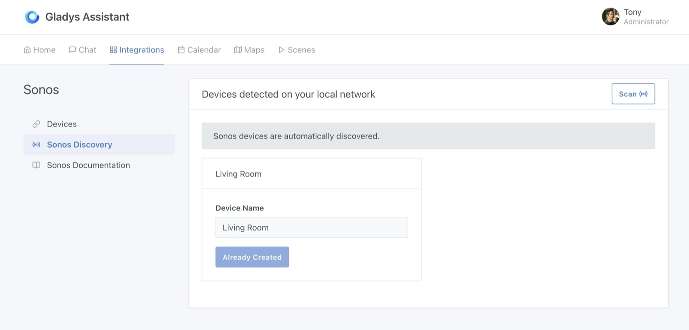
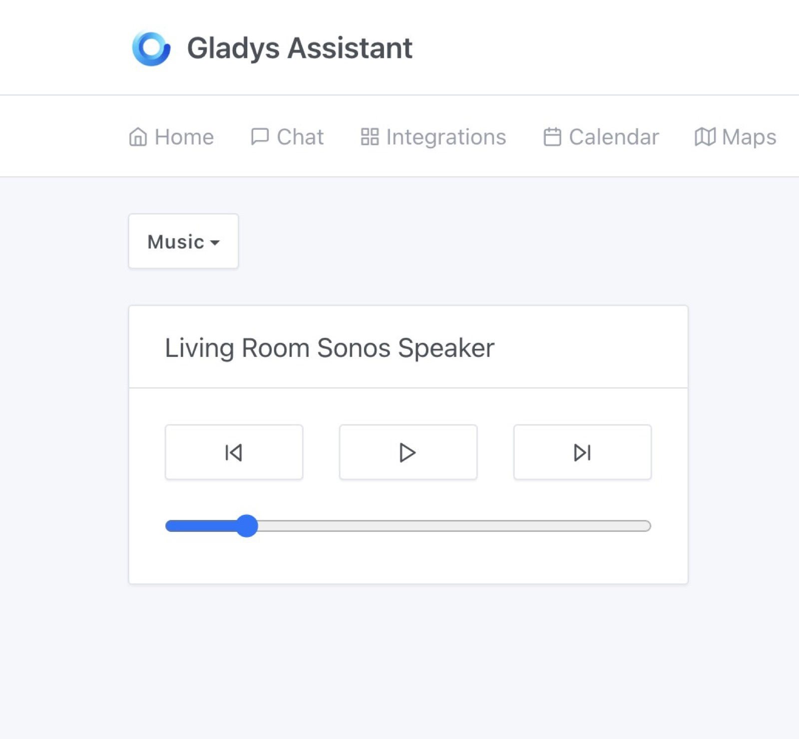
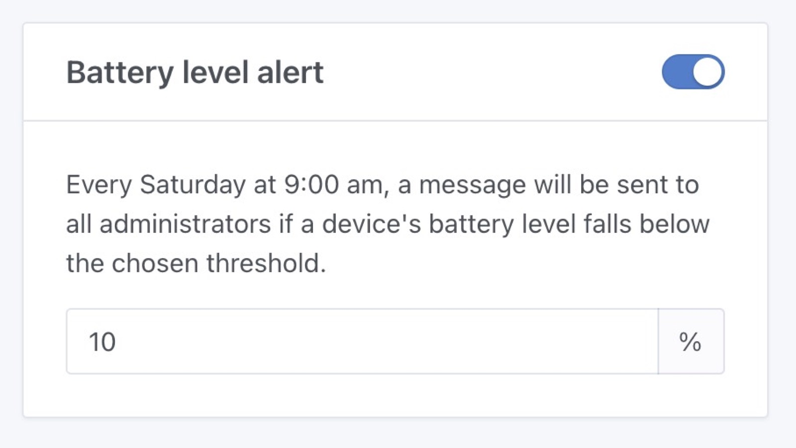
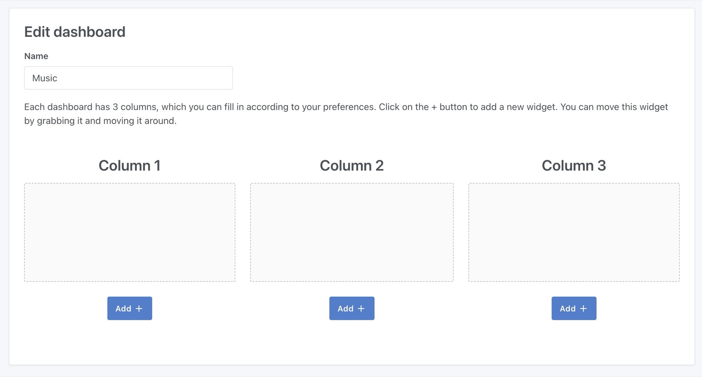
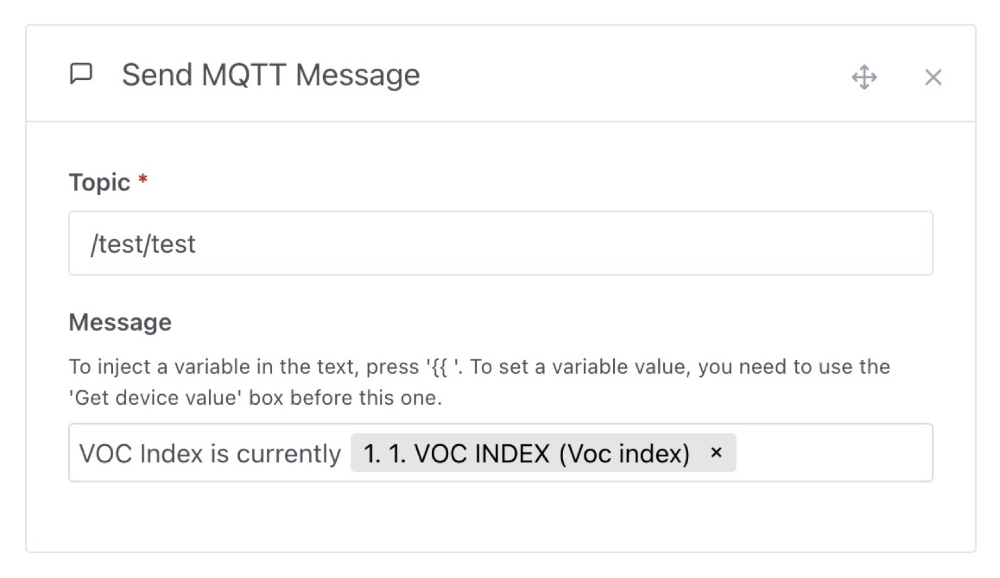

¡Hola a todos!

Hace 2 semanas estuve en directo en YouTube para una sesión de live coding que duró ¡más de 7 horas!

En este directo desarrollé de principio a fin una integración de Sonos para Gladys.

El live coding fue en francés. Si te interesa, la grabación del directo está disponible [aquí en YouTube](https://www.youtube.com/watch?v=M4vOjQXMiZI).

Hoy me alegra publicar Gladys Assistant 4.32, que incluye esta integración de Sonos 😁

## La integración de Sonos en Gladys

A partir de ahora puedes conectar tus altavoces Sonos a Gladys.

{/* truncate */}

En el panel encontrarás un widget "Música" que te permite controlar un altavoz:

¡Y eso es todo por ahora!

Pues sí, el objetivo de este desarrollo era tener un MVP funcional de una integración de Sonos en Gladys, y creo que el objetivo está cumplido 😊

Ahora busco un mantenedor que quiera ayudar a hacer avanzar esta integración.

Si quieres echar una mano en el futuro, ¡únete a nosotros [en el foro](https://community.gladysassistant.com/)!

## Enviar un mensaje cuando la batería está baja

¿Lo habías soñado? ¡Lokkye lo ha hecho por ti!

A partir de ahora, cada sábado a las 9 de la mañana, si uno o varios dispositivos de tu casa conectada tienen un nivel de batería por debajo de cierto umbral, Gladys te enviará un mensaje (por Telegram si lo tienes configurado):

Gracias Lokkye por el desarrollo 🙌

## Zigbee2mqtt: compatibilidad con el sensor IKEA Vindstyrka

El sensor Zigbee [IKEA Vindstyrka](https://www.ikea.com/fr/fr/p/vindstyrka-capteur-qualite-de-lair-connecte-00498231/) devolvía un valor `voc_index` que hasta ahora no gestionábamos en Gladys. A diferencia de un valor de COV "bruto", este representa una variación:

> El índice tiene una escala de 0 a 500, con un valor de referencia de 100 que representa la calidad media del aire de las últimas 24 horas.
> Una lectura por debajo de 100 indica una mejora de la calidad del aire, y por encima de 100, un empeoramiento.

¡Will_71 del foro se ha ocupado del tema y nos ha traído la compatibilidad! Gracias 🙌

## Zigbee2mqtt: compatibilidad completa con el sensor OWON PIR313-E

Este sensor expone 2 funciones que todavía no gestionábamos: "batería baja" (el nivel de batería ya lo gestionábamos) y "detección de manipulación" (por si un ladrón intenta quitar el detector de movimiento).

Una vez más, Will_71 se ha encargado de ello, muchas gracias 🙌

## Panel: un botón "Añadir" por columna

Una pequeña mejora de UX que puede parecer sencilla, pero que nos va a simplificar mucho la vida: ¡ahora hay un botón "Añadir +" por columna en el panel!

Gracias Brisou por tu primera PR en Gladys, que espero sea la primera de muchas 🙌

## Enviar un mensaje MQTT en las escenas

Ahora es posible enviar un mensaje MQTT en las escenas, a un topic personalizado y con un mensaje personalizado.

Gracias Lokkye por esta gran PR 🙌

## Correcciones

¡Unas cuantas correcciones se han colado en esta versión!

- Algunas correcciones en la nueva funcionalidad de filtrado de escenas por etiquetas, por Lokkye 🙌
- En las escenas, algunos selectores se superponían; ya no es el caso. Gracias Will_71 🙌
- El contenedor de Gladys lanza directamente el proceso de Node, lo que permite cerrar correctamente la base de datos cuando Gladys se detiene. Gracias cicoub13 por la corrección 🙌

El CHANGELOG completo está disponible [aquí](https://github.com/GladysAssistant/Gladys/releases/tag/v4.32.0).

## ¿Cómo actualizar?

Para actualizar Gladys, te recomendamos usar Watchtower: actualiza tu contenedor automáticamente en cuanto se publica una nueva versión. Consulta la [documentación](/es/docs/installation/docker#auto-upgrade-gladys-with-watchtower).

## Apóyanos

Si quieres apoyarnos, hay muchas formas de hacerlo:

- Responder a mensajes en el foro y dar tu opinión.
- Ayudarnos a mejorar la documentación.
- Desarrollar nuevas funcionalidades o integraciones para Gladys: somos 100 % código abierto.
- Suscribirte a [Gladys Plus](/es/plus)
