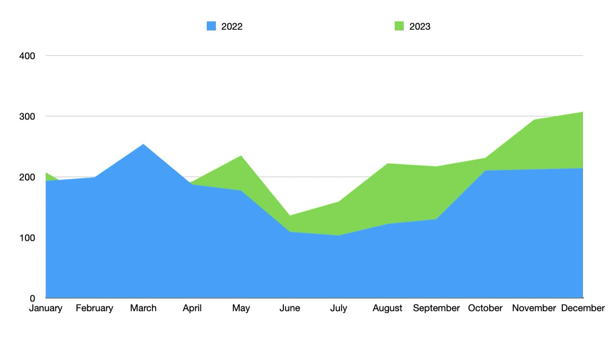
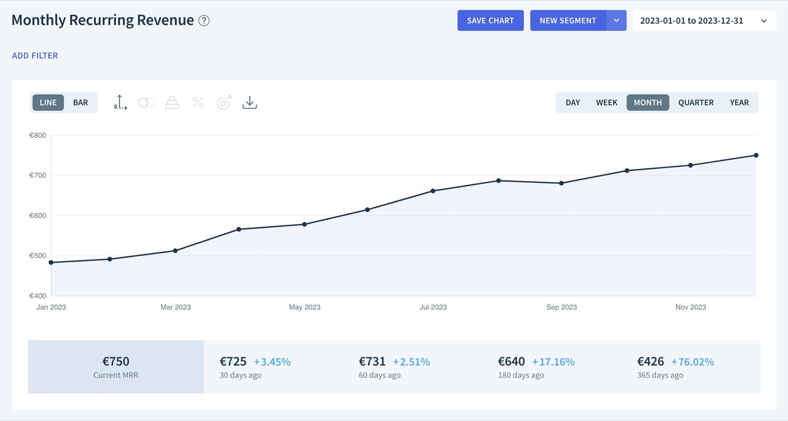
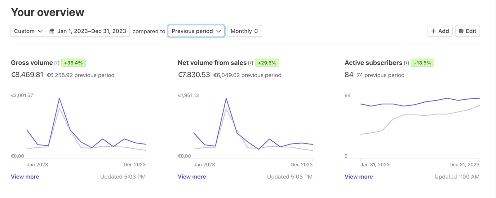
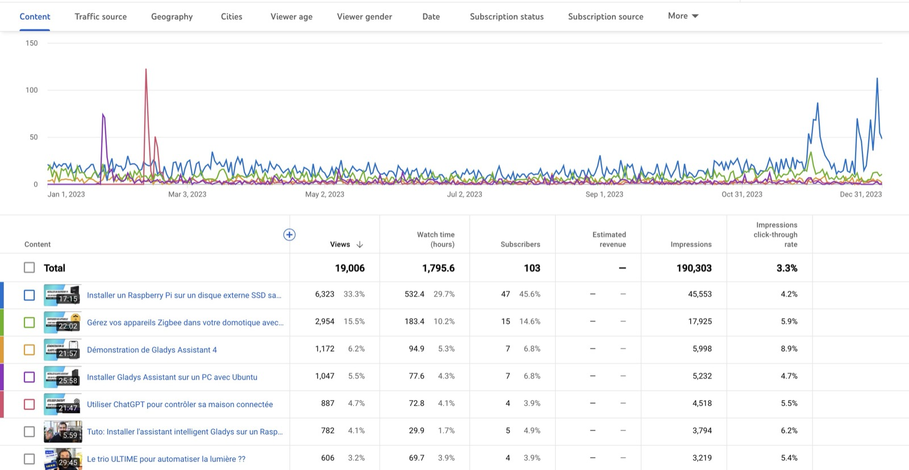

¡Feliz año nuevo a todos! 🙌

Espero que 2024 sea para ti un año lleno de cosas buenas: salud, familia, proyectos.

Como cada año, hago balance del año anterior y presento mis planes para el nuevo año.

Si prefieres ver este balance en vídeo, hice un directo en YouTube que está disponible en diferido [aquí (solo en francés)](https://www.youtube.com/watch?v=9aHgmzqObxQ).

## ¿Qué pasó en 2023?

{/* truncate */}

2023 fue un año lleno de novedades:

- [Una integración con OpenAI ChatGPT](/es/blog/open-ai-gpt-3-in-gladys-assistant/)
- [Transmisión en directo de las cámaras en el panel de control](/es/blog/camera-live-streaming-gladys-assistant-4-23/)
- [Compatibilidad con el protocolo Tuya](/es/blog/gladys-assistant-tuya/)
- [Un modo alarma completo en Gladys](/es/blog/gladys-4-30-alarm-mode/)
- [La integración de Sonos en Gladys](/es/blog/gladys-4-32-sonos-integration/)

Una vez más, GRACIAS a todos los desarrolladores que han contribuido a estas versiones. 2023 ha sido un año excepcional, y todo es gracias a ustedes 🎉

¡Gracias a Alexandre Trovato, Vincent Kulak, Bertrand D'Aure, Cyril Beslay, Corentin Allemand, NickDub, Terdious, Romuald Pochet, Quentin Legay, Jonathan Brisavoine, William Deren, Nicolas Geissel, euguuu, Patrick Scheips y
Brad Sanders! 🙏

### Uso

En 2023, el número de nuevas instalaciones fue superior al de 2022, salvo en febrero y marzo. Esto se explica porque este año estuve de vacaciones de verano en febrero y marzo, ¡así que no estuve activo durante ese periodo!

En cambio, en julio y agosto de 2023 no me tomé vacaciones, y eso se nota en el número de nuevas instalaciones:

En cuanto al MRR (Monthly Recurring Revenue, es decir, ingresos recurrentes mensuales), Gladys Plus se sitúa ahora en 750 € de MRR, un aumento del 76 % respecto al año pasado.

Gladys Plus facturó 8469 € en 2023, un aumento del 35 %.

A finales de 2022 anuncié que quería alcanzar 18 000 € de facturación en 2023.

Es un objetivo no cumplido. El motivo principal es que no pude lanzar el nuevo producto que quería sacar en 2023, y que por tanto llega a principios de 2024... 😎

### El canal de YouTube

¡El [canal de YouTube](https://www.youtube.com/@GladysAssistant) ha mantenido el impulso de 2022!

19 000 visualizaciones en el canal y 1800 horas de reproducción: es un gran año, aunque estamos un poco por debajo de 2022 porque publiqué menos vídeos.

Para mí, YouTube sigue siendo un canal excelente para atraer a nuevos usuarios, y tengo intención de seguir usándolo en 2024.

El live coding de final de año fue todo un éxito, ¡y es algo que seguiré haciendo!

Algunos vídeos que funcionaron bien en 2023 (de momento, solo en francés):

- [Le trio ULTIME pour automatiser la lumière ??](https://www.youtube.com/watch?v=gNlZ2bId8Z0)
- [Live coding : Une intégration Sonos en une journée ?](https://www.youtube.com/watch?v=M4vOjQXMiZI)
- [Live coding : Une intégration Z-Wave en une journée ?](https://www.youtube.com/live/f6mWvy2kWSs?si=tSEA8-RtAdbY2C5d&t=454)
- [Live : Le mode "Alarme" débarque dans Gladys Assistant 🎉](https://www.youtube.com/watch?v=qEcVqvkg-Yc)
- [Gérez vos appareils Zigbee dans votre domotique avec Zigbee2mqtt et Gladys Assistant](https://youtu.be/ALW3uDB9P0s)

### Redes sociales

En las redes sociales:

- [@gladysassistant en Twitter](https://twitter.com/gladysassistant) reúne a 2721 seguidores
- [Gladys Assistant en Facebook](https://www.facebook.com/gladysassistant) tiene 760 "me gusta"
- [@gladysassistant en Instagram](https://www.instagram.com/gladysassistant) tiene 579 seguidores

¡Y 2335 seguidores en [mi Twitter personal](https://twitter.com/pierregillesl)!

### Newsletter

En cuanto a la newsletter, 3277 de ustedes siguen la [newsletter de Gladys Assistant](https://email-list.gladysassistant.com/subscription/haflMsWmU).

- 2775 suscriptores en francés
- 502 suscriptores en inglés

En general, es un año a la baja. Sigo usando la newsletter tanto como siempre, pero no le doy mucha prioridad. ¡Quizá tenga que trabajar esta parte en 2024!

### El GitHub de Gladys Assistant

Estamos en 2430 estrellas ⭐ en el [repositorio de Gladys Assistant](https://github.com/GladysAssistant/Gladys).

¡Es un 9 % más que el año pasado!

Cuento contigo para apoyarnos en GitHub dándole una estrella ⭐ al proyecto.

## Proyectos y objetivos para 2024

Y ahora lo más importante: ¿qué nos depara 2024 en Gladys?

### Hora de crecer

En mi opinión, Gladys Assistant v4 ha llegado a una etapa en la que el producto ha demostrado su valía: tanto en el núcleo como en las integraciones, tenemos una base que funciona a plena satisfacción de cientos de usuarios.

Ahora tenemos que dar a conocer el producto para que otros usuarios se unan a nosotros.

Tenemos que demostrarle al mundo que sí, Gladys Assistant es una solución seria para el hogar inteligente en 2024.

Para ello, tengo en mente un plan muy concreto que presentaré a partir de febrero de 2024, y **lo va a cambiar todo** (#teasing!!)

A lo largo de 2024 te necesitaré a ti, a la comunidad de Gladys, para hablar bien del proyecto, tomar iniciativas para dar a conocer Gladys (presencia en redes sociales, contárselo a amigos y familia, contactar con blogueros y youtubers) y, sobre todo, apoyar a los recién llegados al foro.

Creo que ha llegado el momento de que una solución francesa le haga sombra a nuestro gran competidor estadounidense 😁

### En cuanto al producto

En cuanto al producto, tengo muchas ideas para 2024 y, como siempre, vamos a seguir atendiendo las peticiones de funciones del foro para **satisfacer a los usuarios**.

Muchos de ustedes hacen [peticiones de funciones en el foro](https://community.gladysassistant.com/c/feature-requests/7), y el objetivo sigue siendo ir resolviéndolas una a una.

Tengo en mente 2 objetivos a corto plazo:

- Publicar la integración de Z-Wave JS UI e ir añadiendo compatibilidades una a una.
- Continuar el trabajo de fondo en Zigbee2mqtt y Tuya para tener el mayor número posible de dispositivos compatibles.

El resto lo decidirá la comunidad a lo largo del año: como siempre, no hay hoja de ruta, ¡son ustedes quienes eligen lo que llegará a Gladys en 2024! 🙌

## ¡Gracias a todos!

Gracias a todos los que apoyan Gladys, ya sea desarrollando nuevas funciones, contribuyendo a través de [Gladys Plus](/es/plus/), con [donaciones puntuales](https://www.buymeacoffee.com/gladysassistant) o echando una mano en el [foro](https://community.gladysassistant.com/).

¡Feliz año nuevo a todos!

Pierre-Gilles Leymarie
