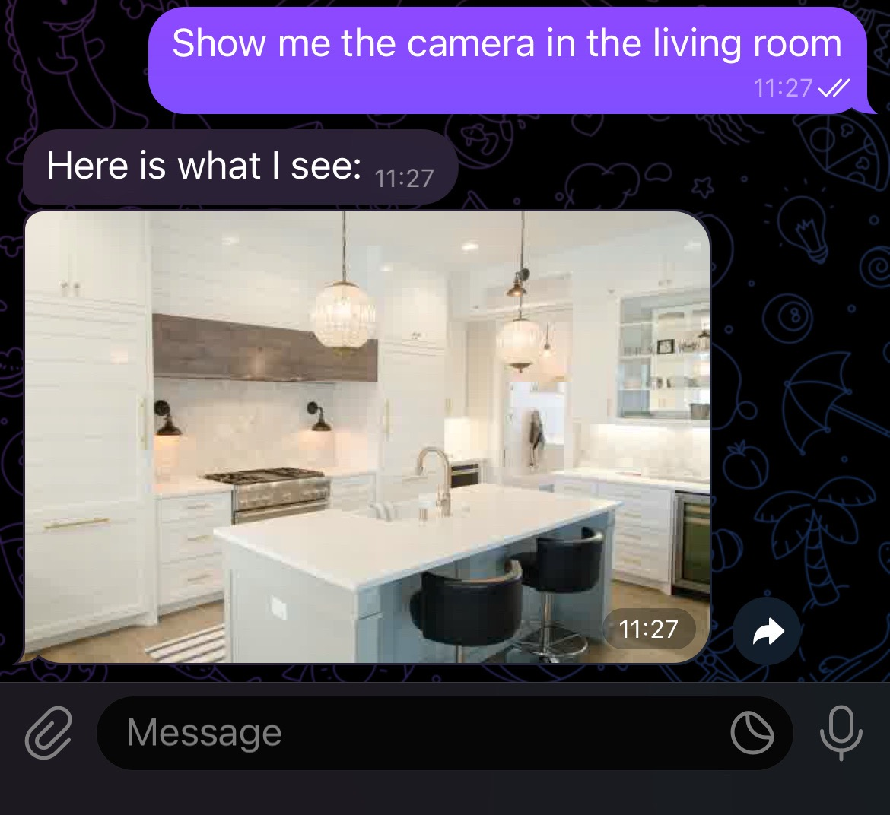
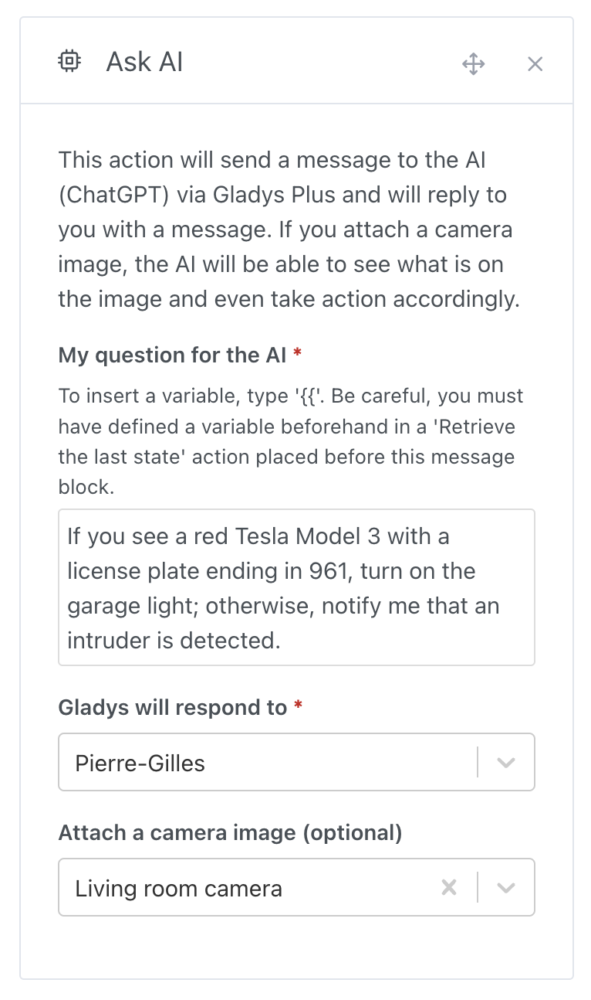
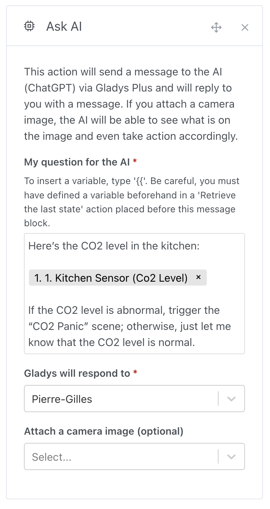

¡Hola a todos!

Hoy tengo el placer de presentarte Gladys Assistant 4.48, una versión en la que la inteligencia artificial está aún más integrada en Gladys para que tu casa sea más inteligente y reactiva.

Desde enero de 2023 ya podías hacerle preguntas a ChatGPT a través de Gladys.

Era un buen comienzo, ¡pero quiero ir más allá! ¿Y si la IA pudiera ser proactiva y tomar decisiones por ti?

## Imagina las posibilidades

{/* truncate */}

Imagina que un coche se detiene delante de tu casa. Un vigilante dedicado observaría, reconocería tu coche, su forma, su color, su matrícula, y sabría al instante que eres tú. ¡Pero contratar a un vigilante 24/7 no está al alcance de todo el mundo!

¿Y si la IA pudiera desempeñar ese papel?

En Gladys, ahora puedes escribir una instrucción sencilla, por ejemplo:

> "Si hay un coche delante de la casa y es un Tesla Model 3 rojo con la matrícula XXX, enciende el garaje; si no, avísame de que hay un intruso."

¡Con Gladys 4.48, este escenario se hace realidad! Tienes una IA generalista lista para vigilar y tomar decisiones, igual que un agente dedicado, pero sin el coste.

## Un ejemplo concreto

Esta nueva función se basa en la API de OpenAI ChatGPT 4o-mini, con su nueva función de visión, disponible para los suscriptores de Gladys Plus.

En una escena, puedes crear una acción "Preguntar a la IA" y, si quieres, enviarle una imagen de una cámara.

Volvamos al ejemplo del coche:

Si se detecta movimiento fuera de tu casa, Gladys enviará la imagen de la cámara del garaje para analizar la situación. Después, según lo detectado:

- Si se reconoce el coche correcto, se enciende la luz del garaje.
- Si se detecta otro coche, recibes una alerta de intruso en tu móvil.

## Analizar los valores de los sensores

¡La cámara es solo un ejemplo! También puedes enviar datos de sensores a la IA y pedirle que actúe según el resultado.

Por ejemplo, podrías enviar el valor de un sensor de CO2 y pedir una acción si el nivel es anómalo:

No hace falta buscar cuáles son los niveles de CO2 recomendados en una habitación: la IA recurre a sus amplios conocimientos (¡básicamente todo internet!) para evaluar la situación y actuar de forma inteligente.

Incluso puedes inyectar valores obtenidos de otras API para:

- Recibir el parte meteorológico a primera hora de la mañana
- Seguir los mercados financieros con un resumen bursátil
- Consultar las noticias con un feed RSS
- Comprobar cada día la seguridad de tu casa durante tus vacaciones (temperatura normal, etc.)

¡Las posibilidades son infinitas! Estoy deseando ver lo que creas con esta actualización. ¡Comparte tus pruebas en el foro para inspirar a otros!

## Otras novedades

- En las escenas, los filtros por etiqueta o por título ahora se guardan en la URL, para que puedas volver fácilmente a un filtro después de navegar.
- Se añade compatibilidad con los radiadores con hilo piloto (fil pilote) en las escenas.
- Las imágenes de las cámaras ahora se obtienen por TCP (en lugar de UDP), lo que evita errores de visualización (como el bug de la franja verde).
- Corrección de los gráficos binarios: el primer valor ahora se muestra correctamente.
- DuckDB: las conexiones ahora se cierran correctamente cuando Gladys se apaga.

¡Gracias a todos los que han contribuido a esta actualización! 🙌

## ¿Cómo actualizar?

Para actualizar Gladys, te recomendamos usar Watchtower: actualiza tu contenedor automáticamente en cuanto se publica una nueva versión. Consulta la [documentación](/es/docs/installation/docker#auto-upgrade-gladys-with-watchtower).
