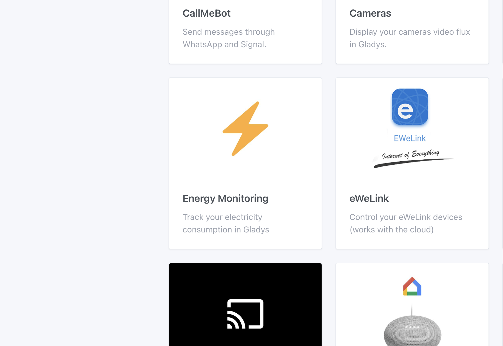
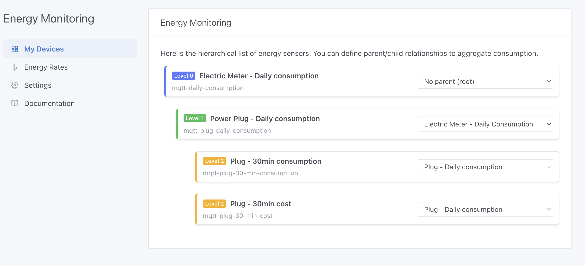
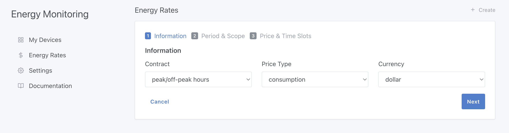
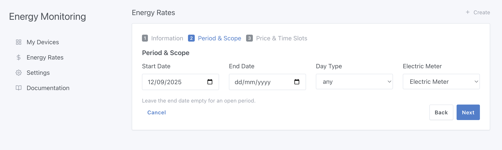
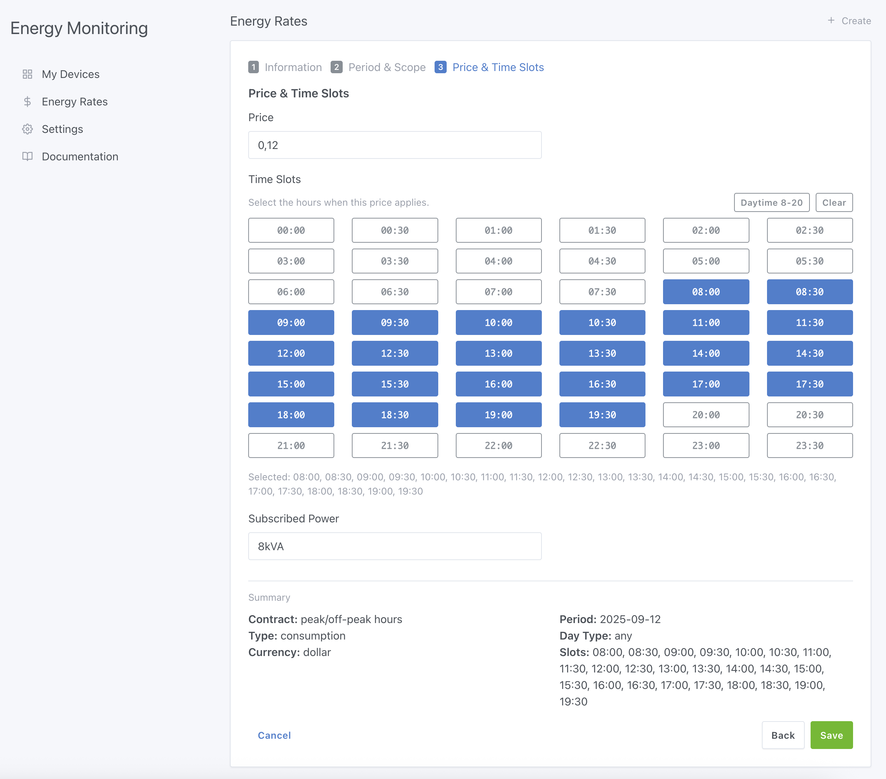
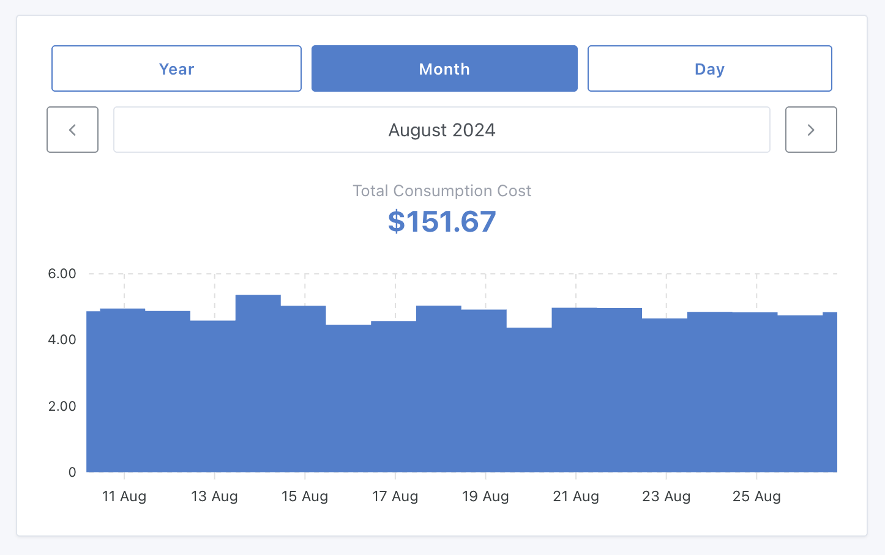

Hola a todos,

A finales de mayo, estaba charlando con Thomas Lemaistre ([**@Terdious**](https://community.gladysassistant.com/u/terdious/summary) en el foro), y me explicaba su instalación eléctrica: varios contadores, paneles solares, un coche eléctrico… y pronto baterías para almacenar su energía.

**Su objetivo en Gladys:**

👉 Seguir su consumo directamente en **euros**  
👉 Visualizar los distintos flujos de energía de su casa  
👉 Medir el rendimiento de sus paneles solares  
👉 Y, sobre todo, saber cuánto le falta para alcanzar la **autosuficiencia energética** 🌞🔋

Llevo mucho tiempo soñando con este tipo de funciones para Gladys 😍 Pero es un proyecto grande, difícil de arrancar sin financiación.

En junio, **@Terdious se ofreció a financiar él mismo el desarrollo**. ¡Así, sin más! 🎉

Preparó un pliego de especificaciones detallado, yo le propuse un presupuesto, lo aceptó… y pude empezar este proyecto este verano.

Hoy estoy muy contento de presentarte la **primera parte** de este desarrollo.

{/* truncate */}

## Lo que se ha desarrollado hasta ahora

### Configuración

Ha llegado una integración completamente nueva a Gladys: **"Seguimiento energético"** 🎉

Aquí encontrarás todas las opciones relacionadas con el seguimiento energético en Gladys.

En la primera pestaña, puedes definir la estructura de tu instalación eléctrica organizando tus dispositivos de forma jerárquica. Así Gladys entiende cómo circula la electricidad en tu casa.

👉 A continuación, puedes introducir tus tarifas eléctricas. Y una novedad importante: ¡Gladys también gestiona el historial de tarifas! Porque, a diferencia de otros programas de domótica, tenemos en cuenta que los precios cambian con los años… y tus cálculos deben reflejar la realidad, año tras año.

Por ahora la introducción es manual, pero ya está prevista una importación automática.

**Ya se admiten 3 tipos de contrato:**

- Tarifa básica
- Horas punta/horas valle
- EDF Tempo

Los dos primeros son totalmente genéricos, así que se pueden usar en cualquier parte del mundo. Por ejemplo, un usuario estadounidense con un contrato de horas punta/horas valle puede usarlo sin ningún problema.

Mi ambición es clara: quiero que los cálculos de Gladys sean tan precisos como los de tu compañía eléctrica. Al céntimo.

**Sin aproximaciones**: la fiabilidad es fundamental.

De hecho, ahí estuvo la mayor parte del trabajo: implementar un motor de cálculo ultrapreciso. He hecho pruebas con mi propio contrato EDF Tempo, y los resultados coinciden exactamente con los valores del portal de EDF ✅

Y una buena noticia: esta integración es compatible tanto con los datos de la integración de Enedis (a través de Gladys Plus) como con cualquier fuente de consumo personalizada:

- un enchufe Zigbee,
- un sensor MQTT,
- o cualquier otra medición que envíes a Gladys.

### 📊 **Panel de control**

He añadido un widget "Seguimiento energético".

Te permite visualizar de un vistazo tu consumo por año, mes o día.

Y esto es solo el principio: más widgets completarán el seguimiento.

## **Próximos pasos**

Aquí es donde necesito tu ayuda:

Busco usuarios dispuestos a ayudarme a probar el algoritmo.

En concreto: si aceptas compartir conmigo por mensaje privado [en el foro](https://community.gladysassistant.com/) tus datos de consumo, puedo compararlos con los cálculos de Gladys y asegurarme de que los resultados coinciden a la perfección.

El objetivo: publicar rápidamente una primera beta del seguimiento energético en Gladys, antes de pasar a las demás funciones que pidió @Terdious.

## **Gracias, Thomas**

Quiero dar las gracias enormemente a @Terdious, sin quien este desarrollo sencillamente no habría existido. Gracias a su financiación pude empezar este proyecto, y creo que toda la comunidad puede darle un enorme GRACIAS 🙌

Y para quienes a veces se preguntan por qué ciertas peticiones no se implementan rápido: nunca es una cuestión de falta de ganas, sino de recursos. Trabajo en Gladys en función de la financiación disponible, y contribuciones como esta son un **enorme acelerador** para el proyecto 🚀
