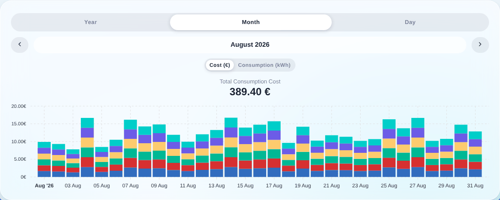

¡Hola a todos!

En septiembre anuncié que [la monitorización energética llegaría pronto a Gladys](/es/blog/energy-monitoring-coming-soon/). Hoy estoy encantado de anunciar que **¡ya está disponible oficialmente en Gladys Assistant 4.66!** 🎉

## Monitorización energética

- **Controla tu consumo en kWh y en euros** con la misma precisión que tu compañía eléctrica
- **Compatibilidad con varios tipos de tarifa**: tarifa básica, horas punta/valle y EDF Tempo
- **Gestión del historial de tarifas**: porque los precios cambian con el tiempo
- **Un bonito widget para el panel de control** para visualizar tu consumo por día, mes o año
- **Compatible con dispositivos Zigbee, sensores MQTT y la integración Enedis**

{/* truncate */}

Para usar esta función, actualiza a Gladys 4.66 y consulta la documentación completa:

👉 [Documentación de la monitorización energética](/es/docs/integrations/energy-monitoring/)

## Servidor MCP: compatibilidad con el historial

¡El [servidor MCP](/es/docs/integrations/mcp/) ahora permite consultar el historial de los dispositivos! Tu asistente de IA ya puede responder a preguntas como "¿Qué temperatura hacía ayer en el salón?" o "Muéstrame mi consumo de energía de la última semana".

## Zigbee2mqtt 2.7.1

Hemos actualizado Zigbee2mqtt de la 2.6.1 a la 2.7.1, con el flamante frontend **Windfront** para una interfaz más moderna y fluida. Consulta el [changelog completo](https://github.com/Koenkk/zigbee2mqtt/releases) para ver todas las mejoras.

## Gracias

¡Un enorme agradecimiento a **Thomas Lemaistre** ([@Terdious](https://community.gladysassistant.com/u/terdious/summary)), que financió este desarrollo y lo hizo posible!

Si tienes preguntas o comentarios, no dudes en escribir en [el foro](https://community.gladysassistant.com/).
