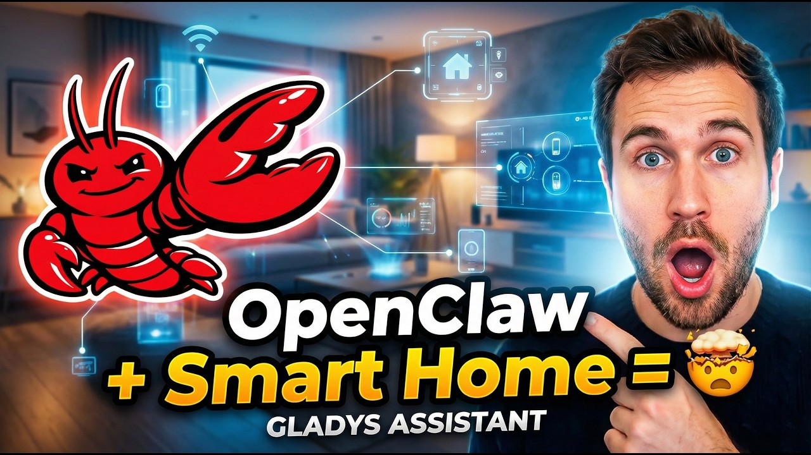

¡Hola a todos!

Seguro que has oído hablar de **OpenClaw**, el framework de IA que arrasó en GitHub hace unas semanas y que acaba de ser adquirido por OpenAI. Decidí conectarlo a Gladys para ver de qué era capaz y, sinceramente, el resultado es impresionante.

{/* truncate */}

Conecté OpenClaw a Gladys para probar las posibilidades de dejar que un agente de IA autónomo controle un hogar inteligente real. Te cuento todo el experimento en este vídeo:

**Una advertencia:** no te recomiendo instalar OpenClaw en tu servidor Gladys. Todavía es un software muy inmaduro, toca un poco de todo y ha recibido críticas por problemas de seguridad. Para esta prueba, desplegué OpenClaw en una máquina virtual aislada en la nube para mantenerlo todo en un entorno aislado (sandbox) 🔐

Es un vistazo fascinante a hacia dónde se dirige la domótica impulsada por la IA, pero la seguridad y la privacidad son lo primero.
