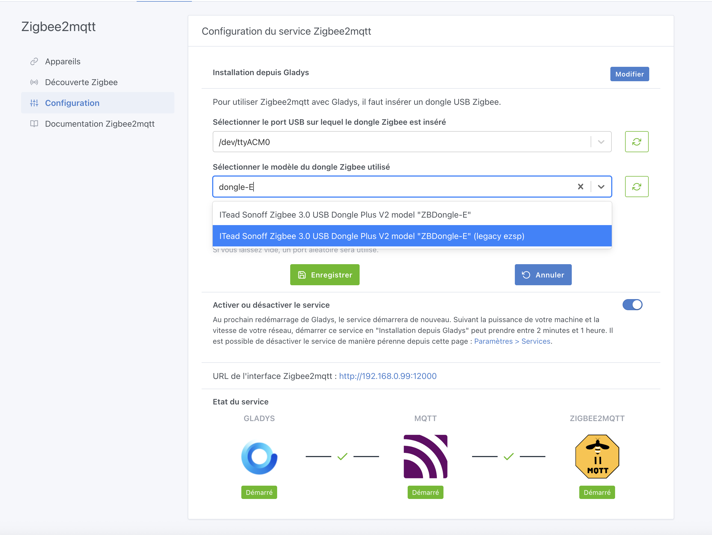
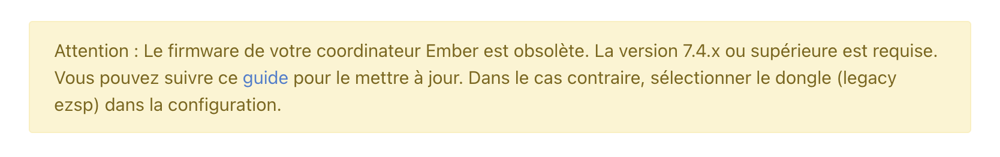

¡Hola a todos!

Ya está disponible una nueva versión de Gladys Assistant 🥳, con el nuevo driver Ember de Zigbee2mqtt y el seguimiento energético de Tasmota.

{/* truncate */}

## Zigbee2mqtt: el nuevo driver Ember

Zigbee2mqtt ofrece ahora un nuevo driver, **Ember**, para ciertos dongles como el Sonoff ZBDongle-E. La integración Zigbee2mqtt de Gladys te permite ahora seleccionar este driver Ember para los dongles compatibles.

Si usas EZSP, Zigbee2mqtt no tocará tu instalación sin que tú hagas nada, para no romper tu configuración. **La estabilidad es un valor fundamental del proyecto**, y esta actualización se ha diseñado para no afectar a tu uso diario.

Si quieres pasarte a Ember, puedes hacerlo, pero probablemente tendrás que actualizar antes el firmware de tu dongle Zigbee. Por ejemplo, para el Sonoff Dongle-E, la integración te permite elegir entre "Ember" (el nuevo valor por defecto) y el antiguo driver EZSP:

Si pruebas el nuevo driver y tu firmware no es compatible, no te preocupes: verás un mensaje claro:

Entonces puedes actualizar el firmware o volver a EZSP de momento. ¡Muchas gracias a [@cicoub13](https://community.gladysassistant.com/) por esta contribución!

## Panel: mejor visualización de los sensores de puerta/ventana

Se ha mejorado la visualización de los sensores de puerta/ventana en el panel para que se lean mejor. Ahora mostramos "Abierto/Cerrado" en lugar del pequeño icono de candado, que no era muy legible.

## Tasmota: seguimiento energético añadido

Los dispositivos Tasmota ya están integrados en el seguimiento del consumo energético. Gracias [@Terdious](https://community.gladysassistant.com/) por este desarrollo 🙌

---

La actualización es automática, o puedes forzarla en los ajustes. ¡Que tengas un buen final de semana!
