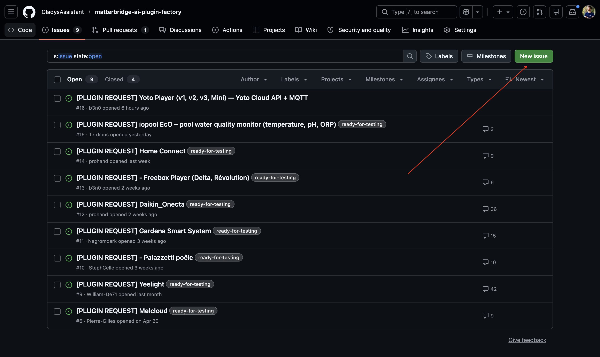
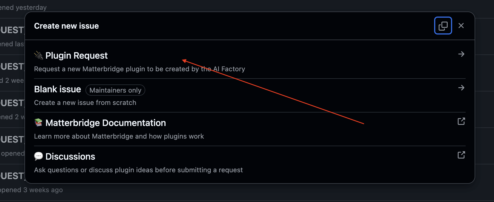
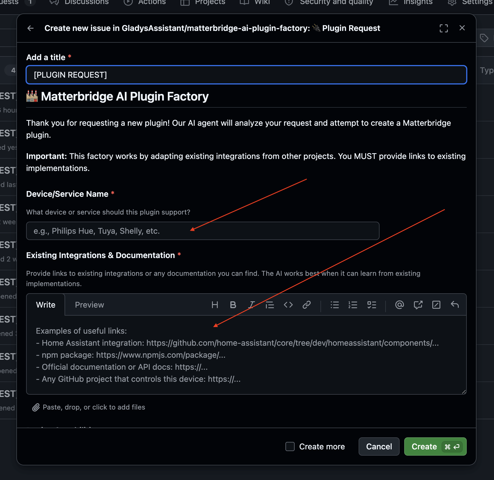
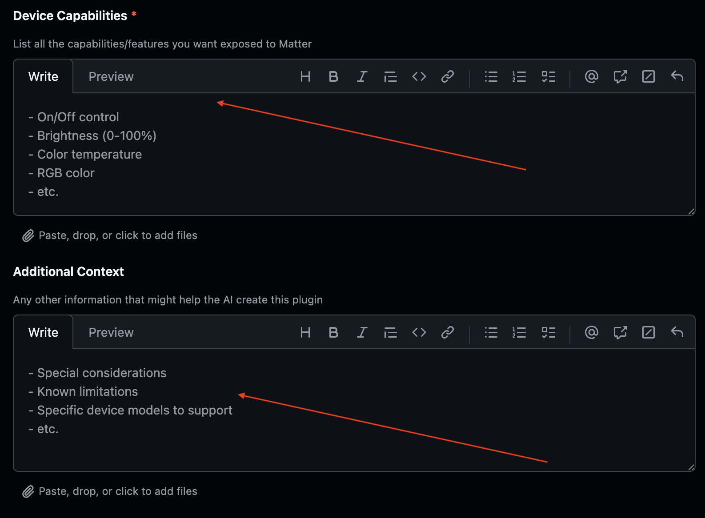
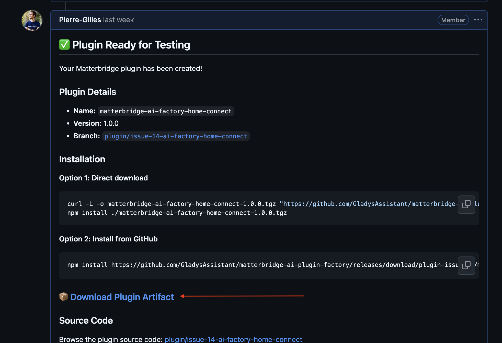
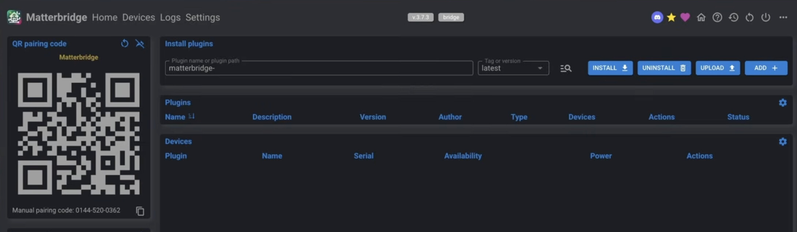
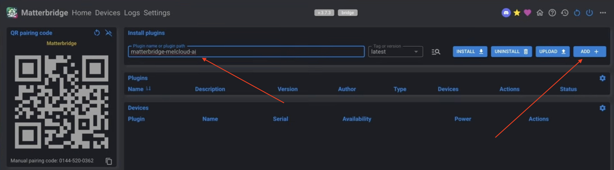
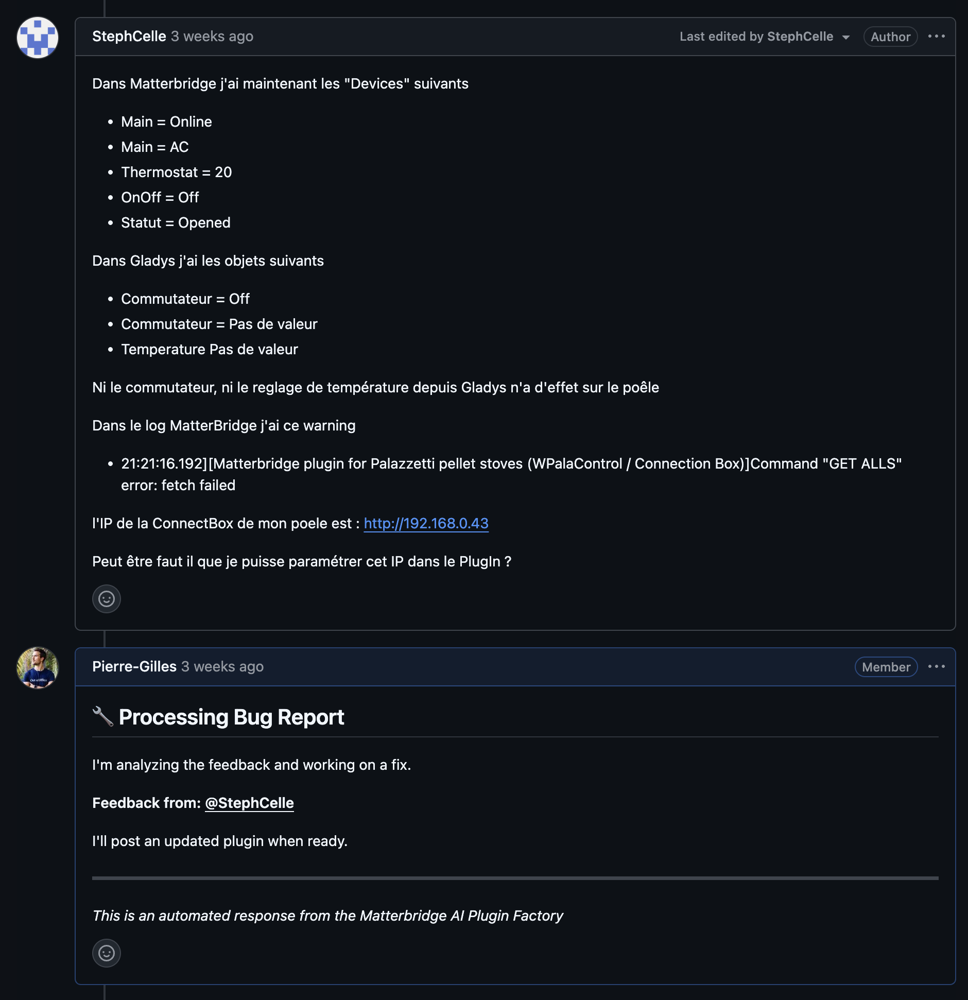

¡Hola a todos!

¿Tienes dispositivos que no son compatibles con Gladys y que no usan un protocolo abierto como Zigbee o Matter? No te preocupes. He creado una **fábrica de plugins de Matterbridge impulsada por IA** que desarrolla automáticamente plugins para tus dispositivos. No necesitas conocimientos de programación.

{/* truncate */}

:::info[Este artículo ya no describe el método recomendado]
Desde la publicación de este artículo, Gladys cuenta con **integraciones externas**: integraciones empaquetadas como contenedores Docker, publicadas en GitHub e instalables con un solo clic desde el catálogo de Gladys. Ahora son la forma recomendada de añadir un dispositivo que no es compatible de forma nativa, y cualquiera puede crear una, en cualquier lenguaje, sin revisión.

👉 [Explora el catálogo de integraciones externas](/es/docs/integrations/external/) o [descubre cómo crear una](/es/docs/dev/external-integrations/).

Este artículo se conserva a modo de archivo.
:::

> **Requisito previo:** Matterbridge debe estar instalado y configurado. Si todavía no lo está, sigue primero [este tutorial de la documentación](/es/docs/integrations/matterbridge/).

## ¿Cómo funciona?

Abres un ticket en GitHub describiendo tu dispositivo, la IA desarrolla el plugin durante la noche y tú solo tienes que probarlo. Si algo no va bien, dejas un comentario y la IA lo corrige en una nueva iteración.

## Paso 1: crea un ticket en GitHub

Ve al repositorio de la fábrica: 👉 [matterbridge-ai-plugin-factory/issues](https://github.com/GladysAssistant/matterbridge-ai-plugin-factory/issues)

Haz clic en **"New Issue"**:

Luego selecciona la plantilla **"Plugin Request"**:

Rellena el formulario:

- **Título:** el nombre del plugin que quieres
- **Enlaces:** si conoces plugins similares en otros proyectos (Home Assistant, Homebridge…), añade los enlaces. Cuanto más contexto aportes, más acertado será el resultado al primer intento.
- **Funciones:** describe lo que quieres controlar. Ejemplos: temperatura, encendido/apagado, humedad, brillo…
- **Contexto adicional:** opcional, pero útil si tu dispositivo tiene alguna particularidad.

> **Consejo:** si no sabes qué poner en los enlaces, indícalo en la descripción y pídele a la IA que busque por su cuenta. Pero cuanto más preciso seas, mejor será el resultado.

## Paso 2: instala y prueba el plugin

La fábrica se ejecuta **cada mañana** y procesa **un plugin por ejecución**. En cuanto el tuyo esté desarrollado, la IA responde directamente en el ticket con un enlace de descarga:

Descarga el archivo y luego, en Matterbridge, haz clic en **"Upload +"**:

A continuación, escribe el nombre del plugin en el campo **"Plugin Name"** y haz clic en **"Add +"**:

¡El plugin está instalado y ya puedes probarlo!

## Paso 3: danos tu opinión

Si el plugin no funciona como esperabas, deja un comentario en el ticket de GitHub. La IA leerá tus comentarios y corregirá el plugin en la siguiente ejecución:

---

No dudes en abrir tickets, ¡para eso está! Y si tienes preguntas sobre cómo funciona la fábrica, pregunta sin problema.
