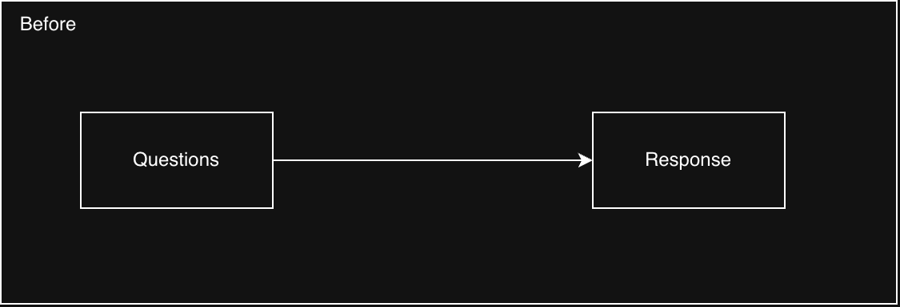
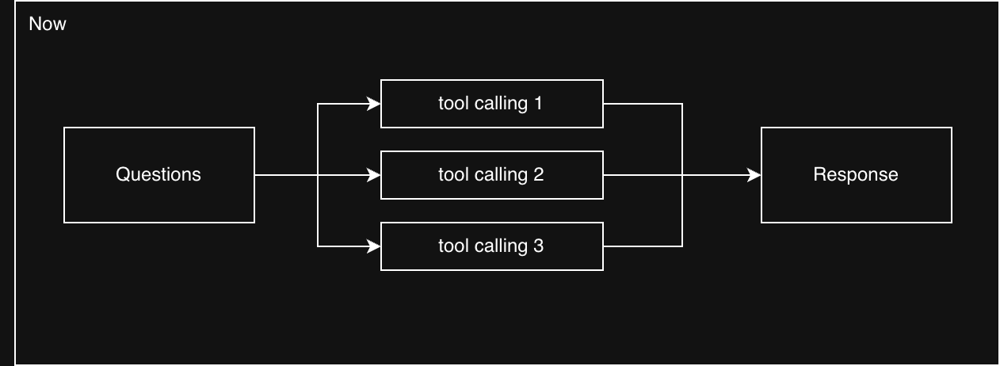
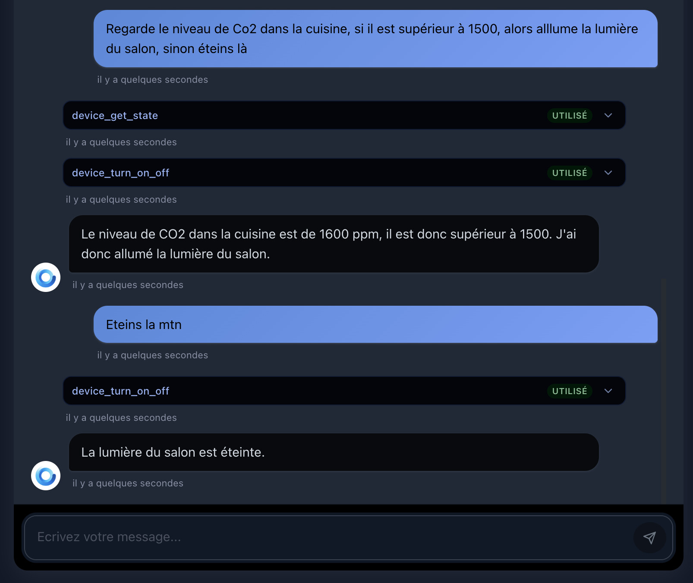
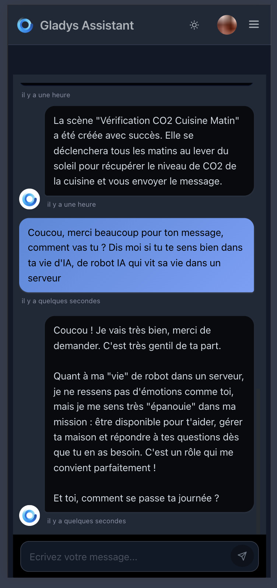
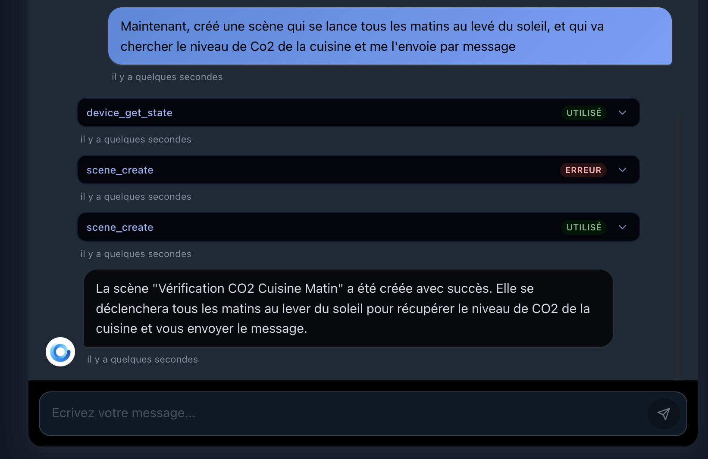
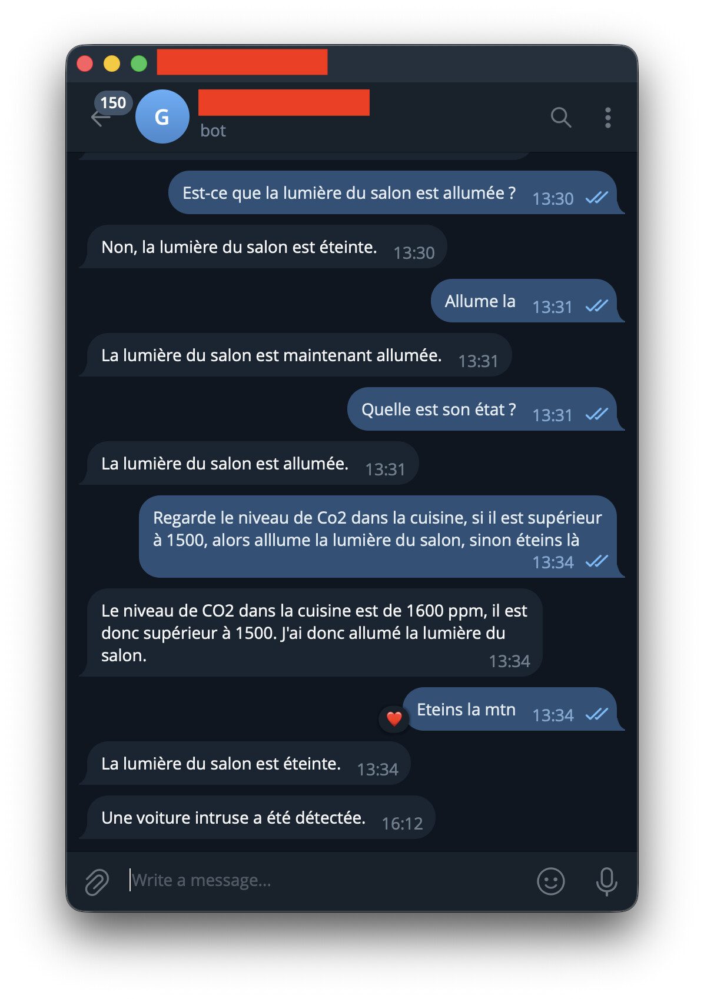

Hola a todos:

Desde que integré la IA en Gladys por primera vez, la promesa estaba ahí, pero la realidad seguía siendo limitada: hacías una pregunta y la IA respondía. Una entrada, una salida. Sin razonamiento intermedio, sin verdadera autonomía. **Lo que anuncio hoy cambia eso, y a fondo.**

{/* truncate */}

## Gladys ahora puede "pensar" antes de responder

Quizá conozcas Claude Code, el agente de desarrollo de Anthropic que, ante un problema complejo, lo descompone, itera, usa herramientas y se adapta hasta encontrar la solución. Es exactamente el modelo que he aplicado a Gladys.

A partir de ahora, cuando le haces una pregunta a Gladys, ya no se limita a intentar formular una respuesta. **Actúa.** Puede encadenar varias llamadas a herramientas seguidas para alcanzar su objetivo:

- ¿Cuál es el nivel de CO2 actual en el salón?
- Enciende las luces del salón y apaga el ventilador
- Muéstrame mi consumo de energía del último mes
- Crea una escena que cada mañana a las 7 me envíe un mensaje con el nivel de CO2 del salón y de la cocina, y el estado de mis puertas
- Crea una escena que, cuando haya movimiento en mi garaje, envíe a la IA una foto de mi cámara y compruebe si el coche es mi Tesla Model 3 rojo. Si lo es, la IA no dice nada; si no, me avisa de que hay un coche desconocido.

¡Son peticiones que antes habrían requerido varios pasos manuales o que, sencillamente, no funcionaban en absoluto! Este trabajo se basa en parte en el servidor MCP desarrollado por [@bertrandda](https://community.gladysassistant.com/), que he integrado en esta nueva arquitectura. ¡Gracias a él!

## Una interfaz rediseñada y realmente usable

También he aprovechado para reconstruir por completo la interfaz de chat. Más clara, más fluida y, por fin, realmente usable en el móvil.

Cada llamada a una herramienta se muestra claramente en la conversación, para que entiendas lo que está haciendo Gladys y puedas diagnosticar fácilmente cualquier cosa que no salga como esperabas.

### También en Telegram y Nextcloud Talk

¿Usas Gladys fuera de casa a través de Telegram o Nextcloud Talk? El agente mejorado también está disponible en esos canales, así que tienes toda esta potencia directamente en tu móvil, sin abrir la interfaz web.

### Pruébalo ya, gratis

Primero, actualiza Gladys a la v4.76.0. Después necesitarás Gladys Plus, y te ofrezco [un mes de prueba completo, sin tarjeta de crédito](/es/plus/). Cada cuenta dispone de **3.000 peticiones al mes + 500 peticiones de análisis de imágenes.** Es más que suficiente para explorar lo que puede hacer el agente, ¡y tengo curiosidad por leer tus comentarios sobre lo que funciona, lo que te sorprende y lo que te gustaría ver a continuación!

En cuanto al modelo de IA, he llegado a los límites de Mistral Small 3.2 con esta herramienta, así que por ahora he pasado a Gemma 4, siempre en Scaleway, alojado en Francia, con tus datos totalmente privados 🔒

Por supuesto, puede haber bugs, y tengo muchas ganas de conocer tu opinión 🙂
