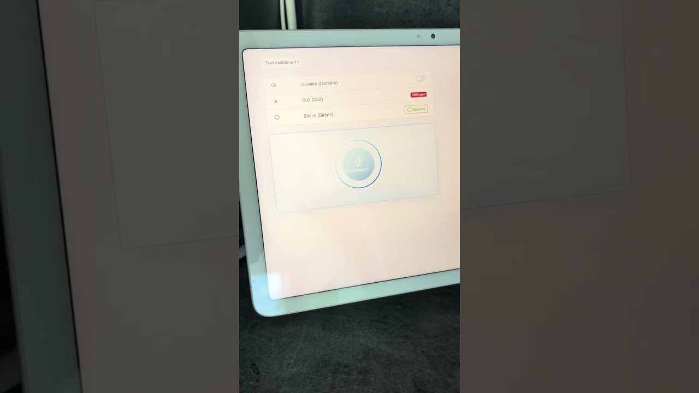
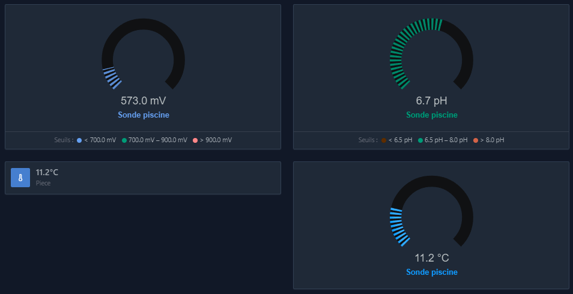
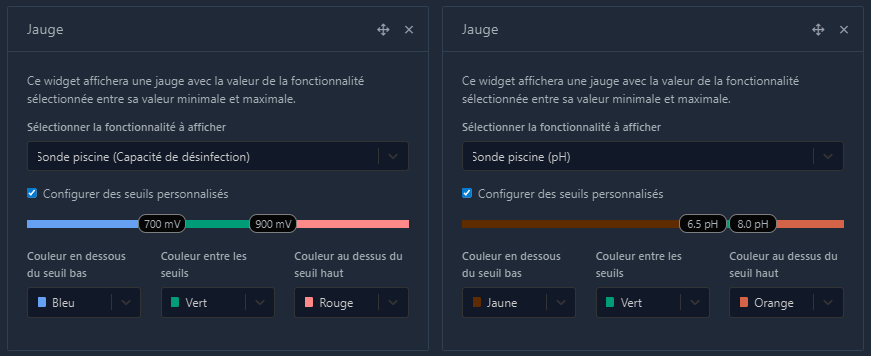
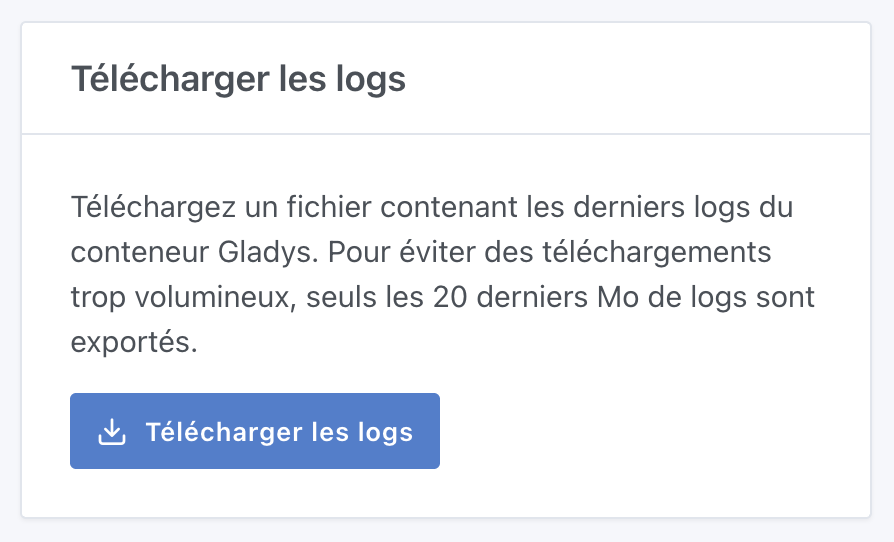

Hola a todos:

Ya está disponible una nueva versión de Gladys, con varias mejoras interesantes, entre ellas un nuevo widget de **Asistente de voz** que puedes colocar directamente en tu panel 🎙️

{/* truncate */}

## 🎙️ Nuevo widget de asistente de voz

Ahora puedes añadir un widget de **Asistente de voz** directamente a tu panel.

Muy práctico en una tablet colgada en la pared o en un smartphone. Me encantaría conocer tu opinión: es ante todo una prueba de concepto que podría dar lugar a más funciones de voz en Gladys si te resulta útil.

## 📊 Widget de indicador: umbrales de color personalizables

Gracias a una contribución de [@Terdious](https://community.gladysassistant.com/), el widget de indicador es aún más flexible. Ahora puedes definir **umbrales de color personalizados** para ver al instante si un valor está en una zona baja, normal o crítica.

Perfecto para seguir la temperatura, la humedad, el consumo eléctrico o cualquier otro indicador importante.

## 📥 Descarga de los logs del sistema

Diagnosticar un problema ahora es más fácil. Un nuevo botón te permite **descargar fácilmente los logs del sistema** desde los ajustes de Gladys, lo que simplifica mucho compartir información cuando pides ayuda.

## 🔌 Mejoras en la integración de Tuya

La integración de Tuya sigue avanzando gracias a [@Terdious](https://community.gladysassistant.com/):

- Soporte local del protocolo Tuya 3.4
- Soporte local del protocolo Tuya 3.5
- Diversas mejoras de estabilidad y compatibilidad

Una gran noticia para los usuarios de Tuya que quieren mantener el control local de sus dispositivos.

---

📋 [Changelog completo](https://github.com/GladysAssistant/Gladys/compare/v4.76.0...v4.77.0)

¡Feliz actualización a todos! 🎉
