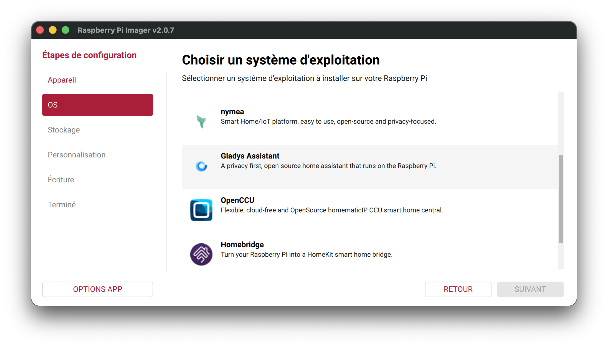

Hola a todos:

He publicado una **nueva imagen de Gladys para Raspberry Pi**, compatible con la Pi 3, 4 y 5.

{/* truncate */}

Esta imagen se basa en Raspberry Pi OS Trixie (Debian 13), de 64 bits. Está disponible directamente en Raspberry Pi Imager, en la categoría *Home automation*.

Para la ocasión, también he reescrito el tutorial de instalación de la web, con cada paso ilustrado:

👉 [Instalar Gladys en una Raspberry Pi](/es/docs/installation/raspberry-pi/)

## Mi opinión sobre la Raspberry Pi

Voy a ser sincero: sigo pensando que la Raspberry Pi no es la mejor opción a largo plazo; un mini-PC sigue siendo más potente y más fiable para un uso diario. También desaconsejo totalmente usar una tarjeta microSD: en la práctica, los datos suelen corromperse al cabo de unos meses. Si optas por una Pi, mejor prevé un SSD NVMe.

Pero para quienes ya tienen una Pi a mano, es una forma excelente de descubrir Gladys sin tener que lidiar con Docker ni con la línea de comandos 🙂

## Próximos pasos

Sigo muy centrado en la distribución y en buscar formas de que Gladys sea más fácil de instalar, sea cual sea tu hardware. El objetivo es que el mayor número posible de personas pueda probar Gladys y formarse su propia opinión.

Estoy trabajando en una imagen "Ubuntu + Gladys" que te permitiría instalar Gladys en un mini-PC con menos pasos que una instalación clásica de Ubuntu. Si tienes ideas para que Gladys sea más accesible y más fácil de instalar, ¡soy todo oídos!

El repositorio: [raspberry-pi-os-gladys](https://github.com/GladysAssistant/raspberry-pi-os-gladys)
