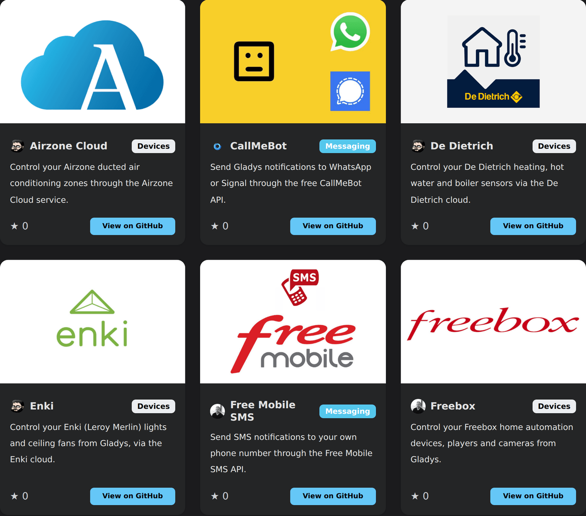

¡Hola a todos!

¡Ya está disponible la versión **4.84.0**, y probablemente sea la versión más importante de la historia del proyecto! 🚀

Durante 6 años, construimos pacientemente **36 integraciones** dentro del núcleo de Gladys. Cada una requería una pull request, una revisión, pruebas y mucho de mi tiempo. Ese era el cuello de botella del proyecto.

Hoy, ese cuello de botella ha desaparecido. Con las **integraciones externas**, cualquiera puede crear y publicar una integración para Gladys, sin pedirme permiso. El resultado no se hizo esperar: **ya hay 20 integraciones disponibles**, creadas en pocos días por 6 colaboradores distintos.

Dicho de otro modo: en pocos días, la comunidad ha producido **más de la mitad** de lo que habíamos conseguido en 6 años. Es un cambio de escala para el proyecto.

{/* truncate */}

## 🧩 Cómo funcionan las integraciones externas

Una integración externa es un **contenedor Docker** supervisado por Gladys. Se comunica con Gladys a través de una API dedicada, y Gladys genera automáticamente toda su interfaz: lista de dispositivos, descubrimiento, formulario de configuración.

En concreto, para ti como usuario:

- Abres el catálogo de integraciones en Gladys
- Las integraciones externas aparecen junto a las nativas, con una insignia de la comunidad
- Haces clic en **Instalar**: Gladys descarga la imagen, arranca el contenedor y muestra la interfaz
- Puedes iniciarla, detenerla, actualizarla, ver sus logs o desinstalarla, directamente desde Gladys

Cada integración se ejecuta en un **entorno aislado (sandbox)** (256 MB de RAM, 0,5 CPU, sistema de archivos de solo lectura, red aislada). Si una integración falla, falla sola: no puede arrastrar consigo a tu instancia de Gladys. Esa garantía es lo que permite publicarlas de forma segura sin revisión.

## 📦 20 integraciones en pocos días

Esto es lo que la comunidad ya ha publicado:

**Dispositivos**: Airzone Cloud, De Dietrich, Enki, Freebox, MELCloud, MELCloud Home, MyNeomitis (Axenco), Netatmo, Philips Hue, Roborock, SmartThings, Spotify, TP-Link Kasa, Tuya, UPnP / IGD, Zendure

**Mensajería**: CallMeBot, Free Mobile SMS, ntfy, Telegram

¡Gracias a [@callemand](https://github.com/callemand), [@cicoub13](https://github.com/cicoub13), [@Dreamthy](https://github.com/Dreamthy), [@Terdious](https://github.com/Terdious) y [@William-De71](https://github.com/William-De71) por estas primeras integraciones!

👉 **[Explora el catálogo completo en la web](/es/docs/integrations/external/)**, actualizado en tiempo real.

## 👨‍💻 Un llamamiento a los desarrolladores: te necesitamos

Aquí es donde te necesito.

Si tienes un dispositivo que Gladys no admite, ahora puedes **hacerlo funcionar tú mismo** y compartirlo con toda la comunidad. En la práctica, esto significa:

- **Una plantilla para clonar.** La [plantilla oficial](https://github.com/GladysAssistant/integration-template-js) ya contiene una integración que funciona (sensores, un interruptor, una luz regulable, un enchufe, una cámara), el SDK de JavaScript, un Dockerfile y un workflow de GitHub Actions que compila y publica tu imagen con un clic. Partes de algo que funciona y sustituyes la lógica por la tuya.
- **Con IA, es aún más rápido.** El camino más sencillo hoy en día: clona la plantilla y pídele a Claude que reescriba la integración para tu dispositivo partiendo de esa base. Es exactamente lo que hice para portar la integración de CallMeBot a una integración externa, y en mi experiencia el resultado fue bueno a la primera.
- **No estás solo con tu protocolo.** Muchos dispositivos ya tienen una librería o una integración de código abierto en otro sitio. Puedes inspirarte en ella o reutilizar directamente la dependencia existente: a menudo, eso ya es el grueso del trabajo hecho.
- **Sin pull request, sin revisión, sin mi aprobación.** Publicas un repositorio público en GitHub con un archivo de manifiesto, añades el topic `gladys-assistant-integration`, y listo.
- **Publicada en menos de una hora.** Un indexador automático se ejecuta cada hora, valida tu manifiesto y publica tu integración en el catálogo de **todas las instancias de Gladys**.

Nunca ha sido tan fácil contribuir a Gladys. Si cada uno aporta la integración que necesita, podremos cubrir en pocos meses lo que nunca habríamos cubierto en años.

👉 **[Lee la guía paso a paso para desarrolladores](/es/docs/dev/external-integrations/)**

Y si publicas algo, ven a enseñarlo [en el foro](https://community.gladysassistant.com/): estoy deseando ver lo que creas.

## 🤖 La IA de Gladys sigue mejorando

El asistente de IA sigue mejorando, con varias peticiones que vienen directamente del foro:

- **Control total de las luces**: ahora puedes pedirle a Gladys que ajuste el **brillo, el color y la temperatura de color** de una bombilla, no solo que la encienda o la apague.
- **Preguntas sobre energía**: Gladys responde ahora a **preguntas sobre consumo (kWh) y coste en un rango de fechas** ("¿cuánto me costó la electricidad en julio?").
- **Creación de escenas más fiable**: un enrutamiento de herramientas en dos etapas mejora notablemente la calidad de las escenas generadas por la IA.
- **Respuestas mejor formateadas**: el Markdown de las respuestas de la IA por fin se muestra correctamente en el chat. Se acabó ver `**27 °C**` en bruto.

## 🏠 Matter

- **Aires acondicionados**: gestión del modo de funcionamiento (Thermostat SystemMode), solicitada en el foro.
- **Sensores de CO2**: ya son compatibles.
- **Corregido un fallo "Cannot mix BigInt and other types"** en los atributos eléctricos.
- matter.js actualizado a la 0.17.6.

## 🔌 Otras integraciones

- **Enedis**: los costes de energía se recalculan después de cada sincronización.
- **CalDAV**: mejor sincronización, con soporte para los eventos eliminados.
- **Zigbee2MQTT**: la dirección IEEE y el enlace Z2M ya no se pierden al guardar un dispositivo.
- **MQTT**: un topic personalizado vacío ya no coincide con todos los mensajes, y el estado "detenido manualmente" se borra correctamente al guardar la configuración.
- **Telegram**: ahora se puede desactivar la integración (detiene el bot, borra la clave y desvincula a los usuarios).
- **Cámaras RTSP**: logs más legibles cuando falla la obtención de una imagen.

## 🖥️ Interfaz

- **Gráficas**: las unidades mostradas siguen ahora las unidades actuales de las funciones del dispositivo, y los valores indefinidos ya no rompen el formato.
- **Panel**: ahora queda claro que el modo tablet solo se aplica al navegador actual.
- **Catálogo de integraciones**: tus filtros y tu orden se conservan cuando vuelves atrás desde la página de una integración, y un botón te permite actualizar el catálogo cuando quieras.

## 🛠️ Aspectos técnicos

- La instalación de las dependencias de los servicios ahora se **paraleliza** (4 a la vez), lo que acelera notablemente la compilación de Gladys. Esto solo afecta al desarrollo: no cambia nada en tu instancia.
- Los fallos de los servicios de mensajería ahora están aislados: un servicio que falla ya no impide que los demás entreguen el mensaje.
- En cuanto a la CI: las imágenes Docker de las ramas se publican automáticamente en el registro de GitHub, y un comando `/build-arm64` compila bajo demanda una imagen ARM64 en una PR.

## ❤️ Gracias

Gracias a todos los que han contribuido a esta versión, y especialmente a los primeros desarrolladores de integraciones externas, que se lanzaron antes incluso del anuncio oficial. En pocos días, han demostrado que el modelo funciona.

Como siempre, Gladys se actualiza automáticamente en un plazo de 24 horas si usas Watchtower; si no, puedes hacerlo con un clic desde los ajustes.

¡Recuerda configurar Telegram para recibir una alerta en tu móvil cuando Gladys se actualice!

[Consulta las notas de versión completas en GitHub](https://github.com/GladysAssistant/Gladys/releases/tag/v4.84.0)
